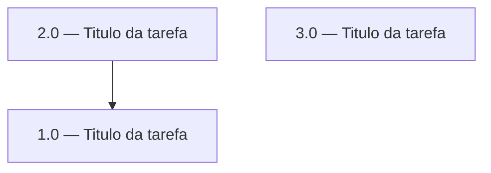

<!-- spec-hash-prd: 0000000000000000000000000000000000000000000000000000000000000000 -->
<!-- spec-hash-techspec: 0000000000000000000000000000000000000000000000000000000000000000 -->

# Resumo das Tarefas de Implementação para [Funcionalidade]

## Metadados
- **PRD:** `.specs/prd-[nome-da-funcionalidade]/prd.md`
- **Especificação Técnica:** `.specs/prd-[nome-da-funcionalidade]/techspec.md`
- **Total de tarefas:** X
- **Tarefas paralelizáveis:** [lista ou "nenhuma"]

## Tarefas

<!-- Colunas e formato canônico (MANDATÓRIO):
     - `#`: id decimal `X.Y` (sempre X.0 para tarefas de topo).
     - `Status`: ^(pending|in_progress|needs_input|blocked|failed|done)$
     - `Dependências`: ^(—|\d+\.\d+(,\s*\d+\.\d+)*)$  (em-dash unicode quando vazio)
     - `Paralelizável`: ^(—|Não|Com\s+\d+\.\d+(,\s*\d+\.\d+)*)$
     - `Skills`: skills processuais extras (descoberta agnóstica em `.agents/skills/`). Use `—` quando
       não houver. Nunca listar skills auto-carregadas (governance/linguagem) nem `*-implementation`.
     - `Fase` (OPCIONAL): inteiro positivo para agrupamento visual de fases de entrega. Pode ser
       omitida em PRDs pequenos; `execute-all-tasks` não consome esta coluna. Se incluída, mantenha
       em todas as linhas para não quebrar o parser de tabela markdown. -->

| # | Título | Status | Dependências | Paralelizável | Skills |
|---|--------|--------|-------------|---------------|--------|
| 1.0 | [Título da tarefa] | pending | — | — | — |
| 2.0 | [Título da tarefa] | pending | 1.0 | Não | <skill-1>, <skill-2> |
| 3.0 | [Título da tarefa] | pending | — | Com 2.0 | <skill-1> |

## Dependências Críticas
- [Descrever dependências bloqueantes entre tarefas]

## Riscos de Integração
- [Pontos de integração que podem causar retrabalho]

## Cobertura de Requisitos

| Tarefa | Requisitos cobertos |
|--------|-------------------|
| 1.0 | RF-01, RF-02, ... |
| 2.0 | RF-03, RF-04, ... |

## Grafo de Dependencias

## Legenda de Status
- `pending`: aguardando execução
- `in_progress`: em execução
- `needs_input`: aguardando informação do usuário
- `blocked`: bloqueado por dependência ou falha externa
- `failed`: falhou após limite de remediação
- `done`: completado e aprovado
