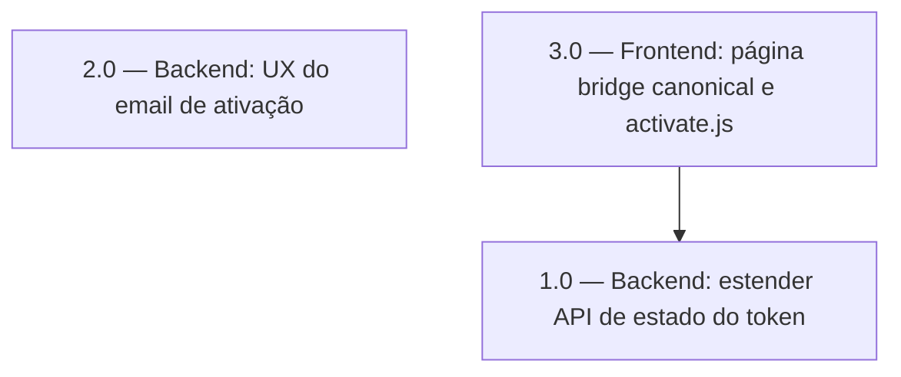

<!-- spec-hash-prd: 8097e774290bb9f84f64e0f08a0adcfbac263aafe5d7065c531cc3b84d808e72 -->
<!-- spec-hash-techspec: 354f004c778b0a624fcb108135124b12259948cc0a176eea1aedfb5b1475700b -->
# Resumo das Tarefas de Implementação — Ativação UX

## Metadados
- **PRD:** `.specs/prd-activation-ux/prd.md`
- **Especificação Técnica:** `.specs/prd-activation-ux/techspec.md`
- **Total de tarefas:** 3
- **Tarefas paralelizáveis:** 1.0 e 2.0 (backends independentes entre si; 3.0 depende de 1.0)

## Tarefas

<!-- Colunas e formato canônico (MANDATÓRIO):
     - `#`: id decimal `X.Y` (sempre X.0 para tarefas de topo).
     - `Status`: ^(pending|in_progress|needs_input|blocked|failed|done)$
     - `Dependências`: ^(—|\d+\.\d+(,\s*\d+\.\d+)*)$  (em-dash unicode quando vazio)
     - `Paralelizável`: ^(—|Não|Com\s+\d+\.\d+(,\s*\d+\.\d+)*)$
     - `Skills`: skills processuais extras (descoberta agnóstica em `.agents/skills/`). Use `—` quando
       não houver. Nunca listar skills auto-carregadas (governance/linguagem) nem `*-implementation`.
     - `Fase` (OPCIONAL): inteiro positivo para agrupamento visual de fases de entrega. Pode ser
       omitida em PRDs pequenos; `execute-all-tasks` não consome esta coluna. Se incluída, mantenha
       em todas as linhas para não quebrar o parser de tabela markdown. -->

| # | Título | Status | Dependências | Paralelizável | Skills |
|---|--------|--------|-------------|---------------|--------|
| 1.0 | Backend: estender API de estado do token com reason e support_url | done | — | Com 2.0 | semantic-commit |
| 2.0 | Backend: UX do email de ativação — WaMeURL, SupportURL e template | done | — | Com 1.0 | semantic-commit |
| 3.0 | Frontend: página bridge canonical e activate.js reason-aware | done | 1.0 | Não | semantic-commit |

## Dependências Críticas

- **3.0 → 1.0**: o frontend consome `reason` e `support_url` da API. A task 3.0 pode ser desenvolvida com mock da API, mas o smoke test final requer o backend de 1.0 implantado.
- **2.0 é independente**: nenhuma dependência funcional com 1.0 ou 3.0 — pode ser mergeada separadamente.

## Riscos de Integração

- `sanitizeE164` é movida de `get_token_state.go` para `e164.go` na task 1.0; task 2.0 consome a mesma função — garantir que ambas as tasks usem o helper após a movimentação.
- `emailCfg.ActivateURL` / `EMAIL_ACTIVATE_URL` são removidos na task 2.0 — verificar que `configs/config.go` compila limpo após a remoção antes de fechar.
- Frontend (task 3.0) em dois repositórios distintos (`mecontrola` vs `mecontrola-landingpage`) — as tasks de backend e frontend devem ser mergeadas e implantadas na ordem: 1.0 → 2.0 → 3.0.

## Cobertura de Requisitos

| Tarefa | Requisitos cobertos |
|--------|-------------------|
| 1.0 | RF-11 |
| 2.0 | RF-01, RF-02, RF-03, RF-04 |
| 3.0 | RF-05, RF-06, RF-07, RF-08, RF-09, RF-10 |

## Grafo de Dependencias

## Legenda de Status
- `pending`: aguardando execução
- `in_progress`: em execução
- `needs_input`: aguardando informação do usuário
- `blocked`: bloqueado por dependência ou falha externa
- `failed`: falhou após limite de remediação
- `done`: completado e aprovado
