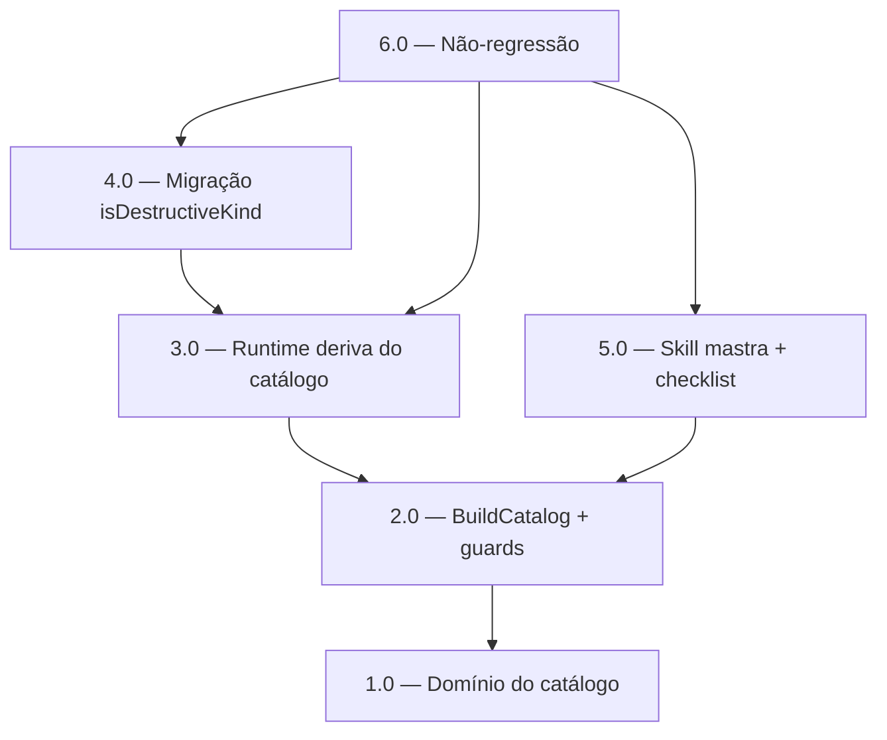

<!-- spec-hash-prd: 48acf5bbae04e963357453918477daf059e55f11ebfcaa8d31943f8af666b571 -->
<!-- spec-hash-techspec: 515e2a1dc3d4ec9fcbdb486ca844c2ab1f91b1790264b976feb338e87490b2e2 -->
# Resumo das Tarefas de Implementação para Catálogo Canônico de Capabilities do Agent

## Metadados
- **PRD:** `.specs/prd-agent-capability-catalog/prd.md`
- **Especificação Técnica:** `.specs/prd-agent-capability-catalog/techspec.md`
- **Total de tarefas:** 6
- **Tarefas paralelizáveis:** 4.0 e 5.0 (com 3.0, após 2.0); ver grafo

## Tarefas

| # | Título | Status | Dependências | Paralelizável | Skills |
|---|--------|--------|-------------|---------------|--------|
| 1.0 | Domínio do catálogo: CapabilityMode, CapabilitySpec, Catalog | done | — | — | mastra |
| 2.0 | BuildCatalog (24 specs) + guards de cobertura e consistência | done | 1.0 | Não | mastra |
| 3.0 | Runtime deriva do catálogo + remoção de workflowFor/toolFor | done | 2.0 | — | mastra |
| 4.0 | Migração isDestructiveKind via RequiresConfirmation | done | 3.0 | — | mastra |
| 5.0 | Skill mastra + checklist de extensão (5 seams) | done | 2.0 | Com 3.0 | mastra |
| 6.0 | Não-regressão: suíte agent/workflow verde + gates HITL | done | 3.0, 4.0, 5.0 | — | — |

## Dependências Críticas
- **1.0 → 2.0:** `BuildCatalog` precisa dos tipos `CapabilityMode`/`CapabilitySpec`/`Catalog`.
- **2.0 → 3.0:** o runtime só pode derivar de um catálogo construído e validado.
- **3.0 → 4.0:** a injeção do catálogo no `DailyLedgerAgent` (wiring de 3.0 em `module.go`) é pré-requisito da migração de `isDestructiveKind`; ambos tocam o wiring, sequenciados para evitar conflito.
- **2.0 → 5.0:** a skill documenta o catálogo já existente; pode rodar em paralelo a 3.0 (arquivos disjuntos: `.agents/skills/` vs `internal/agent`).
- **3.0/4.0/5.0 → 6.0:** verificação final só após todas as mudanças de código e docs.

## Riscos de Integração
- **Wiring compartilhado (`module.go`):** 3.0 e 4.0 alteram a injeção do catálogo no mesmo arquivo de wiring; por isso 4.0 depende de 3.0 (sequencial), não paralelo.
- **Drift de label observável (D-02/ADR-002):** 3.0 corrige 4 kinds (`QueryIncomeSummary`, `BudgetRecurrence`, `Delete/EditTransactionByRef`) de `conversational` para o workflow real. O teste de equivalência por kind protege os demais; o impacto de métricas deve ser comunicado no PR.
- **Não-regressão HITL (ADR-003):** 4.0 troca a fonte de `isDestructiveKind`; o teste de consistência catálogo↔`intentToOperationKind` e a suíte de confirmação (6.0) blindam contra escape de gate.
- **Dupla fonte catálogo×registry (R2/ADR-001):** mitigado pelo teste de consistência em 2.0.

## Cobertura de Requisitos

| Tarefa | Requisitos cobertos |
|--------|-------------------|
| 1.0 | RF-01, RF-02, RF-04, RF-05, RF-06, RF-11 |
| 2.0 | RF-03, RF-06, RF-10 |
| 3.0 | RF-07, RF-08, RF-09, RF-13, RF-17 |
| 4.0 | RF-12 |
| 5.0 | RF-14, RF-15 |
| 6.0 | RF-16 |

## Grafo de Dependencias

## Legenda de Status
- `pending`: aguardando execução
- `in_progress`: em execução
- `needs_input`: aguardando informação do usuário
- `blocked`: bloqueado por dependência ou falha externa
- `failed`: falhou após limite de remediação
- `done`: completado e aprovado
