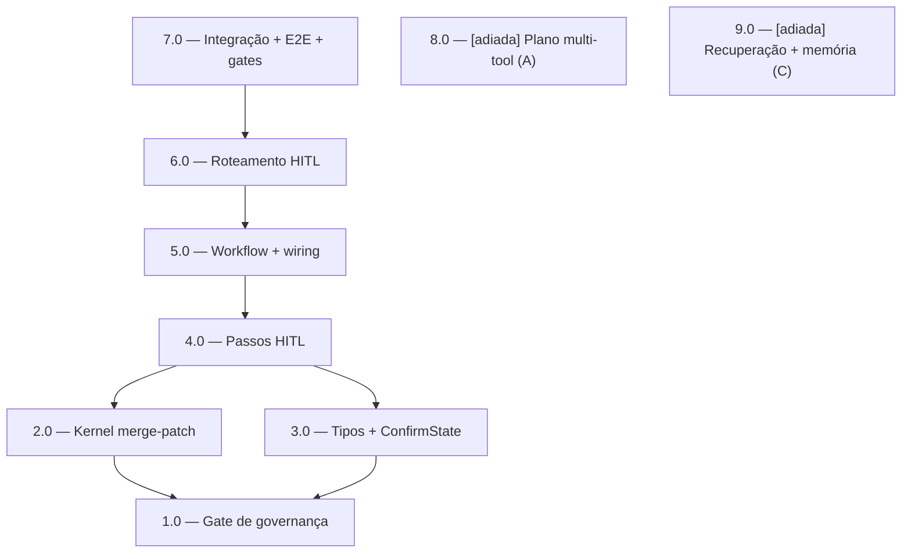

<!-- spec-hash-prd: 88de69d62688347098bf7f771c6405e496b424fda2fc9dcbf0c5f513b61eaf56 -->
<!-- spec-hash-techspec: 173b28c41d72a20f58d3cdac32b8ec9ea4f5090d6c8cd8d06ff1935afc3c7d6c -->
# Resumo das Tarefas de Implementação para Evolução da Plataforma de Agentes (MVP: Human-in-the-Loop)

## Metadados
- **PRD:** `.specs/prd-agent-platform-evolution/prd.md`
- **Especificação Técnica:** `.specs/prd-agent-platform-evolution/techspec.md`
- **Total de tarefas:** 9 (7 do MVP capacidade B + 2 guarda-chuva de fases adiadas)
- **Tarefas paralelizáveis:** 2.0 com 3.0; 8.0 com 9.0 (placeholders de roadmap)

## Tarefas

| # | Título | Status | Dependências | Paralelizável | Skills |
|---|--------|--------|-------------|---------------|--------|
| 1.0 | Gate de governança — addendum R-AGENT-WF-001.7 (AwaitingApproval) + nota merge-patch | done | — | Não | — |
| 2.0 | Kernel merge-patch no resume (ADR-001) | done | 1.0 | Com 3.0 | — |
| 3.0 | Tipos fechados + ConfirmState (domain/confirmation) | done | 1.0 | Com 2.0 | — |
| 4.0 | Passos HITL — prepare_target, confirm_gate, execute_destructive | done | 2.0, 3.0 | Não | — |
| 5.0 | Workflow destructive_confirm + wiring no module.go | done | 4.0 | Não | — |
| 6.0 | Roteamento HITL no agent + resume antes do parse + gate de budget no commit | done | 5.0 | Não | — |
| 7.0 | Integração (testcontainers) + E2E dos 4 cenários + gates R-* | done | 6.0 | Não | — |
| 8.0 | [Fase 2 — adiada] Plano multi-tool determinístico (capacidade A) | done | — | Com 9.0 | — |
| 9.0 | [Fase 3 — adiada] Recuperação contextual estruturada + memória (capacidade C) | done | — | Com 8.0 | — |

## Dependências Críticas
- **1.0 é gate-first**: a regra de governança (addendum R-AGENT-WF-001.7) deve ser redigida ANTES de qualquer código do HITL — espelha o padrão ADR-004/task-1.0 do `prd-workflow-kernel`.
- **2.0 (kernel merge-patch) é fundacional**: corrige o defeito latente de perda de estado no resume; é pré-requisito do suspend/resume correto do HITL (4.0+).
- **2.0 ∥ 3.0**: a correção do kernel (plataforma) e os tipos/estado do agent (domínio) são independentes e podem ser feitas em paralelo após 1.0.
- **4.0 → 5.0 → 6.0 → 7.0**: caminho crítico sequencial (passos → workflow/wiring → roteamento → prova ponta a ponta).

## Riscos de Integração
- **Alteração no kernel (2.0) afeta todos os consumidores** (inclusive clarificação de categoria). Mitigado por teste de regressão do defeito + `parity_test.go` verde antes do merge; resume vazio é no-op.
- **HITL sempre-on sem flag (ADR-002)**: mudança de comportamento em produção (ops destrutivas passam a exigir confirmação). Mitigado por ser aditiva-de-segurança + não regressão obrigatória em 7.0. Risco residual aceito.
- **Colisão de runs suspensos por chave** (categoria vs aprovação na mesma `(user,channel)`): workflow IDs distintos; ordem determinística de resume (categoria → aprovação → parse) validada em 6.0/7.0.
- **Handoff sessão→kernel no commit de budget (ADR-004)**: o draft completo é serializado em `ConfirmState`; cancelamento/expiração preservam o budget vigente. Validado em 7.0.
- **Escopo MVP = capacidade B**: as tarefas 8.0 e 9.0 são guarda-chuva `pending` que cobrem RF-01..07 e RF-15..20 como PLANEJADOS-NÃO-IMPLEMENTADOS; serão decompostas em rodada própria de `create-tasks` quando priorizadas. Isso preserva o roadmap e a cobertura de RFs sem falso positivo de maturidade. Total de 9 tarefas (≤ 10) — justificado pela necessidade de cobertura completa dos 27 RFs do PRD multifásico.

## Cobertura de Requisitos

| Tarefa | Requisitos cobertos |
|--------|-------------------|
| 1.0 | RF-21, RF-22, RF-23, RF-24, RF-25, RF-27 |
| 2.0 | RF-09, RF-10, RF-24 |
| 3.0 | RF-11, RF-23 |
| 4.0 | RF-08, RF-11, RF-12, RF-13 |
| 5.0 | RF-08, RF-09, RF-12 |
| 6.0 | RF-08, RF-13, RF-14, RF-21, RF-22 |
| 7.0 | RF-09, RF-10, RF-12, RF-25, RF-26 |
| 8.0 | RF-01, RF-02, RF-03, RF-04, RF-05, RF-06, RF-07 |
| 9.0 | RF-15, RF-16, RF-17, RF-18, RF-19, RF-20 |

## Grafo de Dependencias

## Legenda de Status
- `pending`: aguardando execução
- `in_progress`: em execução
- `needs_input`: aguardando informação do usuário
- `blocked`: bloqueado por dependência ou falha externa
- `failed`: falhou após limite de remediação
- `done`: completado e aprovado
