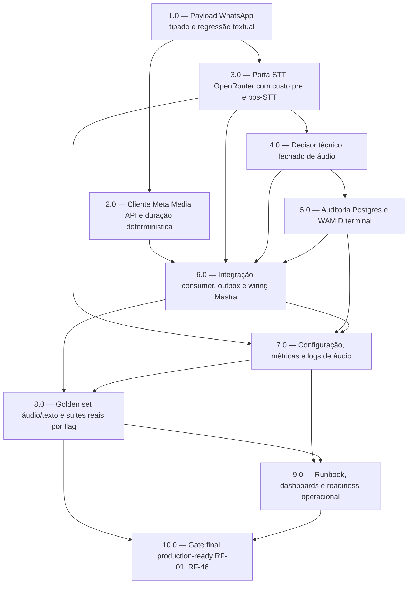

<!-- spec-hash-prd: fcb9286b6b71310a28ab180a856e778dc3243d91dca5ac2118fd524e4d62572d -->
<!-- spec-hash-techspec: 94684ab5916c41311bc90fd917d4a333af21235d52cf6dea41ea724a32726bc1 -->
# Resumo das Tarefas de Implementação para Agente com Audio WhatsApp via OpenRouter

## Metadados
- **PRD:** `.specs/prd-agente-audio-openrouter/prd.md`
- **Especificação Técnica:** `.specs/prd-agente-audio-openrouter/techspec.md`
- **Total de tarefas:** 10
- **Tarefas paralelizáveis:** 2.0 com 3.0

## Tarefas

<!-- Colunas e formato canônico (MANDATÓRIO):
     - `#`: id decimal `X.Y` (sempre X.0 para tarefas de topo).
     - `Status`: ^(pending|in_progress|needs_input|blocked|failed|done)$
     - `Dependências`: ^(—|\d+\.\d+(,\s*\d+\.\d+)*)$  (em-dash unicode quando vazio)
     - `Paralelizável`: ^(—|Não|Com\s+\d+\.\d+(,\s*\d+\.\d+)*)$
     - `Skills`: skills processuais extras (descoberta agnóstica em `.agents/skills/`). Use `—` quando
       não houver. Nunca listar skills auto-carregadas (governance/linguagem) nem `*-implementation`.
     - `Fase` (OPCIONAL): inteiro positivo para agrupamento visual de fases de entrega. Pode ser
       omitida em PRDs pequenos; `execute-all-tasks` não consome esta coluna. Se incluída, mantenha
       em todas as linhas para não quebrar o parser de tabela markdown. -->

| # | Título | Status | Dependências | Paralelizável | Skills |
|---|--------|--------|-------------|---------------|--------|
| 1.0 | Payload WhatsApp tipado e regressão textual | pending | — | — | mastra, domain-modeling-production, design-patterns-mandatory |
| 2.0 | Cliente Meta Media API e duração determinística | pending | 1.0 | Não | mastra, domain-modeling-production, design-patterns-mandatory |
| 3.0 | Porta STT OpenRouter com custo pre e pos-STT | pending | 1.0 | Com 2.0 | mastra, domain-modeling-production, design-patterns-mandatory |
| 4.0 | Decisor técnico fechado de áudio | pending | 3.0 | Não | mastra, domain-modeling-production, design-patterns-mandatory |
| 5.0 | Auditoria Postgres e WAMID terminal | pending | 4.0 | Não | mastra, domain-modeling-production, design-patterns-mandatory, postgresql-production-standards |
| 6.0 | Integração consumer, outbox e wiring Mastra | pending | 2.0, 3.0, 4.0, 5.0 | Não | mastra, domain-modeling-production, design-patterns-mandatory |
| 7.0 | Configuração, métricas e logs de áudio | pending | 3.0, 5.0, 6.0 | Não | mastra, domain-modeling-production, design-patterns-mandatory, golden-signals-otel-standards |
| 8.0 | Golden set áudio/texto e suites reais por flag | pending | 6.0, 7.0 | Não | mastra, domain-modeling-production, design-patterns-mandatory |
| 9.0 | Runbook, dashboards e readiness operacional | pending | 7.0, 8.0 | Não | mastra, domain-modeling-production, design-patterns-mandatory, otel-grafana-dashboards, golden-signals-otel-standards |
| 10.0 | Gate final production-ready RF-01..RF-46 | pending | 8.0, 9.0 | Não | mastra, domain-modeling-production, design-patterns-mandatory |

## Dependências Críticas
- 1.0 desbloqueia toda a cadeia porque áudio precisa chegar tipado ao outbox/consumer sem quebrar texto.
- 2.0 e 3.0 podem evoluir em paralelo após 1.0 porque Media API e STT têm fronteiras técnicas distintas.
- 4.0 depende de 3.0 porque o decisor precisa conhecer contrato de resposta/erro/truncamento/custo do STT.
- 5.0 depende de 4.0 porque a auditoria persiste estados e reasons fechados do decisor.
- 6.0 é a integração de maior risco: depende de media, STT, decisor e auditoria para preservar fail-closed antes de `HandleInbound`.
- 8.0 e 9.0 fecham regressão e operação; 10.0 não pode iniciar sem ambos.

## Riscos de Integração
- Regressão textual: mensagens `type=text` devem continuar no fluxo atual sem alteração funcional.
- Falso positivo financeiro: áudio incerto não pode chamar `tryResume`, onboarding, `HandleInbound` ou tool financeira.
- Idempotência: falha terminal de áudio não pode remover dedup e reabrir WAMID para replay automático.
- Privacidade: logs, métricas, spans e auditoria não podem persistir áudio bruto, base64, URL temporária ou transcrição completa em INFO.
- Custo: OpenRouter só retorna custo real após STT; por isso a implementação deve ter preflight por duração/modelo e gate pós-STT por `usage.cost`.
- Duração: se `audio/ogg`/Opus ou M4A/AAC não tiver duração extraível deterministicamente, o áudio deve falhar fechado antes do STT.

## Cobertura de Requisitos

| Tarefa | Requisitos cobertos |
|--------|-------------------|
| 1.0 | RF-01, RF-02, RF-03, RF-04, RF-05, RF-40, RF-41 |
| 2.0 | RF-06, RF-07, RF-08, RF-24 |
| 3.0 | RF-09, RF-10, RF-11, RF-12, RF-36, RF-45 |
| 4.0 | RF-13, RF-14, RF-15, RF-16, RF-17, RF-19, RF-33, RF-35, RF-42 |
| 5.0 | RF-21, RF-22, RF-23, RF-24, RF-25, RF-26, RF-27 |
| 6.0 | RF-18, RF-20, RF-39, RF-43 |
| 7.0 | RF-28, RF-29, RF-45 |
| 8.0 | RF-30, RF-31, RF-32, RF-34, RF-35, RF-36, RF-44 |
| 9.0 | RF-28, RF-29, RF-46 |
| 10.0 | RF-01, RF-02, RF-03, RF-04, RF-05, RF-06, RF-07, RF-08, RF-09, RF-10, RF-11, RF-12, RF-13, RF-14, RF-15, RF-16, RF-17, RF-18, RF-19, RF-20, RF-21, RF-22, RF-23, RF-24, RF-25, RF-26, RF-27, RF-28, RF-29, RF-30, RF-31, RF-32, RF-33, RF-34, RF-35, RF-36, RF-37, RF-38, RF-39, RF-40, RF-41, RF-42, RF-43, RF-44, RF-45, RF-46 |

## Grafo de Dependencias

## Legenda de Status
- `pending`: aguardando execução
- `in_progress`: em execução
- `needs_input`: aguardando informação do usuário
- `blocked`: bloqueado por dependência ou falha externa
- `failed`: falhou após limite de remediação
- `done`: completado e aprovado
