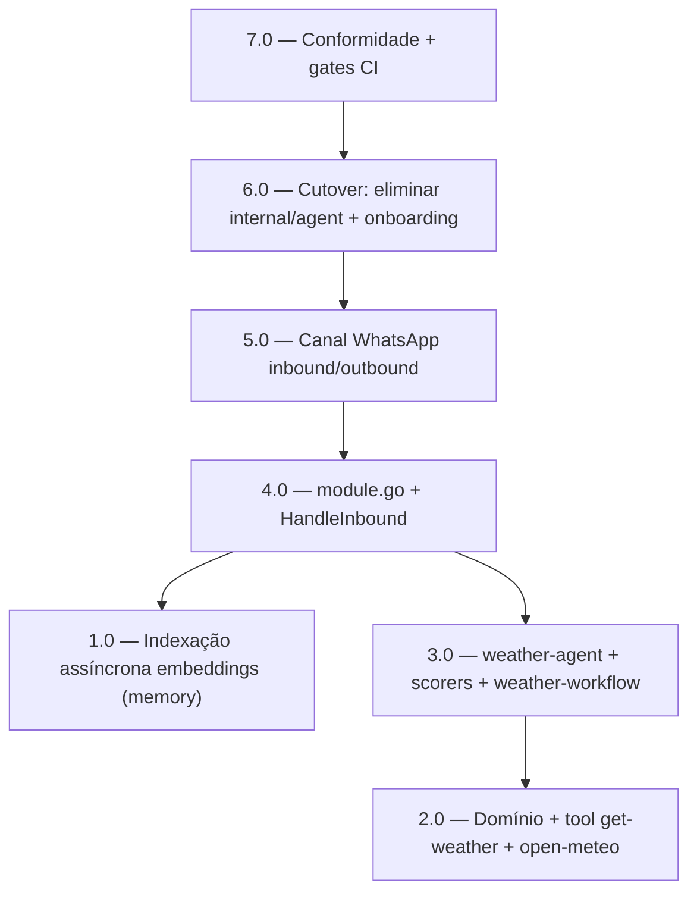

<!-- spec-hash-prd: 031b016adff4b7973adbe240a2448e5998e92ca99a8118c6d35effaf3bf92cf0 -->
<!-- spec-hash-techspec: 9d5ac610e1d0704270bb936ded348f1797fc20d25c716e059984f22c48c70dfc -->
# Resumo das Tarefas de Implementação para `internal/agents` (weather, paridade Mastra)

## Metadados
- **PRD:** `.specs/prd-agents-weather-mastra/prd.md`
- **Especificação Técnica:** `.specs/prd-agents-weather-mastra/techspec.md`
- **Total de tarefas:** 7
- **Tarefas paralelizáveis:** 1.0 com 2.0

## Tarefas

<!-- Colunas e formato canônico (MANDATÓRIO):
     - `#`: id decimal `X.Y` (sempre X.0 para tarefas de topo).
     - `Status`: ^(pending|in_progress|needs_input|blocked|failed|done)$
     - `Dependências`: ^(—|\d+\.\d+(,\s*\d+\.\d+)*)$  (em-dash unicode quando vazio)
     - `Paralelizável`: ^(—|Não|Com\s+\d+\.\d+(,\s*\d+\.\d+)*)$
     - `Skills`: skills processuais extras (descoberta agnóstica em `.agents/skills/`). Use `—` quando
       não houver. Nunca listar skills auto-carregadas (governance/linguagem) nem `*-implementation`. -->

| # | Título | Status | Dependências | Paralelizável | Skills |
|---|--------|--------|-------------|---------------|--------|
| 1.0 | Indexação assíncrona de embeddings em `internal/platform/memory` (publishingMessageStore + evento outbox + consumer/worker idempotente por event_id) — resolve gap B3 | done | — | Com 2.0 | mastra |
| 2.0 | `internal/agents` domínio + tool `get-weather` + cliente open-meteo (value objects/closed types DMMF, schemas I/O) | done | — | Com 1.0 | mastra |
| 3.0 | `weather-agent` + scorers (code-based + LLM-judged) + `weather-workflow` (agent-como-step, streaming) — promovendo `test/conformance/weather` | done | 2.0 | — | mastra |
| 4.0 | `module.go` + usecase `HandleInbound` (DI completo sobre a plataforma; `MessageStore` decorado; AgentRuntime Thread→Run) | done | 1.0, 3.0 | — | mastra |
| 5.0 | Canal WhatsApp: rota inbound (publica outbox) + consumer no worker + resposta via gateway | done | 4.0 | — | mastra |
| 6.0 | Cutover/eliminação: apagar `internal/agent/**`; religar `cmd/server`/`cmd/worker`; rota única no dispatcher (desligar onboarding conversacional); ajustar/remover e2e; migrar config | done | 5.0 | — | — |
| 7.0 | Conformidade + gates: integração testcontainers pgvector; variante `RUN_REAL_LLM`; gate de ausência de `internal/agent` no CI; gofmt/governança verdes | done | 6.0 | — | taskfile-production, mastra |

## Dependências Críticas
- 1.0 (indexação assíncrona) é base para a memória/recall do agente funcionar de verdade (gap B3); bloqueia 4.0.
- 2.0 → 3.0 → 4.0 é o caminho do agente (domínio/tool → agent/workflow/scorers → módulo/wiring).
- 5.0 (canal WhatsApp) depende de 4.0 (módulo wired).
- 6.0 (eliminação física de `internal/agent`) só pode ocorrer DEPOIS de 5.0 — nunca apagar antes de `internal/agents` wired e build/CI verdes (operação irreversível).
- 7.0 (gates/conformidade) fecha o enforcement e depende de 6.0 (gate de ausência de `internal/agent`).

## Riscos de Integração
- **Remoção de módulo vivo (irreversível)**: `internal/agent` está wired em cmd/server, cmd/worker e a migration 000003 dropa suas tabelas. Gate de pronto da 6.0: `grep internal/agent` (≠ `internal/platform/agent`) vazio, `test -d internal/agent` falso, `go build ./...` e CI verdes. Commit isolado para rollback via revert.
- **Streaming agent-como-step (3.0)**: a sugestão de atividades usa `agent.Stream` dentro do step; validar fim-de-stream/structured output (contrato `Result(ctx)` que drena `Deltas()`, fix B5) com teste de >64 deltas sem drenar.
- **Indexação assíncrona (1.0)**: risco de leak/duplicação; idempotência por `event_id` + `ON CONFLICT (source_message_pk, model)`; shutdown cooperativo; teste de replay.
- **Onboarding desligado (6.0)**: "ATIVAR <token>" deixa de ser atendido no WhatsApp (decisão de produto RF-24); documentar no runbook; ajustar e2e de `internal/onboarding` que importam `internal/agent`.
- **Drift de config (6.0)**: migração `AGENT_*` → config do módulo; checklist para evitar variável órfã.

## Cobertura de Requisitos

| Tarefa | Requisitos cobertos |
|--------|-------------------|
| 1.0 | RF-18, RF-19 |
| 2.0 | RF-04, RF-09, RF-10 |
| 3.0 | RF-05, RF-06, RF-07, RF-08, RF-11, RF-12, RF-13, RF-14, RF-15, RF-16 |
| 4.0 | RF-01, RF-02, RF-03, RF-17 |
| 5.0 | RF-20, RF-21, RF-22 |
| 6.0 | RF-23, RF-24, RF-25, RF-26, RF-27 |
| 7.0 | RF-28, RF-29, RF-30 |

## Grafo de Dependencias

## Legenda de Status
- `pending`: aguardando execução
- `in_progress`: em execução
- `needs_input`: aguardando informação do usuário
- `blocked`: bloqueado por dependência ou falha externa
- `failed`: falhou após limite de remediação
- `done`: completado e aprovado
