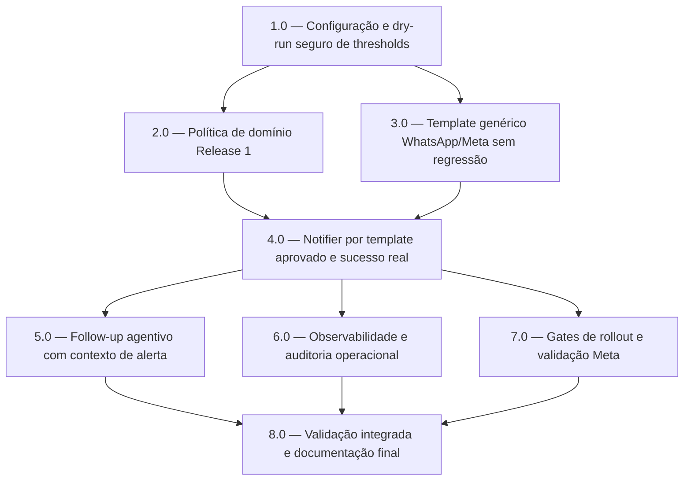

<!-- spec-hash-prd: 0c576e503ceb25e4988cef6a1cb2fb50c9964f3e4efca6d5e6943ecbc4c11d65 -->
<!-- spec-hash-techspec: 5277fe78c579baeddc6f7d884921a5251d0deb56eeef9942bd91ff37c732c3f6 -->
# Resumo das Tarefas de Implementação para Alertas Proativos

## Metadados
- **PRD:** `.specs/prd-alertas-proativos/prd.md`
- **Especificação Técnica:** `.specs/prd-alertas-proativos/techspec.md`
- **Total de tarefas:** 8
- **Tarefas paralelizáveis:** 2.0 com 3.0; 6.0 com 7.0

## Tarefas

<!-- Colunas e formato canônico (MANDATÓRIO):
     - `#`: id decimal `X.Y` (sempre X.0 para tarefas de topo).
     - `Status`: ^(pending|in_progress|needs_input|blocked|failed|done)$
     - `Dependências`: ^(—|\d+\.\d+(,\s*\d+\.\d+)*)$  (em-dash unicode quando vazio)
     - `Paralelizável`: ^(—|Não|Com\s+\d+\.\d+(,\s*\d+\.\d+)*)$
     - `Skills`: skills processuais extras (descoberta agnóstica em `.agents/skills/`). Use `—` quando
       não houver. Nunca listar skills auto-carregadas (governance/linguagem) nem `*-implementation`.
     - `Fase` (OPCIONAL): inteiro positivo para agrupamento visual de fases de entrega. Pode ser
       omitida em PRDs pequenos; `execute-all-tasks` não consome esta coluna. Se incluída, mantenha
       em todas as linhas para não quebrar o parser de tabela markdown. -->

| # | Título | Status | Dependências | Paralelizável | Skills |
|---|--------|--------|-------------|---------------|--------|
| 1.0 | Configuração e dry-run seguro de thresholds | pending | — | — | domain-modeling-production, design-patterns-mandatory |
| 2.0 | Política de domínio Release 1 | pending | 1.0 | Com 3.0 | domain-modeling-production, design-patterns-mandatory |
| 3.0 | Template genérico WhatsApp/Meta sem regressão | pending | 1.0 | Com 2.0 | design-patterns-mandatory |
| 4.0 | Notifier por template aprovado e sucesso real | pending | 2.0, 3.0 | Não | domain-modeling-production, design-patterns-mandatory |
| 5.0 | Follow-up agentivo com contexto de alerta | pending | 4.0 | Não | mastra, domain-modeling-production, design-patterns-mandatory |
| 6.0 | Observabilidade e auditoria operacional | pending | 4.0 | Com 7.0 | golden-signals-otel-standards |
| 7.0 | Gates de rollout e validação Meta | pending | 4.0 | Com 6.0 | design-patterns-mandatory |
| 8.0 | Validação integrada e documentação final | pending | 5.0, 6.0, 7.0 | Não | mastra, domain-modeling-production, design-patterns-mandatory |

## Dependências Críticas
- 1.0 precede 2.0 e 3.0 porque define o modo seguro de rollout.
- 4.0 depende de domínio e template genérico para não enviar mensagem errada nem marcar falso sucesso.
- 5.0 depende de 4.0 porque follow-up precisa de contexto real do alerta enviado.
- 8.0 fecha o pacote somente após follow-up, observabilidade e gates.

## Riscos de Integração
- `ChannelGateway` é contrato compartilhado; stubs e mocks de budgets, card, transactions e onboarding precisam ser atualizados no mesmo commit da tarefa 3.0.
- O notifier atual marca `notified_at` antes do envio; tarefa 4.0 deve corrigir isso no fluxo alterado.
- Templates Meta `PENDING` não podem ser usados em envio real; tarefa 7.0 transforma isso em gate verificável.
- Follow-up não pode inferir intenção sem contexto recente; tarefa 5.0 deve cobrir contexto expirado.

## Cobertura de Requisitos

| Tarefa | Requisitos cobertos |
|--------|-------------------|
| 1.0 | RF-10, RF-16, RF-17, REQ-11, REQ-13, REQ-19, REQ-20, REQ-22 |
| 2.0 | RF-01, RF-02, RF-03, RF-04, RF-06, RF-07, RF-08, RF-09, RF-18, REQ-07, REQ-08, REQ-09, REQ-10, REQ-12, REQ-16, REQ-17, REQ-18 |
| 3.0 | RF-11, RF-12, RF-13, REQ-01, REQ-02, REQ-03, REQ-04, REQ-05, REQ-06 |
| 4.0 | RF-05, RF-08, RF-09, RF-11, RF-12, RF-18, REQ-13, REQ-14, REQ-21 |
| 5.0 | RF-14, REQ-15 |
| 6.0 | RF-15, REQ-23, REQ-24 |
| 7.0 | RF-05, RF-10, RF-11, RF-18, REQ-21, REQ-25 |
| 8.0 | RF-01, RF-02, RF-03, RF-04, RF-05, RF-06, RF-07, RF-08, RF-09, RF-10, RF-11, RF-12, RF-13, RF-14, RF-15, RF-16, RF-17, RF-18, REQ-01, REQ-02, REQ-03, REQ-04, REQ-05, REQ-06, REQ-07, REQ-08, REQ-09, REQ-10, REQ-11, REQ-12, REQ-13, REQ-14, REQ-15, REQ-16, REQ-17, REQ-18, REQ-19, REQ-20, REQ-21, REQ-22, REQ-23, REQ-24, REQ-25 |

## Grafo de Dependencias

## Legenda de Status
- `pending`: aguardando execução
- `in_progress`: em execução
- `needs_input`: aguardando informação do usuário
- `blocked`: bloqueado por dependência ou falha externa
- `failed`: falhou após limite de remediação
- `done`: completado e aprovado
