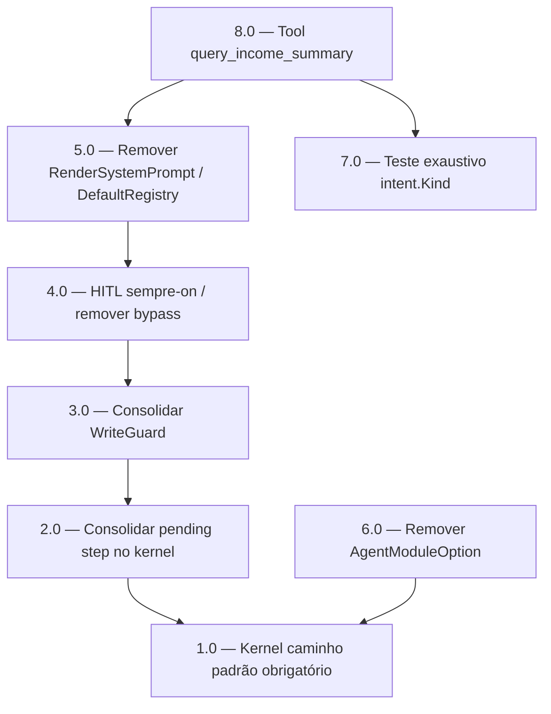

# Resumo das Tarefas de Implementação para Arquitetura do Agente — Consolidação Mastra/Workflows

## Metadados
- **Fonte (substitui PRD/Techspec):** `docs/plans/2026_06_24_arquitetura_agente_mastra_workflows_bounded_contexts.md`
- **PRD:** N/A — bundle derivado de plano arquitetural, não de PRD/techspec formal.
- **Especificação Técnica:** N/A — ver plano-fonte acima.
- **Total de tarefas:** 8
- **Tarefas paralelizáveis:** 6.0 e 7.0 (entre si e com a cadeia principal, após suas dependências).

## Tarefas

| # | Título | Status | Dependências | Paralelizável | Skills |
|---|--------|--------|-------------|---------------|--------|
| 1.0 | Estabelecer kernel como caminho padrão e obrigatório | done | — | — | go-implementation, mastra |
| 2.0 | Consolidar pending step no snapshot do kernel e deduplicar helpers | done | 1.0 | Não | go-implementation, mastra |
| 3.0 | Consolidar WriteGuard única no kernel | done | 2.0 | Não | go-implementation, mastra |
| 4.0 | HITL sempre-on: remover bypass sem confirmação e duplo caminho de tools | done | 3.0 | Não | go-implementation, mastra |
| 5.0 | Remover RenderSystemPrompt morto e consolidar DefaultRegistry na registry canônica | done | 4.0 | Não | go-implementation, mastra |
| 6.0 | Remover AgentModuleOption com dependências explícitas | done | 1.0 | Com 7.0 | go-implementation, mastra |
| 7.0 | Teste de regressão exaustivo dos intent.Kind | done | — | Com 6.0 | go-implementation |
| 8.0 | Implementar tool de leitura query_income_summary | done | 5.0, 7.0 | Não | go-implementation, mastra |

## Dependências Críticas
- **1.0 destrava 2.0/3.0/4.0:** enquanto `WorkflowKernelConfig.TransactionsWriteEnabled` puder ser `false` ou `confirmEngine` puder ser `nil`, o caminho legacy continua sendo fallback vivo — remover legacy sem 1.0 regride pending step (categoria), WriteGuard e HITL. 1.0 é pré-condição obrigatória.
- **Cadeia 2.0 → 3.0 → 4.0 → 5.0 é serial:** todas tocam `internal/agent/application/services/daily_ledger_agent.go` e/ou `agent_workflows.go`. Serializar evita conflito de merge e divergência de comportamento.
- **8.0 depende de 5.0 e 7.0:** 5.0 deixa a registry canônica como fonte única (a nova tool registra um kind novo via `routableKinds`/`buildRegistry`); 7.0 cria o teste exaustivo que 8.0 deve estender para o novo kind.
- **6.0 e 7.0 são independentes da cadeia de serviços:** 6.0 toca `module.go` + entrypoints (depende só de 1.0, que também toca `module.go`); 7.0 toca apenas `domain/intent` (sem dependência).

## Riscos de Integração
- **Plano-fonte não é PRD/techspec formal:** sem IDs `RF-nn`; a cobertura usa rótulos derivados do plano (PRE-KERNEL, ITEM-1..ITEM-6, TOOL-EX). `ai-spec sync-spec-hash`/`check-spec-drift` podem reportar ausência de `prd.md`/`techspec.md` — esperado; a rastreabilidade canônica é o plano.
- **Correção de escopo do Item 4 (armadilha):** "remover fallback legacy do HITL" NÃO significa remover `dispatchWriteDestructive`/`wireBudgetCommitGate` (são o caminho canônico atual). O alvo é o ramo de bypass (`confirmEngine == nil`) e o duplo caminho de execução dos tools de delete/edit. Remover as funções canônicas desliga o HITL e regride ADR-002.
- **`card_purchase` via `ForceCategory`:** ao remover o legacy de pending step (2.0), garantir que o `PersistFn` do kernel cobre o ramo `card_purchase` com `state.ForceCategory`; senão regride (ver `project_pending_step_generic`).
- **`parity_test.go` é a rede de segurança:** prova equivalência legacy×kernel — deve permanecer verde durante 2.0/3.0 e ser adaptado (não excluído) quando o legacy sair.
- **`onboardingLLM` é opcional por deployment:** `cmd/worker` não passa `WithOnboardingLLM`; em 6.0 ela deve virar parâmetro nullable explícito, nunca obrigatório (senão worker/e2e passam zero-value mascarado).
- **8 tarefas (≤10):** dentro do teto; a Task 1.0 é pré-requisito sintetizado dos achados de revisão, não micro-passo.

## Cobertura de Requisitos

| Tarefa | Requisitos cobertos (rótulos do plano) |
|--------|----------------------------------------|
| 1.0 | PRE-KERNEL (pré-condição implícita itens 2/3/4 — "quando o kernel for o caminho padrão") |
| 2.0 | ITEM-2 (Pending step legacy → consolidar no kernel; remover side-store) |
| 3.0 | ITEM-3 (WriteGuard duplicada → consolidar nos steps do kernel) |
| 4.0 | ITEM-4 (HITL legacy fallback → remover após testes de durabilidade) |
| 5.0 | ITEM-1 (RenderSystemPrompt não usado → remover; DefaultRegistry desatualizado → consolidar) |
| 6.0 | ITEM-5 (AgentModuleOption → avaliar e remover) |
| 7.0 | ITEM-6 (Testes de regressão do schema → adicionar) |
| 8.0 | TOOL-EX (Exemplo completo — nova tool de leitura query_income_summary, Passos 1–9) |

## Grafo de Dependencias

## Legenda de Status
- `pending`: aguardando execução
- `in_progress`: em execução
- `needs_input`: aguardando informação do usuário
- `blocked`: bloqueado por dependência ou falha externa
- `failed`: falhou após limite de remediação
- `done`: completado e aprovado
