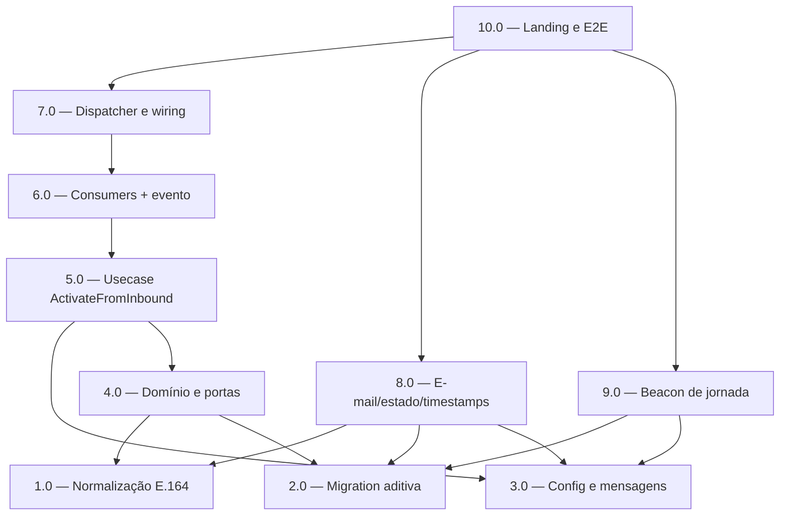

<!-- spec-hash-prd: 1f811a026ec03efc9d4fb146425f9642bebbbbbdac51b3db2336b1c909f5076d -->
<!-- spec-hash-techspec: 31cb5f5167ab2fa81ee08925fc656594d0f1cf45bd944beb41b773f859e28c04 -->
# Resumo das Tarefas de Implementação para Jornada de Ativação via WhatsApp

## Metadados
- **PRD:** `.specs/prd-ativacao-whatsapp/prd.md`
- **Especificação Técnica:** `.specs/prd-ativacao-whatsapp/techspec.md`
- **Total de tarefas:** 10
- **Tarefas paralelizáveis:** 1.0/2.0/3.0 (fundação); 4.0 com 8.0; 8.0 com 9.0

> Nota de skills: `go-implementation` e `object-calisthenics-go` têm `category: language` e são
> **auto-carregadas por detecção de diff** no `execute-task` (Stage 2). Por contrato da skill
> `create-tasks`, skills de linguagem/governança NÃO são declaradas na coluna `Skills` (fica `—`).
> Toda tarefa Go abaixo aplica obrigatoriamente `go-implementation` + DMMF (`domain-modeling.md`) e
> as regras `R-ADAPTER-001`, `R-DTO-VALIDATE-001`, `R-TESTING-001`, `R-TXN-004` conforme a techspec.

## Tarefas

| # | Título | Status | Dependências | Paralelizável | Skills |
|---|--------|--------|-------------|---------------|--------|
| 1.0 | Normalização E.164 única (`internal/platform/phone`) | done | — | Com 2.0, 3.0 | — |
| 2.0 | Migration aditiva (índice telefone, timestamps, throttle) | done | — | Com 1.0, 3.0 | — |
| 3.0 | Config e mensagens da jornada de ativação | done | — | Com 1.0, 2.0 | — |
| 4.0 | Domínio e portas (janela, query por telefone, throttle, concorrência) | done | 1.0, 2.0 | Com 8.0 | — |
| 5.0 | Usecase `ActivateFromInbound` + DTO `Validate()` | done | 3.0, 4.0 | Não | 5.0_execution_report.md |
| 6.0 | Consumers de ativação e boas-vindas + evento | done | 5.0 | Não | 6.0_execution_report.md |
| 7.0 | Dispatcher event-driven e wiring | done | 6.0 | Não | — |
| 8.0 | E-mail para `/ativar`, estado do token e timestamps server-side | done | 1.0, 2.0, 3.0 | Com 4.0 | 8.0_execution_report.md |
| 9.0 | Beacon de jornada (`page_opened`/`whatsapp_opened`) | done | 2.0, 3.0 | Com 8.0 | — |
| 10.0 | Landing (sem Telegram + beacon) e E2E ponta a ponta | done | 7.0, 8.0, 9.0 | Não | — |

## Dependências Críticas
- **1.0 (normalização)** destrava 4.0 (query por telefone) e 8.0 (link `wa.me`): telefone Kiwify e `msg.From` Meta precisam do mesmo formato E.164.
- **2.0 (migration)** é pré-requisito de 4.0 (índice + tabela throttle), 8.0 (`email_sent_at`/`activation_started_at`) e 9.0 (`page_opened_at`/`whatsapp_opened_at`).
- **3.0 (config)** alimenta a janela de 24h (4.0/5.0), os textos de no-match/boas-vindas (5.0/6.0) e a base-URL da página (8.0).
- Núcleo sequencial **5.0 → 6.0 → 7.0**: usecase, depois consumers (que registram o evento), depois o dispatcher que publica o evento e o wiring.
- **10.0** fecha a jornada e só roda após 7.0/8.0/9.0.

## Riscos de Integração
- **Concorrência multi-instância** na ativação: `UpdateMarkConsumed` deve checar `RowsAffected==0` → `AlreadyActive` (tarefa 4.0), senão dois eventos publicam `subscription_bound` em duplicidade.
- **Cutover de e-mails em voo**: o consumer (6.0) deve aceitar transicionalmente token no texto (com/sem `ATIVAR`) enquanto tokens antigos não expiram; o dispatcher (7.0) já remove o ramo `ATIVAR`.
- **Evento sem usuário**: `onboarding.activation.attempted.v1` precisa entrar em `noUserEventAllowlist` (6.0), senão o outbox rejeita.
- **Boas-vindas desacopladas**: `WelcomeConsumer` (6.0) consome `onboarding.subscription_bound`; idempotência por event id evita mensagem dupla em reentrega.
- **Limitação conhecida (fora de escopo)**: após a ativação, a próxima mensagem roteia ao `weather-agent` (único registrado); a boas-vindas promete "assistente financeiro". Documentado na techspec; resolver quando o agente financeiro existir.
- **Deploy**: backend primeiro (inclui o endpoint beacon), landing depois; a página atual consome `wa_me_url` as-is, então não quebra.
- **Total de 10 tarefas**: dentro do teto padrão; nenhuma justificativa de expansão necessária.

## Cobertura de Requisitos

| Tarefa | Requisitos cobertos |
|--------|-------------------|
| 1.0 | RF-07, RF-21 |
| 2.0 | RF-23, RF-24, RF-35 |
| 3.0 | RF-10, RF-24, RF-29 |
| 4.0 | RF-08, RF-09, RF-10, RF-23, RF-25, RF-27 |
| 5.0 | RF-20, RF-22, RF-23, RF-24, RF-26, RF-30, RF-31, RF-36, RF-37 |
| 6.0 | RF-25, RF-27, RF-28, RF-32, RF-33, RF-34 |
| 7.0 | RF-18, RF-25, RF-29 |
| 8.0 | RF-06, RF-11, RF-12, RF-13, RF-14, RF-16, RF-17, RF-19, RF-29, RF-35 |
| 9.0 | RF-35 |
| 10.0 | RF-01, RF-02, RF-03, RF-04, RF-05, RF-15, RF-34 |

## Grafo de Dependencias

## Legenda de Status
- `pending`: aguardando execução
- `in_progress`: em execução
- `needs_input`: aguardando informação do usuário
- `blocked`: bloqueado por dependência ou falha externa
- `failed`: falhou após limite de remediação
- `done`: completado e aprovado
