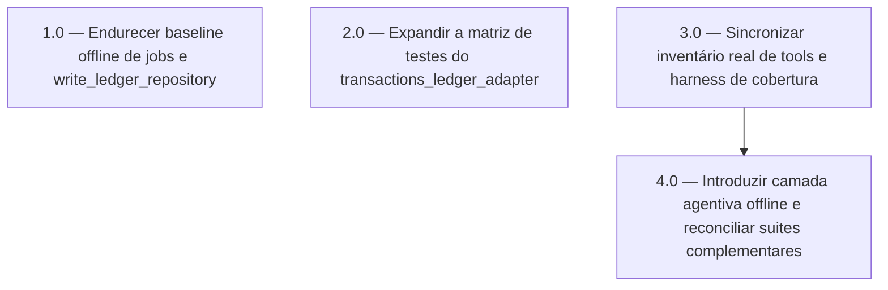

<!-- spec-hash-prd: c1abc3c8be24b9e5faaaf7b0f8db62062550ea9b22f65c11132551cf68fe2b0d -->
<!-- spec-hash-techspec: 8903e76eb93a4a74441e4e0cc0f0f28debdf29b2ad3f485fe4efdbf64acf722c -->
# Resumo das Tarefas de Implementação para Auditoria de Testes de `internal/agents`

## Metadados
- **PRD:** `.specs/prd-auditoria-testes-internal-agents/prd.md`
- **Especificação Técnica:** `.specs/prd-auditoria-testes-internal-agents/techspec.md`
- **Total de tarefas:** 4
- **Tarefas paralelizáveis:** `1.0, 2.0, 3.0`

## Tarefas

<!-- Colunas e formato canônico (MANDATÓRIO):
     - `#`: id decimal `X.Y` (sempre X.0 para tarefas de topo).
     - `Status`: ^(pending|in_progress|needs_input|blocked|failed|done)$
     - `Dependências`: ^(—|\d+\.\d+(,\s*\d+\.\d+)*)$  (em-dash unicode quando vazio)
     - `Paralelizável`: ^(—|Não|Com\s+\d+\.\d+(,\s*\d+\.\d+)*)$
     - `Skills`: skills processuais extras (descoberta agnóstica em `.agents/skills/`). Use `—` quando
       não houver. Nunca listar skills auto-carregadas (governance/linguagem) nem `*-implementation`.
     - `Fase` (OPCIONAL): inteiro positivo para agrupamento visual de fases de entrega. Pode ser
       omitida em PRDs pequenos; `execute-all-tasks` não consome esta coluna. Se incluída, mantenha
       em todas as linhas para não quebrar o parser de tabela markdown. -->

| # | Título | Status | Dependências | Paralelizável | Skills |
|---|--------|--------|-------------|---------------|--------|
| 1.0 | Endurecer baseline offline de jobs e `write_ledger_repository` | pending | — | Com 2.0, 3.0 | — |
| 2.0 | Expandir a matriz de testes do `transactions_ledger_adapter` | pending | — | Com 1.0, 3.0 | — |
| 3.0 | Sincronizar inventário real de tools e harness de cobertura | pending | — | Com 1.0, 2.0 | mastra |
| 4.0 | Introduzir camada agentiva offline e reconciliar suites complementares | pending | 3.0 | Não | mastra |

## Dependências Críticas
- `4.0` depende de `3.0` porque a camada agentiva offline precisa partir do inventário real de tools e do harness corrigido para evitar cristalizar um denominador errado.
- `1.0`, `2.0` e `3.0` podem ser executadas em paralelo porque possuem write sets distintos e gates independentes.

## Riscos de Integração
- Misturar inventário de tools com camada agentiva offline na mesma fase esconderia drift estrutural de cobertura; por isso `3.0` fecha primeiro a fonte de verdade.
- Os testes offline de `write_ledger_repository` devem validar SQL e erros tipados sem substituir a suíte `integration`.
- A camada agentiva offline deve usar `.mockery.yaml` e o padrão `testify/suite` + cenários table-driven quando houver mocks, evitando scorers permissivos ou inspeção apenas de prompt.

## Cobertura de Requisitos

| Tarefa | Requisitos cobertos |
|--------|-------------------|
| 1.0 | RF-01, RF-02, RF-03, RF-12 |
| 2.0 | RF-04, RF-05, RF-12 |
| 3.0 | RF-06, RF-07, RF-08, RF-12 |
| 4.0 | RF-09, RF-10, RF-11, RF-12 |

## Grafo de Dependencias

## Legenda de Status
- `pending`: aguardando execução
- `in_progress`: em execução
- `needs_input`: aguardando informação do usuário
- `blocked`: bloqueado por dependência ou falha externa
- `failed`: falhou após limite de remediação
- `done`: completado e aprovado
