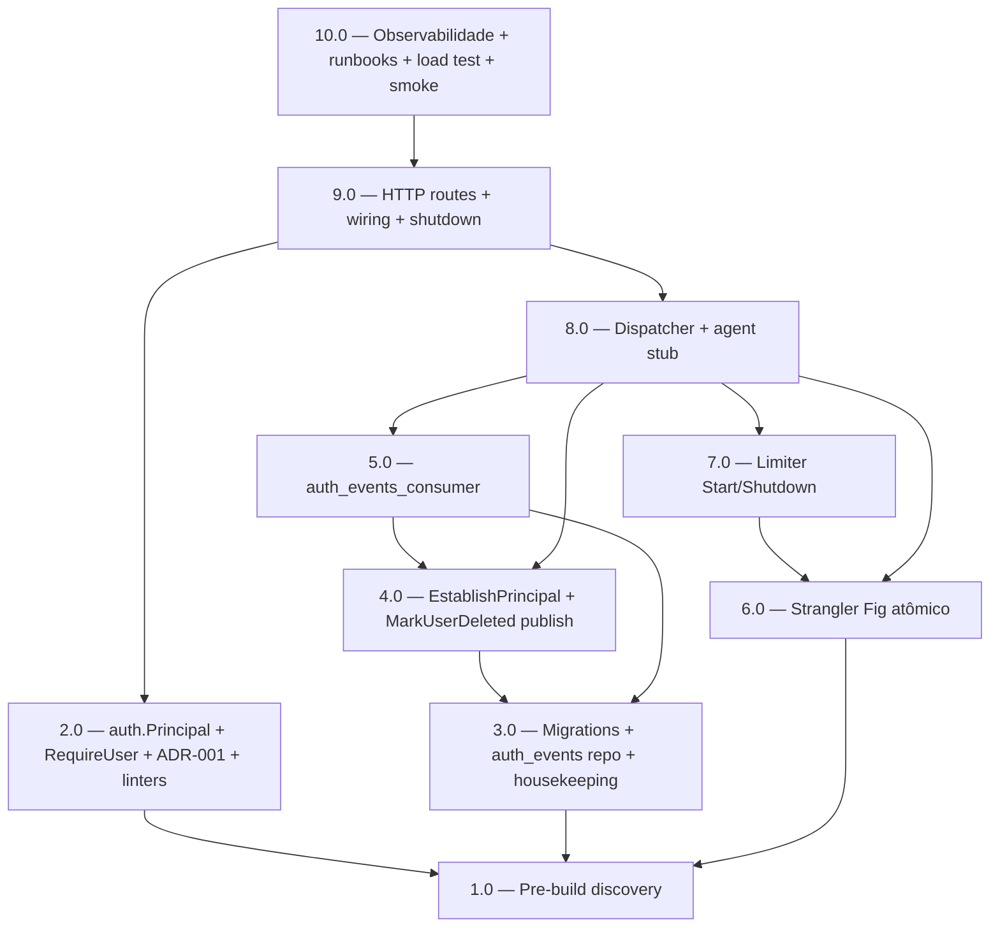

<!-- spec-hash-prd: 98ea00ae8ca6f9f82e92cd0bd459fd85952a5d7c1ca346e376ddc3c251b0066b -->
<!-- spec-hash-techspec: dcf036d83ba85cce384e5fb2c38738986f4c44b4d9c3cf092c7448ccee4f74a9 -->
# Resumo das Tarefas de Implementação para Fundação de Autenticação e Autorização

## Metadados
- **PRD:** `.specs/prd-auth-foundation/prd.md`
- **Especificação Técnica:** `.specs/prd-auth-foundation/techspec.md`
- **ADRs:** `adr-001-principal-contract-and-future-http-boundary.md`, `adr-002-strangler-fig-onboarding-whatsapp.md`
- **Total de tarefas:** 10
- **Tarefas paralelizáveis:** 2.0 ∥ 3.0 ∥ 6.0 (após 1.0)

## Tarefas

| # | Título | Status | Dependências | Paralelizável | Skills |
|---|--------|--------|-------------|---------------|--------|
| 1.0 | Pre-build discovery (framework, headers, config, user.deleted publish) | pending | — | — | — |
| 2.0 | auth.Principal + RequireUser + ADR-001 + .golangci.yml (depguard/forbidigo) | pending | 1.0 | Com 3.0, 6.0 | — |
| 3.0 | Migrations 0014/0015 + auth_events repository (UUID v7) + housekeeping job | pending | 1.0 | Com 2.0, 6.0 | — |
| 4.0 | EstablishPrincipal + TryFindActiveByWhatsApp + MarkUserDeleted publica user.deleted | pending | 3.0 | Não | — |
| 5.0 | auth_events_consumer (projeção idempotente + anonimização) | pending | 3.0, 4.0 | Não | — |
| 6.0 | Strangler Fig atômico — internal/platform/whatsapp + migra onboarding + ADR-002 | pending | 1.0 | Com 2.0, 3.0 | — |
| 7.0 | whatsapp.ratelimit.Limiter (Start/Shutdown via module.go) + race + bench | pending | 6.0 | Não | — |
| 8.0 | whatsapp.dispatcher.Dispatcher + agent stub + integração end-to-end | pending | 4.0, 5.0, 6.0, 7.0 | Não | — |
| 9.0 | HTTP routes + wiring module.go + cmd/api/main.go shutdown order + cross-PRD bumps | pending | 2.0, 8.0 | Não | — |
| 10.0 | Observabilidade + runbooks + Grafana + load test k6 + task auth:smoke | pending | 9.0 | Não | taskfile-production, otel-grafana-dashboards |

## Dependências Críticas
- **1.0 → todas**: as descobertas de framework de teste, headers atualmente lidos, pacote canônico de config e estado do publish de `user.deleted` em `MarkUserDeleted` são pré-requisitos para qualquer codificação.
- **3.0 → 4.0, 5.0**: schema e repositório precisam existir antes do usecase e consumer.
- **4.0 + 5.0 + 6.0 + 7.0 → 8.0**: dispatcher integra usecase + consumer + platform/whatsapp + ratelimit.
- **8.0 → 9.0**: rotas HTTP só wiream quando o pipeline interno está fechado.
- **9.0 → 10.0**: observabilidade/load test/smoke pressupõem rotas servindo.
- **6.0 é PR único atômico (RF-28)**: criação dos novos pacotes + migração do onboarding + deleção dos arquivos antigos + bump de `prd-onboarding-magic-token` em um único PR, conforme ADR-002.

## Riscos de Integração
- **Strangler Fig (6.0)**: risco mais alto. Suíte existente `meta_signature_test.go` MUST ser movida intacta; integration test do webhook em pre-merge é obrigatório; `task onboarding:smoke` (criar se ausente) cobre fluxo end-to-end de ativação para detectar regressão.
- **Linter ampla (2.0)**: pode quebrar CI ao mergear se handlers atuais leem headers fora da allowlist. Mitigação: 1.0 (PRE-02) audita previamente e amplia allowlist com justificativa.
- **Race no Limiter (7.0)**: bucket creation race tratado por `sync.Map.LoadOrStore`; CAS loop em `tryConsume`. Race detector obrigatório.
- **Outbox `MarkUserDeleted` publish (4.0)**: se a publicação atual estiver ausente, adicionar pode introduzir regressão em testes do prd-identity-foundation. Mitigação: rodar suíte completa de identity após mudança; cobertura por integration test.
- **Shutdown order (9.0)**: errar a ordem em `cmd/api/main.go` vaza eventos in-flight ou trava em rede. Mitigação: ordem canônica documentada na techspec; integration test do graceful shutdown.
- **k6 load test (10.0)**: requer staging com PG real e secret Meta configurado; sem isso, gate de release não fecha.

## Cobertura de Requisitos

| Tarefa | Requisitos cobertos |
|--------|-------------------|
| 1.0 | — (preparatório — informa decisões de implementação das demais) |
| 2.0 | RF-01, RF-02, RF-12, RF-13, RF-14, RF-23, RF-27 |
| 3.0 | RF-09, RF-22, RF-24, RF-33, RF-36 |
| 4.0 | RF-03, RF-26, RF-34 |
| 5.0 | RF-10, RF-11 |
| 6.0 | RF-04, RF-05, RF-28, RF-31 |
| 7.0 | RF-07, RF-08, RF-32 |
| 8.0 | RF-06, RF-35 |
| 9.0 | RF-21, RF-25 |
| 10.0 | RF-15, RF-16, RF-17, RF-18, RF-19, RF-20, RF-29, RF-30 |

## Grafo de Dependencias

## Legenda de Status
- `pending`: aguardando execução
- `in_progress`: em execução
- `needs_input`: aguardando informação do usuário
- `blocked`: bloqueado por dependência ou falha externa
- `failed`: falhou após limite de remediação
- `done`: completado e aprovado
