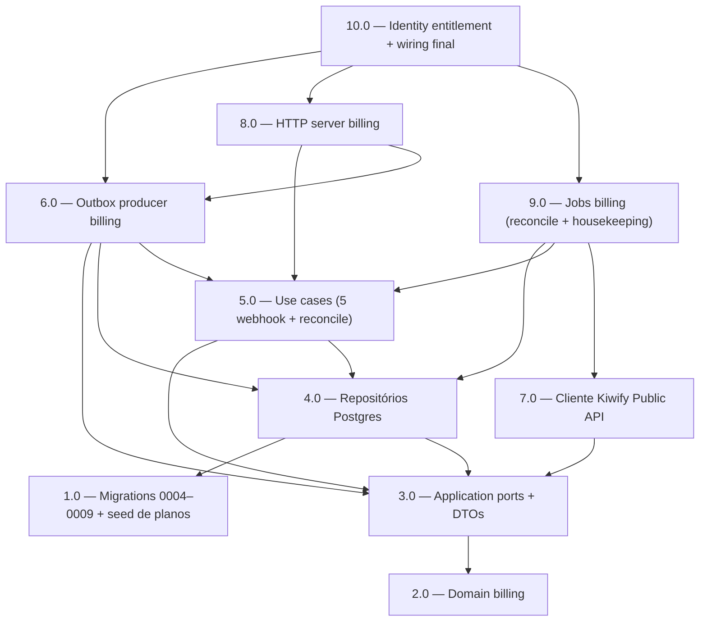

<!-- spec-hash-prd: d4dd551c624b11b0e588deefb020ee94e4baadd9b283366cfccde1fa19345a6b -->
<!-- spec-hash-techspec: dbc9a411ac6484d97fe99726c2501947609c44606f88cccbc2afaabf2720f967 -->
# Resumo das Tarefas de Implementação para Billing Pipeline (E2)

## Metadados
- **PRD:** `.specs/prd-billing-pipeline/prd.md`
- **Especificação Técnica:** `.specs/prd-billing-pipeline/techspec.md`
- **Total de tarefas:** 10
- **Tarefas paralelizáveis:** 1.0↔2.0, 4.0/5.0/6.0↔7.0, 8.0↔9.0

## Tarefas

| # | Título | Status | Dependências | Paralelizável | Skills |
|---|--------|--------|--------------|---------------|--------|
| 1.0 | Migrations 0004–0009 + seed de planos | done | — | Com 2.0 | — |
| 2.0 | Domain billing: agregado Subscription, value objects e tabela de transições | done | — | Com 1.0 | — |
| 3.0 | Application ports + DTOs billing (interfaces consumer-defined) | done | 2.0 | — | — |
| 4.0 | Repositórios Postgres billing | done | 1.0, 3.0 | Com 7.0 | — |
| 5.0 | Use cases billing (5 webhook + reconcile) | done | 3.0, 4.0 | Com 7.0 | — |
| 6.0 | Outbox producer billing: publisher + structs de evento | pending | 3.0, 4.0, 5.0 | Com 7.0 | — |
| 7.0 | Cliente Kiwify Public API (OAuth + rate limit + retry) | done | 3.0 | Com 4.0, 5.0, 6.0 | — |
| 8.0 | HTTP server billing: router, handler, middleware HMAC e raw_body | pending | 5.0, 6.0 | Com 9.0 | — |
| 9.0 | Jobs billing: reconciliação horária e housekeeping de kiwify_events | pending | 4.0, 5.0, 7.0 | Com 8.0 | — |
| 10.0 | Identity entitlement (read model, projector, DecideUserEntitlement) e wiring final em cmd/server, cmd/worker e billing.NewBillingModule | pending | 6.0, 8.0, 9.0 | — | — |

## Dependências Críticas

- **1.0 → 4.0:** sem migrations não há schema para os repositórios; tooling de migração deve estar verde antes de qualquer integ test.
- **2.0 → 3.0 → 4.0/5.0/6.0:** ports só podem ser declaradas após os tipos de domínio existirem; repositórios e use cases só implementam contratos já fixados.
- **4.0 + 5.0 + 6.0 → 8.0:** o handler precisa de UoW com `processed_events`, `subscriptions` e `outbox.Publisher` participando da mesma transação.
- **5.0 + 7.0 → 9.0:** o job de reconciliação reusa o mesmo use case do webhook e depende do cliente Kiwify configurado com OAuth + rate limit.
- **6.0 + 8.0 + 9.0 → 10.0:** wiring final exige que producer outbox, router HTTP e jobs estejam prontos; identity projector é o último consumidor do contrato.
- **Wiring ordenado no worker (Tarefa 10.0):** `identityModule.EventHandlers` precisa ser registrado em `events.Dispatcher` ANTES de `outbox.DispatcherJob` iniciar, para evitar race entre publish billing e consumer identity.

## Riscos de Integração

- **L-01 — HMAC suposto (ADR-002):** o algoritmo de assinatura da Public API Kiwify não está documentado. Tarefa 8.0 implementa HMAC-SHA256 sobre `raw_body` como decisão técnica; rotação via `KIWIFY_WEBHOOK_SECRET_NEXT` absorve correção futura. Validação em sandbox é gate pré-execução, não pré-tarefa.
- **L-03 — campo do funnel token (`tracking.s1` vs `src`):** isolado em uma única função `extractFunnelToken(payload)` na Tarefa 5.0 para troca cirúrgica caso o sandbox aponte campo diferente.
- **Cross-module via `events.Dispatcher` in-process:** falha persistente do projector identity marca row outbox como `failed` (ADR-003); runbook em techspec §9.4. Ordem de registro no worker é gate explícito da Tarefa 10.0.
- **`internal/billing/module.go` e `routes.go` existem como placeholders vazios:** Tarefa 10.0 (módulo) e Tarefa 8.0 (router) sobrescrevem os placeholders seguindo o padrão `IdentityModule`. Nenhuma tarefa pode assumir wiring já existente.
- **`KiwifyEventsHousekeepingJob` (retention 90d, ADR-008) é operacional/LGPD-básico, sem RF explícito.** Incluído na Tarefa 9.0 porque techspec §6.7 + ADR-008 declaram `billing_kiwify_events` raw como necessário para auditoria; sem retention, viola LGPD básica herdada do MVP.
- **RF-19 (sweep 90d full + dashboard MRR/churn) e RF-21 (whitelist de comandos administrativos)** são intencionalmente fora deste PRD (E4 e E3, respectivamente). Cobertos por reconhecimento de não-implementação na Tarefa 10.0; nenhuma subtarefa de código aberta para eles.
- **`NotificationSender` permanece stub no-op no MVP** (Q-01 / techspec §11.4): a interface vive na Tarefa 3.0 e o handler best-effort na Tarefa 10.0. Implementação concreta WhatsApp é responsabilidade de E3/E5 e está explicitamente fora do escopo.
- **Decisões abertas Q-02 (graça uniforme 3d) e Q-03 (refund parcial = REFUNDED total)** travadas no PRD em 2026-06-05; refletidas como invariantes na Tarefa 2.0 e Tarefa 5.0. Mudanças futuras exigem novo PRD/techspec.

## Cobertura de Requisitos

| Tarefa | Requisitos cobertos |
|--------|---------------------|
| 1.0 | RF-02, RF-04, RF-11, RF-16, RF-17 |
| 2.0 | RF-04, RF-05, RF-06, RF-07, RF-08, RF-09, RF-12 |
| 3.0 | RF-10, RF-13, RF-18, RF-20 |
| 4.0 | RF-11, RF-12, RF-17, RF-18 |
| 5.0 | RF-03, RF-06, RF-09, RF-10, RF-11, RF-12 |
| 6.0 | RF-10, RF-11 |
| 7.0 | RF-18 |
| 8.0 | RF-01, RF-03, RF-10 |
| 9.0 | RF-18 |
| 10.0 | RF-05, RF-06, RF-07, RF-08, RF-13, RF-14, RF-15, RF-16, RF-19 (out-of-scope), RF-20, RF-21 (out-of-scope) |

## Grafo de Dependencias

## Legenda de Status
- `pending`: aguardando execução
- `in_progress`: em execução
- `needs_input`: aguardando informação do usuário
- `blocked`: bloqueado por dependência ou falha externa
- `failed`: falhou após limite de remediação
- `done`: completado e aprovado
