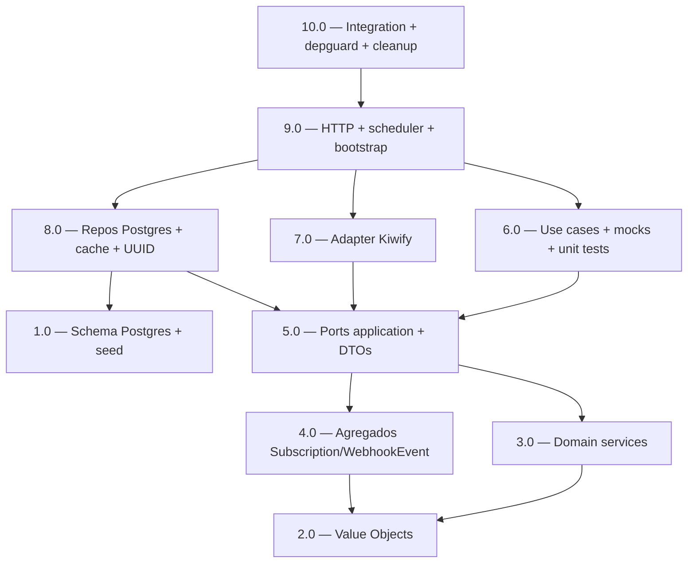

<!-- spec-hash-prd: 3836b94a299ee31b4c11e530b2d28022d302dd5225799e7bd46710ce3040d950 -->
<!-- spec-hash-techspec: 87713a4274498b15f2e658646b936fdbf5a88b808ffc04b35741a3e6262fbcda -->
# Resumo das Tarefas de Implementação para Billing Pipeline

## Metadados
- **PRD:** `.specs/prd-billing-pipeline/prd.md`
- **Especificação Técnica:** `.specs/prd-billing-pipeline/techspec.md`
- **Total de tarefas:** 10
- **Tarefas paralelizáveis:** 1.0 ‖ 2.0; 3.0 ‖ 4.0; 6.0 ‖ 7.0

## Tarefas

| # | Título | Status | Dependências | Paralelizável | Skills |
|---|--------|--------|--------------|---------------|--------|
| 1.0 | Schema Postgres `0009_billing_schema` + seed `0010_billing_plans` | done | — | Com 2.0 | — |
| 2.0 | Value Objects do domínio (PlanCode, BillingPeriod, SubscriptionStatus, CanonicalEventType, TransitionReason, ExternalEventID, ExternalSubscriptionID, MoneyBRL, WebhookEventID) | done | — | Com 1.0 | — |
| 3.0 | Domain services: StateMachine + CanonicalEvent + CanonicalSubscription + PeriodChange | done | 2.0 | Com 4.0 | — |
| 4.0 | Agregados Subscription + WebhookEvent + errors + satisfação de identity.Subscription | done | 2.0 | Com 3.0 | — |
| 5.0 | Ports application (6 interfaces) + DTOs input/output | done | 3.0, 4.0 | — | — |
| 6.0 | Use cases finos + mocks via mockery + unit tests table-driven | done | 5.0 | Com 7.0 | — |
| 7.0 | Adapter Kiwify (HTTP client + OAuth + signature verifier + payload mapper + PII redactor) | done | 5.0 | Com 6.0 | — |
| 8.0 | Repositórios Postgres (FOR UPDATE) + cache LRU + UUID generator + mapper | done | 1.0, 5.0 | — | — |
| 9.0 | HTTP handler + chiserver.Router + WithRouteTimeout + scheduler + outbox registrar + bootstrap | done | 6.0, 7.0, 8.0 | — | — |
| 10.0 | Integration tests + depguard + drift cleanup + cobertura final | done | 9.0 | — | — |

## Dependências Críticas

- **1.0** (schema) bloqueia **8.0** (adapter precisa das tabelas reais) e **10.0** (integração via testcontainers aplica todas as migrations).
- **2.0** (VOs) bloqueia **3.0**, **4.0** e **5.0** — assinaturas das ports/services consomem tipos dos VOs.
- **3.0 + 4.0** (domain) bloqueiam **5.0** (ports referenciam entidades).
- **5.0** (ports) bloqueia **6.0** (use cases consomem) e **7.0** (adapter implementa) e **8.0** (repos implementam).
- **6.0 + 7.0 + 8.0** bloqueiam **9.0** (bootstrap wireia tudo).
- **9.0** bloqueia **10.0** (gate final: testes E2E + drift + cobertura).
- **Cross-PRD:** execução de qualquer tarefa exige `prd-identity-foundation` com `status: implemented`. Validação pré-execução em hook `pre-execute-all-tasks.sh` (importa `identity.entities.User`, `identity.valueobjects.WhatsAppNumber`, `identity.UserRepository`, `identity.EntitlementChecker`, `identity.Subscription`).

## Riscos de Integração

- **Drift VO ↔ Mapper** (2.0 ↔ 8.0): se assinatura de `NewBillingPeriodFor` ou `ParsePlanCode` mudar após 8.0 iniciar, mapper precisa rerun do test.
- **Drift Port ↔ Use Case ↔ Mock** (5.0 ↔ 6.0): mudança em `SubscriptionRepository.FindActiveByUserIDForUpdate` força regenerar mocks (`mockery --config .mockery.yml`) e atualizar tabelas de teste.
- **Drift CanonicalEvent ↔ PayloadMapper** (3.0 ↔ 7.0): adicionar campo em `CanonicalEvent` exige atualizar `kiwify.PayloadMapper.Parse`.
- **Identity dependency** (E1): 4.0, 5.0, 6.0, 7.0 importam tipos de `identity/domain` e port `UserRepository`; se E1 ainda não tiver materializado os artefatos da techspec, build quebra. Pré-execução valida com `go build ./internal/identity/...`.
- **Outbox runtime** (9.0): registro de handler em `outbox.Registry` deve ocorrer **antes** do `Dispatcher.Start` no bootstrap; ordem invertida resulta em event_type `billing.kiwify.received` sem subscription, eventos vão direto a DLQ.
- **mockery v2 sync** (6.0): técspec foi corrigida de v3 → v2.53.6; comando é `mockery --config .mockery.yml --dry-run` (não `mockery/v3`).
- **`chiserver.Router` reuse** (9.0): ADR-002 revisado usa contrato existente em `devkit-go`; alteração em `internal/platform/http/server.go` deve preservar comportamento atual (Deps.Registrars nil-safe).
- **Testes de integração lentos** (10.0): testcontainers + 4 tabelas + outbox runtime. Mitigação: SetupSuite aplica migrations uma vez; SetupTest faz TRUNCATE CASCADE.

## Cobertura de Requisitos

| Tarefa | Requisitos cobertos |
|--------|---------------------|
| 1.0 | RF-10, RF-11, RF-12, RF-13, RF-14, RF-15, RF-48 |
| 2.0 | RF-16 (VOs), RF-19, RF-30 (parsing tracking — preparação) |
| 3.0 | RF-17, RF-17a, RF-18 (contrato consumido), RF-20 (delegação ao state machine) |
| 4.0 | RF-16 (aggregate), RF-17a (chargeback), RF-20 (Subscription.ApplyEvent), RF-25 (verificação stale no aggregate) |
| 5.0 | Definição de interfaces consumidas em RF-21..27, RF-32..36, RF-37..41, RF-49..52 |
| 6.0 | RF-04, RF-05, RF-21, RF-22, RF-23, RF-24, RF-25, RF-26, RF-27, RF-32, RF-33, RF-34, RF-35, RF-37, RF-38, RF-39, RF-40, RF-41, RF-49, RF-51, RF-52 |
| 7.0 | RF-02, RF-03, RF-28, RF-29, RF-30, RF-31, RF-31a, RF-31b |
| 8.0 | RF-12 (impl pgx), RF-13 (impl), RF-14 (impl), RF-22 (impl idempotência), RF-36 (LRU), RF-50 (anonimização SQL) |
| 9.0 | RF-01, RF-06, RF-07, RF-08, RF-09, RF-44, RF-46, RF-47 |
| 10.0 | RF-42, RF-43, RF-45 + CA-01..12 (validação consolidada) |

## Grafo de Dependencias

## Legenda de Status
- `pending`: aguardando execução
- `in_progress`: em execução
- `needs_input`: aguardando informação do usuário
- `blocked`: bloqueado por dependência ou falha externa
- `failed`: falhou após limite de remediação
- `done`: completado e aprovado
