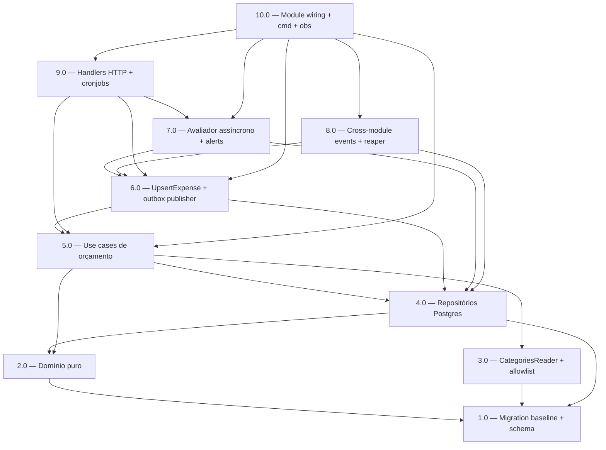

<!-- spec-hash-prd: f50a99a3576147e2f2366a8bbff0a347f0fc42d24307dfbf90d7fecbbcf9ae69 -->
<!-- spec-hash-techspec: c42a8796092160b4352d0ef6f267f62c78a6da15d10f5348d9d5d8cc5988c669 -->
# Resumo das Tarefas de Implementação para Módulo de Orçamentos Mensais (`internal/budgets`)

## Metadados
- **PRD:** `.specs/prd-budgets-monthly/prd.md`
- **Especificação Técnica:** `.specs/prd-budgets-monthly/techspec.md`
- **Total de tarefas:** 10
- **Tarefas paralelizáveis:** 2.0 ‖ 3.0; 7.0 ‖ 8.0

## Tarefas

| # | Título | Status | Dependências | Paralelizável | Skills |
|---|--------|--------|-------------|---------------|--------|
| 1.0 | Migration baseline + schema budgets (6 tabelas + índices) | done | — | — | — |
| 2.0 | Domínio puro: entities, valueobjects e services | done | 1.0 | Com 3.0 | object-calisthenics-go |
| 3.0 | CategoriesReader cross-module + cache + allowlist de produtores | done | 1.0 | Com 2.0 | — |
| 4.0 | Repositórios Postgres + integration tests com testcontainers | done | 1.0, 2.0 | — | — |
| 5.0 | Use cases de orçamento + auto-draft + recorrência | done | 2.0, 3.0, 4.0 | — | — |
| 6.0 | Use cases de despesa + outbox publisher + soft-delete | done | 4.0, 5.0 | — | — |
| 7.0 | Avaliação assíncrona de alerta + consumer interno + ListAlerts | done | 4.0, 6.0 | Com 8.0 | — |
| 8.0 | Eventos cross-module + pending events reaper job | done | 4.0, 6.0 | Com 7.0 | — |
| 9.0 | Handlers HTTP + router + cronjobs operacionais + retention purge | done | 5.0, 6.0, 7.0 | — | postman-collection-generator |
| 10.0 | Module wiring + cmd integration + OpenAPI + observabilidade + smoke load | done | 5.0, 6.0, 7.0, 8.0, 9.0 | — | otel-grafana-dashboards |

## Dependências Críticas

- **1.0 (schema)** bloqueia tudo. Sem as 6 tabelas (`budgets`, `budgets_allocations`, `budgets_expenses`, `budgets_alerts`, `budgets_threshold_states`, `budgets_expense_events_pending`) com índices RT-29 nenhum repositório integra.
- **3.0 (CategoriesReader)** bloqueia 5.0 e 6.0: validação de raízes/subcategorias é pré-condição de qualquer mutação (RF-04d, RT-23, RT-31). Falha de resolução no boot interrompe startup do módulo.
- **4.0 (repositórios)** bloqueia 5.0, 6.0, 7.0, 8.0: use cases consomem `database.DBTX` direto via `uow.UnitOfWork[T]` mas precisam dos repositórios concretos.
- **6.0 (UpsertExpense + outbox publisher)** bloqueia 7.0 e 8.0: o consumer interno só pode consumir `budgets.expense.committed.v1` quando o publisher já existir; o reaper de pendentes depende do mesmo caminho de aplicação canônico.
- **10.0 (wiring final)** depende de tudo — é a única tarefa que altera `cmd/server/server.go`, `cmd/worker/worker.go` e `configs/`. Sem ela o módulo não sobe.

## Riscos de Integração

- **Drift `prd.md` ↔ `techspec.md`**: spec-hashes injetados nas duas primeiras linhas; rodar `ai-spec check-spec-drift` antes de qualquer execução de tarefa downstream.
- **Coordenação cross-module com `internal/categories`**: o `CategoriesReader` exige expor `ResolveBySlug` (e talvez `ValidateSubcategory`) como use case em `CategoriesModule`. Se essa entrega não existir, 3.0 fica em `blocked` até a coordenação ser fechada.
- **`uow.UnitOfWork[T]` do devkit-go**: 5.0/6.0/7.0/8.0 devem espelhar exatamente o padrão de `internal/billing/application/usecases/process_*` — não introduzir `TxRunner` local.
- **Outbox compartilhado**: o `event.ID` é a única garantia de idempotência at-least-once do consumer interno (RT-24). Cuidado em 7.0 para não duplicar lógica de dedup que já é responsabilidade de `internal/platform/outbox`.
- **Pico de retroativos durante adoção**: M-09 / RF-61 limitam alertas a 10 por tupla — confirmar via integration test (8.0/7.0) que o caminho retroativo não consome cota de competência corrente.
- **Limite de 10 tarefas atingido**: justificado pela alta complexidade (125 RFs + 31 RTs + 5 ADRs). Consolidar abaixo de 10 misturaria preocupações (ex.: consumer interno com handlers HTTP). 10 fatias coerentes mantém revisão objetiva por PR.

## Cobertura de Requisitos

| Tarefa | Requisitos cobertos |
|--------|-------------------|
| 1.0 | RF-44, RF-47b, RF-60e, RF-64a, RF-39a, RT-04, RT-10, RT-27, RT-29 |
| 2.0 | RF-04a, RF-05, RF-06, RF-07a, RF-07b, RF-10, RF-11, RF-11a, RF-25a, RF-25b, RF-25c, RF-29c, RF-33, RF-41, RF-52, RF-52a, RF-59, RF-60, RF-60a, RF-60b, RT-04, RT-19, RT-26, RT-27 |
| 3.0 | RF-04, RF-04b, RF-04c, RF-04d, RF-04e, RF-31, RF-32a, RF-32b, RF-32c, RF-72, RF-72a, RT-05, RT-14, RT-18, RT-23, RT-28, RT-31 |
| 4.0 | RF-02, RF-29c, RF-29d, RF-29e, RF-42, RF-43, RF-44, RF-45, RF-47, RF-47a, RF-47b, RF-60e, RF-60f, RF-64a, RF-39a, RT-29 |
| 5.0 | RF-01, RF-03, RF-04, RF-07, RF-08, RF-09, RF-09a, RF-09b, RF-09c, RF-09d, RF-12, RF-12a, RF-12b, RF-13, RF-14, RF-15, RF-16, RF-17, RF-19, RF-20, RF-21, RF-21a, RF-21b, RF-22, RF-23, RF-23a, RF-24, RT-11, RT-13 |
| 6.0 | RF-25, RF-25c, RF-25d, RF-26, RF-27, RF-27a, RF-28, RF-29, RF-29a, RF-29b, RF-29c, RF-29d, RF-29e, RF-30, RF-31, RF-40, RF-41, RF-44, RF-45, RF-46, RF-47, RF-47a, RF-47b, RT-15, RT-21, RT-22, RT-24, RT-26 |
| 7.0 | RF-55, RF-56, RF-56a, RF-56b, RF-57, RF-58, RF-59, RF-60, RF-60a, RF-60b, RF-60c, RF-60d, RF-60e, RF-60f, RF-61, RF-61a, RF-62, RF-63, RF-64, RF-64a, RF-64b, RF-64c, RF-64d, RT-21, RT-24 |
| 8.0 | RF-32, RF-32a, RF-32b, RF-32c, RF-33, RF-34, RF-35, RF-36, RF-36a, RF-37, RF-38, RF-39, RF-39a, RF-39c, RF-40, RF-41, RT-15, RT-16, RT-30 |
| 9.0 | RF-18, RF-18a, RF-18b, RF-18c, RF-18d, RF-48, RF-49, RF-50, RF-51, RF-52, RF-52a, RF-53, RF-54, RF-54a, RF-65, RF-66, RF-67, RF-67a, RF-67b, RF-71, RF-71a, RF-71b, RT-17, RT-20, RT-30 |
| 10.0 | RF-39b, RF-39c, RF-68, RF-69, RF-70, RT-01, RT-02, RT-03, RT-06, RT-07, RT-08, RT-09, RT-12, RT-25 |

## Grafo de Dependencias

## Legenda de Status
- `pending`: aguardando execução
- `in_progress`: em execução
- `needs_input`: aguardando informação do usuário
- `blocked`: bloqueado por dependência ou falha externa
- `failed`: falhou após limite de remediação
- `done`: completado e aprovado
