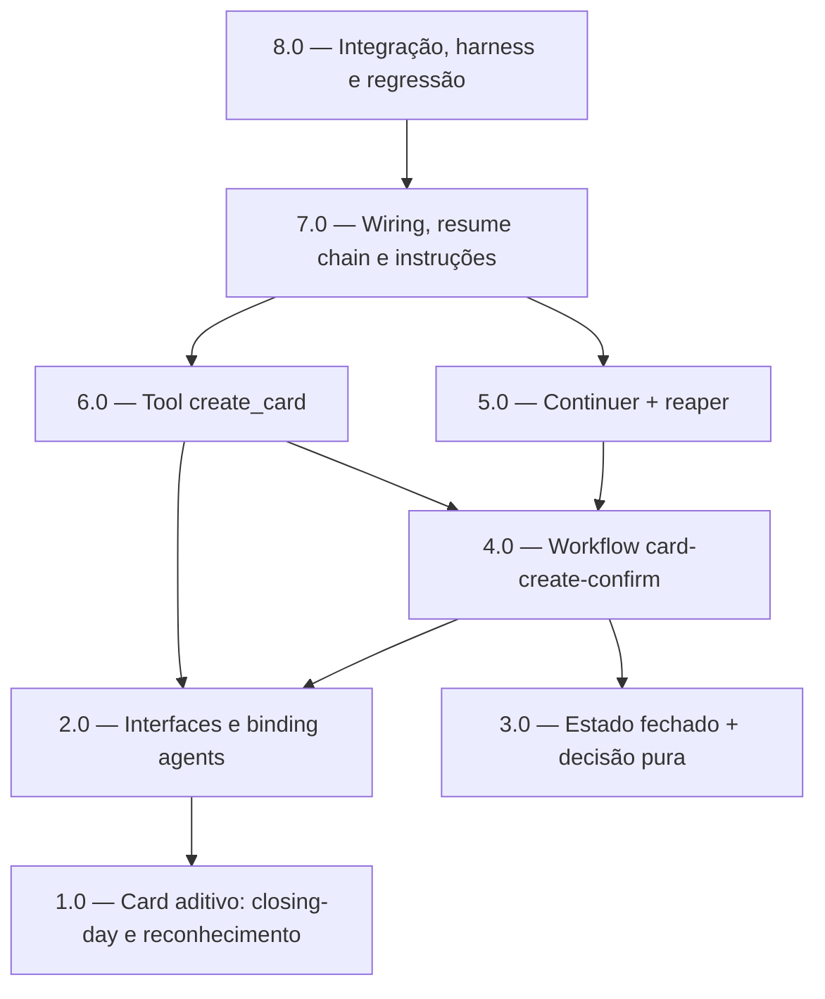

<!-- spec-hash-prd: 85c7c8eff5955982193ee5b5de602ae2378b1445432b491270e270741c714105 -->
<!-- spec-hash-techspec: 9d7f5261bba5488debd8c395313e3700472921de9400afbb50f0e92a58f84e8c -->
# Resumo das Tarefas de Implementação para Cadastro Conversacional de Cartão

## Metadados
- **PRD:** `.specs/prd-cadastro-conversacional-cartao/prd.md`
- **Especificação Técnica:** `.specs/prd-cadastro-conversacional-cartao/techspec.md`
- **Total de tarefas:** 8
- **Tarefas paralelizáveis:** 1.0‖3.0 (início); 5.0‖6.0 (após 4.0)

## Tarefas

| # | Título | Status | Dependências | Paralelizável | Skills |
|---|--------|--------|-------------|---------------|--------|
| 1.0 | Card (aditivo): closing-day opcional e reconhecimento de banco | pending | — | Com 3.0 | domain-modeling-production, postgresql-production-standards, design-patterns-mandatory |
| 2.0 | Interfaces e binding agents: NewCard closing + CardManager.BankRecognized | pending | 1.0 | Não | mastra, design-patterns-mandatory |
| 3.0 | Estado de espera fechado + decisão pura da confirmação | pending | — | Com 1.0 | domain-modeling-production, design-patterns-mandatory, mastra |
| 4.0 | Workflow card-create-confirm + escrita idempotente | pending | 2.0, 3.0 | Não | mastra, design-patterns-mandatory |
| 5.0 | Continuer auditável + reaper de runs suspensos | pending | 4.0 | Com 6.0 | mastra, design-patterns-mandatory |
| 6.0 | Tool create_card (adapter fino, slot-filling, guardrail) | pending | 2.0, 4.0 | Com 5.0 | mastra, design-patterns-mandatory |
| 7.0 | Wiring, resume chain e instruções do agente | pending | 5.0, 6.0 | Não | mastra |
| 8.0 | Testes de integração, harness real-LLM e regressão do incidente | pending | 7.0 | Não | mastra |

## Dependências Críticas
- **1.0 → 2.0:** o binding dos agents (`CardManager.BankRecognized`, mapeamento de `ClosingDay`) depende
  do read `IsBankRecognized` e do branch do usecase entregues em 1.0.
- **2.0 + 3.0 → 4.0:** o workflow precisa do `CardManager` estendido (2.0) e do estado fechado + decisão
  pura (3.0).
- **4.0 → 5.0 e 4.0 → 6.0:** continuer/reaper (5.0) e tool (6.0) dependem do `Definition`/`Engine` do
  workflow entregue em 4.0.
- **5.0 + 6.0 → 7.0:** o wiring registra tool, continuer, reaper e a posição no resume chain.
- **7.0 → 8.0:** os testes de integração/harness exercem o fluxo fim-a-fim já fiado.

## Riscos de Integração
- **Exclusão mútua de estados de espera (RF-18):** a ordem determinística no `WhatsAppInboundConsumer`
  (`pending_entry → destructive_confirm → card-create → onboarding → ParseInbound`) e a semântica
  resume-consome-mensagem precisam ser validadas por teste de integração (Task 8.0), senão dois gates
  suspensos poderiam colidir.
- **Idempotência via `IdempotentWriter` (RF-14/RF-16):** roteiar a escrita pelo writer dos agents
  (operation=`create_card`) precisa mapear `ErrNicknameConflict` como outcome de domínio (não infra),
  senão a métrica e a mensagem ao usuário divergem (ADR-003).
- **Normalização de banco (ADR-002):** `IsBankRecognized` deve reusar `NewBankCode` para não divergir da
  derivação; coberto em 1.0 e validado em 8.0 com banco acentuado/espaçado.
- **Onboarding intacto (RF-09):** o branch do usecase é por `ClosingDayProvided` (não por
  reconhecimento); regressão do onboarding validada em 1.0.

## Cobertura de Requisitos

| Tarefa | Requisitos cobertos |
|--------|-------------------|
| 1.0 | RF-07, RF-08, RF-09, RF-10, RF-11, RF-20 |
| 2.0 | RF-07, RF-08, RF-09, RF-20 |
| 3.0 | RF-03, RF-04 |
| 4.0 | RF-02, RF-12, RF-14, RF-16, RF-21 |
| 5.0 | RF-15, RF-16, RF-18, RF-21 |
| 6.0 | RF-01, RF-05, RF-06, RF-07, RF-08, RF-13, RF-17 |
| 7.0 | RF-13, RF-18, RF-19 |
| 8.0 | RF-04, RF-12, RF-13, RF-14, RF-15, RF-18, RF-22 |

## Grafo de Dependencias

## Legenda de Status
- `pending`: aguardando execução
- `in_progress`: em execução
- `needs_input`: aguardando informação do usuário
- `blocked`: bloqueado por dependência ou falha externa
- `failed`: falhou após limite de remediação
- `done`: completado e aprovado
