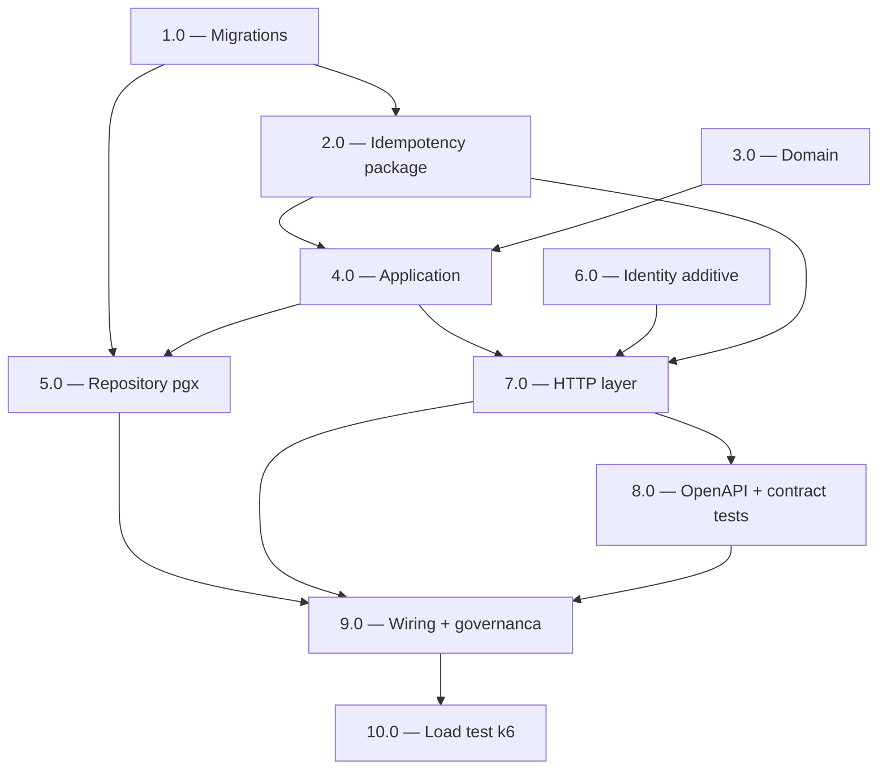

<!-- spec-hash-prd: eb1398f20d26c6ec2753d4c31c5ebada6a0eca1922972b3e23b1195da50d841b -->
<!-- spec-hash-techspec: 972c6b7d38afb9f1299a2214e95735d57847923037131badc5456420431b79d1 -->
# Resumo das Tarefas de Implementação para Card CRUD MVP (`internal/card`)

## Metadados
- **PRD:** `.specs/prd-card-crud-mvp/prd.md`
- **Especificação Técnica:** `.specs/prd-card-crud-mvp/techspec.md`
- **Total de tarefas:** 10
- **Tarefas paralelizáveis:** 3.0 ↔ 6.0; 5.0 ↔ 7.0

## Tarefas

| # | Título | Status | Dependências | Paralelizável | Skills |
|---|--------|--------|--------------|---------------|--------|
| 1.0 | Migrations 000004/000005 e schema `mecontrola.cards` + `idempotency_keys` | done | — | — | — |
| 2.0 | Pacote `internal/platform/idempotency/` (Storage + Middleware + Recorder) | done | 1.0 | — | — |
| 3.0 | Domain do `card` — VOs, agregado, `InvoiceFor` puro, fixtures + property-based | done | — | Com 6.0 | — |
| 4.0 | Application layer — DTOs, interfaces, use cases (UoW + Storage), mocks | done | 2.0, 3.0 | — | — |
| 5.0 | Repository pgx + paginação keyset + mapping de erros + integration tests | done | 1.0, 4.0 | Com 7.0 | — |
| 6.0 | Identity additive — `auth.SourceHeader` + `InjectPrincipalFromHeader` middleware | done | — | Com 3.0 | — |
| 7.0 | HTTP layer do `card` — handlers thin, router com chain, redact helper, spans/logs | done | 2.0, 4.0, 6.0 | Com 5.0 | — |
| 8.0 | Contrato OpenAPI 3.1 + contract tests (kin-openapi) + Postman collection | done | 7.0 | — | postman-collection-generator |
| 9.0 | Wiring + governança operacional (module.go, server.go, lint anti-PCI, runbook, dashboard) | done | 5.0, 7.0, 8.0 | — | otel-grafana-dashboards, taskfile-production |
| 10.0 | Load test k6 + evidência de SLO M-02/M-03/M-04 | done | 9.0 | — | — |

## Dependências Críticas

- **1.0 bloqueia 2.0 e 5.0**: schemas físicos são pré-condição para qualquer integration test.
- **2.0 + 3.0 bloqueiam 4.0**: use cases dependem da interface `idempotency.Storage` e dos VOs/sentinels.
- **4.0 bloqueia 5.0 e 7.0**: interfaces e DTOs precisam estar fixados.
- **6.0 bloqueia 7.0**: chain do `CardRouter` consome `InjectPrincipalFromHeader` + constante `SourceHeader`.
- **7.0 bloqueia 8.0**: golden files exigem handlers reais para gerar fixtures iniciais.
- **9.0 bloqueia 10.0**: load test exige binário wired publicado em homologação.

## Riscos de Integração

- **R-INT-01 — Drift entre encoder JSON do use case e do handler** (ADR-006): tests de replay byte-a-byte em 7.0 e 8.0 cobrem; falha indica que o use case marshalou com config diferente do handler.
- **R-INT-02 — `tzdata` ausente no container** (ADR-002, R1): validar Dockerfile em 9.0 (`apk add tzdata` / `ca-certificates`).
- **R-INT-03 — Race de `Idempotency-Key`** (ADR-006): integration test 10 goroutines em 2.0 e 5.0; falha indica bug no `ON CONFLICT DO NOTHING RETURNING`.
- **R-INT-04 — `SourceHeader` em produção sem gateway** (ADR-003, PRD S-07): exposição interna até gateway garantir injeção confiável de `X-User-ID`; pré-condição operacional registrada no runbook.
- **R-INT-05 — `UoW.Execute` rollback ao falhar `Storage.Put`** (ADR-006, R8): test específico em 4.0 com mock que injeta erro pós-`repo.Insert`.

## Cobertura de Requisitos

| Tarefa | Requisitos cobertos |
|--------|---------------------|
| 1.0 | RF-09, RF-10, RF-11, RF-12, RF-16, RF-17, RF-18, RF-19 |
| 2.0 | RF-28, RF-30, RF-31, RF-32 |
| 3.0 | RF-01, RF-02, RF-03, RF-04, RF-05, RF-06, RF-07, RF-08, RF-15, RF-37, RF-38, RF-41, RF-42, RF-43, RF-44, RF-45 |
| 4.0 | RF-39, RF-40, RF-48 |
| 5.0 | RF-13, RF-14, RF-46 |
| 6.0 | RF-27 |
| 7.0 | RF-21, RF-22, RF-23, RF-24, RF-25, RF-26, RF-33, RF-34, RF-35, RF-36 |
| 8.0 | RF-29, RF-47 |
| 9.0 | RF-16, RF-20, RF-37, RF-38, RF-49, RF-50 |
| 10.0 | (Métricas de Sucesso M-02, M-03, M-04 do PRD — sem RF numérico associado) |

## Grafo de Dependencias

## Legenda de Status

- `pending`: aguardando execução
- `in_progress`: em execução
- `needs_input`: aguardando informação do usuário
- `blocked`: bloqueado por dependência ou falha externa
- `failed`: falhou após limite de remediação
- `done`: completado e aprovado
