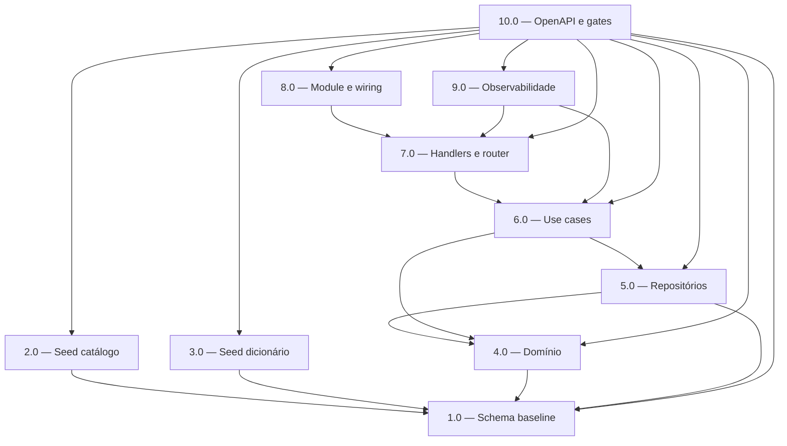

<!-- spec-hash-prd: cc1021c7ec9c74909c692690bab838f2e96cdfc9f45ed0e9b341334658b3c3a4 -->
<!-- spec-hash-techspec: af3aa808915c5de9df82e903b0aaa978d6129bed4c735eb016c8c1c60cb8e27f -->

# Resumo das Tarefas de Implementação para Categories CRUD

## Metadados
- **PRD:** `.specs/prd-categories-crud/prd.md`
- **Especificação Técnica:** `.specs/prd-categories-crud/techspec.md`
- **Total de tarefas:** 10
- **Tarefas paralelizáveis:** 2.0 e 3.0 (com 1.0); 4.0 (com 1.0–3.0)

## Tarefas

| # | Título | Status | Dependências | Paralelizável | Skills |
|---|--------|--------|-------------|---------------|--------|
| 1.0 | Schema baseline, extensão unaccent e tabela de versão editorial | done | — | — | — |
| 2.0 | Seed editorial do catálogo completo | done | 1.0 | Com 3.0 | — |
| 3.0 | Seed editorial do dicionário mínimo | done | 1.0 | Com 2.0 | — |
| 4.0 | Domínio: value objects, entidades e CandidateResolver | done | — | Com 1.0, 2.0, 3.0 | — |
| 5.0 | Repositórios Postgres, VersionReader e testes de integração | done | 1.0, 4.0 | — | — |
| 6.0 | Use cases: ListCategories, GetCategory, ListDictionary, SearchDictionary | done | 4.0, 5.0 | — | — |
| 7.0 | Handlers HTTP, router, RequireUser, ETag/304 e envelope de erro | pending | 6.0 | — | — |
| 8.0 | CategoriesModule, wiring e registro em cmd/server/server.go | pending | 7.0 | — | — |
| 9.0 | Observabilidade: métricas custom, logs e traces | pending | 6.0, 7.0 | — | — |
| 10.0 | OpenAPI, testes de cenários canônicos e gates R0–R7 | pending | 1.0–9.0 | — | — |

## Dependências Críticas

- **1.0 é a base de schema:** todas as tarefas de seed (2.0, 3.0), repositórios (5.0) e testes dependem do DDL.
- **4.0 (domínio) desbloqueia 5.0 e 6.0:** repositórios e use cases dependem dos tipos de domínio.
- **7.0 desbloqueia 8.0:** router precisa dos handlers instanciados.
- **10.0 é tarefa de fechamento:** só inicia quando 1.0–9.0 estiverem `done`.

## Riscos de Integração

- **Extensão `unaccent` e locale `pt_BR`**: se não estiverem disponíveis no Postgres de CI/produção, migrations 1.0 falham. Mitigação: validar em container idêntico antes de merge.
- **Seed editorial grande (2.0 + 3.0)**: risco de migration falhar por timeout ou violação de constraint. Mitigação: teste de integração obrigatório com seed completo.
- **ETag/304 em handlers (7.0)**: se `VersionReader` não for injetado corretamente, cache fica inconsistente. Mitigação: teste de integração CC-V1 a CC-V4 na tarefa 10.0.
- **Métricas custom (9.0)**: se `devkit-go` não expuser histogramas, fallback para `prometheus/client_golang` pode exigir alteração em 7.0. Mitigação: validar API de métricas logo no início de 9.0.

## Cobertura de Requisitos

| Tarefa | Requisitos cobertos |
|--------|-------------------|
| 1.0 | RF-06, RF-20 (schema), RT-09 (unaccent) |
| 2.0 | RF-01–RF-07, RF-30, RF-31, RF-36, RF-36a, RF-38, RF-40 |
| 3.0 | RF-19, RF-21–RF-23, RF-28, RF-29, RF-32–RF-34, RF-35 (ignorado MVP), RF-36, RF-36a, RF-38, RF-40 |
| 4.0 | RF-24–RF-27 (algoritmo de domínio) |
| 5.0 | RF-08–RF-14a, RF-11, RF-15a, RF-37, RF-41 |
| 6.0 | RF-08–RF-18a, RF-09, RF-10, RF-12, RF-17, RF-18, RF-27 |
| 7.0 | RF-07, RF-08–RF-18a, RT-11 |
| 8.0 | RT-03 (padrão de módulo) |
| 9.0 | RF-41–RF-43 |
| 10.0 | RF-07, RT-10, RF-39, RF-40a, CC-B1–CC-V4 |

## Grafo de Dependencias

## Legenda de Status
- `pending`: aguardando execução
- `in_progress`: em execução
- `needs_input`: aguardando informação do usuário
- `blocked`: bloqueado por dependência ou falha externa
- `failed`: falhou após limite de remediação
- `done`: completado e aprovado
