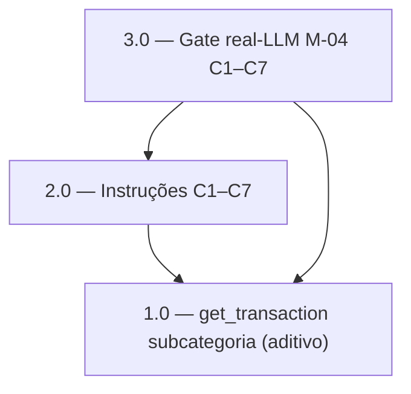

<!-- spec-hash-prd: a0bd0d9a1332e20ea9e51f536f16659d031ddb893981eb131e616c03a8993f9c -->
<!-- spec-hash-techspec: 9b319736d226f699986ca0d2cc89be1e847e93aabab9bd72149613219366c335 -->
# Resumo das Tarefas de Implementação para Consulta Conversacional Financeira

## Metadados
- **PRD:** `.specs/prd-consulta-conversacional-financeira/prd.md`
- **Especificação Técnica:** `.specs/prd-consulta-conversacional-financeira/techspec.md`
- **Total de tarefas:** 3
- **Tarefas paralelizáveis:** nenhuma (cadeia linear 1.0 → 2.0 → 3.0)

## Tarefas

| # | Título | Status | Dependências | Paralelizável | Skills |
|---|--------|--------|-------------|---------------|--------|
| 1.0 | Extensão aditiva de `get_transaction` (`subcategoryNameSnapshot`) + unit test | done | — | — | mastra |
| 2.0 | Bloco de instruções C1–C7 na const `mecontrolaAgentInstructions` | done | 1.0 | Não | mastra |
| 3.0 | Testes de regressão real-LLM C1–C7 (harness M-04 ≥ 0.90) + cadeias C4/C5 | done | 1.0, 2.0 | Não | mastra |

## Dependências Críticas
- 2.0 depende de 1.0: as instruções de C5 referenciam `subcategoryNameSnapshot`; sem o campo exposto por 1.0, C5 renderiza categoria incompleta (gap de integração).
- 3.0 depende de 1.0 e 2.0: o gate real-LLM valida o campo aditivo (C5) e o protocolo de instruções (C1–C7) juntos; rodar antes deixaria o gate sem objeto.

## Riscos de Integração
- A const `mecontrolaAgentInstructions` é compartilhada com registro/edição/HITL. A edição de 2.0 deve ser **apêndice de seção**, sem reescrever regras existentes de confirmação/escrita. Mitigação: 3.0 roda a suíte completa de agents (incl. `pending_entry_*`) e o M-04 dos 22 cenários já existentes para garantir não-regressão do denominador.
- Não-determinismo do LLM em C1 (multi-tool `query_month` + `query_plan`): coberto por asserter de conjunto e cenário dedicado em 3.0.
- Escopo mantido dentro do teto de 10 tarefas; nenhuma justificativa de expansão necessária.

## Emenda Pós-Review (2026-07-07) — D-10 / gate de C4

Revisão estrita expôs falso-verde em C4 (asserção single-shot mascarava ~30–50% de acerto real no
modelo de produção). Correção sem regressão (M-04 permaneceu 1.00/29): instrução C4 guiada por
exemplo + descrição aditiva de `resolve_card` (D-10, exceção sancionada a RF-35) +
`TestRealLLM_QueryCardInvoiceChain_C4` promovido a gate estatístico ≥ 8/10 (resultado: 10/10). Ver
`3.0_execution_report.md` (Addendum) e `prd.md` (D-10).

## Cobertura de Requisitos

| Tarefa | Requisitos cobertos |
|--------|-------------------|
| 1.0 | RF-06 (dado de subcategoria para C5), RF-35 (extensão aditiva única) |
| 2.0 | RF-01, RF-02, RF-03, RF-04, RF-05, RF-06, RF-06a, RF-07, RF-07a, RF-08, RF-08a, RF-09, RF-10, RF-11, RF-12, RF-13, RF-14, RF-15, RF-16, RF-17, RF-18, RF-19, RF-20, RF-21, RF-22, RF-23, RF-24, RF-25, RF-26, RF-27, RF-28, RF-29, RF-30, RF-31, RF-32, RF-32a, RF-33, RF-34, RF-35, RF-36 |
| 3.0 | RF-01, RF-02, RF-03, RF-04, RF-05, RF-06, RF-06a, RF-07, RF-07a, RF-08, RF-08a, RF-09, RF-10, RF-32a |

## Grafo de Dependencias

## Legenda de Status
- `pending`: aguardando execução
- `in_progress`: em execução
- `needs_input`: aguardando informação do usuário
- `blocked`: bloqueado por dependência ou falha externa
- `failed`: falhou após limite de remediação
- `done`: completado e aprovado
