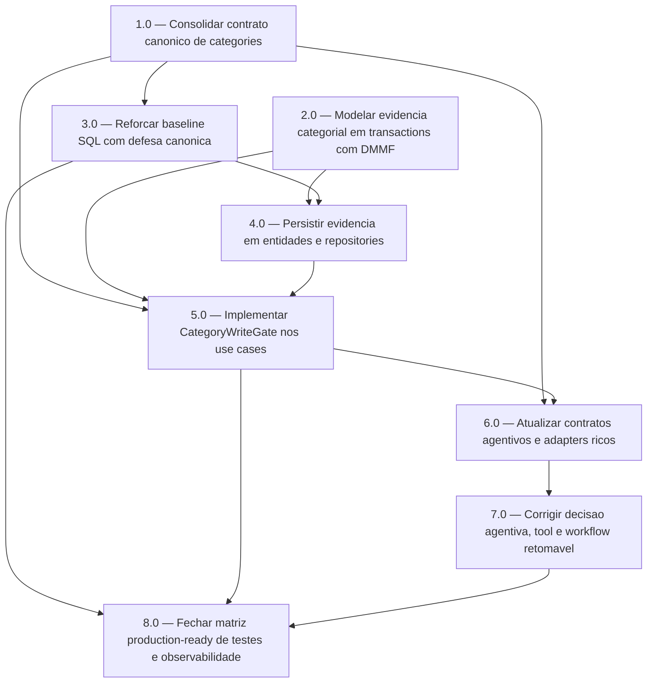

<!-- spec-hash-prd: 1c03f9d959dc6c103436cd8a6c396ef2a8a5760e8f477f933d645f9f6972d461 -->
<!-- spec-hash-techspec: 41b328bde20ec5ec6d5fff2c93fec6a650d16dc0d3d4eecfbf1451601cdae6c7 -->
# Resumo das Tarefas de Implementação para Contrato Deterministico de Categorias para Transacoes Agentivas

## Metadados
- **PRD:** `.specs/prd-contrato-categorias-transacoes-agentivas/prd.md`
- **Especificação Técnica:** `.specs/prd-contrato-categorias-transacoes-agentivas/techspec.md`
- **Total de tarefas:** 8
- **Tarefas paralelizáveis:** 1.0 com 2.0; 2.0 com 1.0 e 3.0; 3.0 com 2.0

## Tarefas

<!-- Colunas e formato canônico (MANDATÓRIO):
     - `#`: id decimal `X.Y` (sempre X.0 para tarefas de topo).
     - `Status`: ^(pending|in_progress|needs_input|blocked|failed|done)$
     - `Dependências`: ^(—|\d+\.\d+(,\s*\d+\.\d+)*)$  (em-dash unicode quando vazio)
     - `Paralelizável`: ^(—|Não|Com\s+\d+\.\d+(,\s*\d+\.\d+)*)$
     - `Skills`: skills processuais extras (descoberta agnóstica em `.agents/skills/`). Use `—` quando
       não houver. Nunca listar skills auto-carregadas (governance/linguagem) nem `*-implementation`.
     - `Fase` (OPCIONAL): inteiro positivo para agrupamento visual de fases de entrega. Pode ser
       omitida em PRDs pequenos; `execute-all-tasks` não consome esta coluna. Se incluída, mantenha
       em todas as linhas para não quebrar o parser de tabela markdown. -->

| # | Título | Status | Dependências | Paralelizável | Skills |
|---|--------|--------|-------------|---------------|--------|
| 1.0 | Consolidar contrato canonico de categories | done | — | Com 2.0 | — |
| 2.0 | Modelar evidencia categorial em transactions com DMMF | done | — | Com 1.0, 3.0 | — |
| 3.0 | Reforcar baseline SQL com defesa canonica | done | 1.0 | Com 2.0 | — |
| 4.0 | Persistir evidencia em entidades e repositories | done | 2.0, 3.0 | Não | — |
| 5.0 | Implementar CategoryWriteGate nos use cases | done | 1.0, 2.0, 4.0 | Não | — |
| 6.0 | Atualizar contratos agentivos e adapters ricos | done | 1.0, 5.0 | Não | mastra |
| 7.0 | Corrigir decisao agentiva, tool e workflow retomavel | done | 6.0 | Não | mastra |
| 8.0 | Fechar matriz production-ready de testes e observabilidade | done | 3.0, 5.0, 7.0 | Não | mastra |

## Dependências Críticas
- `1.0` desbloqueia o contrato canonico usado por `transactions` e `agents`.
- `2.0` desbloqueia invariantes DMMF de evidencia, source e outcome antes de entidades, repositories e gate.
- `3.0` deve preceder repositories porque o banco novo exige defesa por FKs, checks e triggers no baseline.
- `5.0` deve preceder os fluxos agentivos finais porque `internal/transactions` e a autoridade de persistencia.
- `8.0` depende dos tres eixos implementados para validar zero falso positivo com testes unitarios, integracao, E2E e observabilidade.

## Riscos de Integração
- Duplicacao de regra entre `agents` e `transactions`; mitigacao: `agents` classifica/explica, `transactions` decide a persistencia pelo gate final.
- Mocks aceitarem estados impossiveis; mitigacao: mocks gerados devem exigir `Outcome=matched`, `Version>0` e testes de integracao com `categories` real e Postgres.
- Bypass do use case por repository ou SQL direto; mitigacao: baseline SQL com FKs, checks e triggers semanticos.
- Drift editorial entre classificacao e persistencia; mitigacao: versao editorial obrigatoria na evidencia e bloqueio por `CategoryWriteGate`.
- Latencia adicional no fluxo conversacional; mitigacao: leitura canonica no gate imediatamente antes do write e metricas de baixa cardinalidade.

## Cobertura de Requisitos

| Tarefa | Requisitos cobertos |
|--------|-------------------|
| 1.0 | RF-01, RF-02, RF-03, RF-05, RF-06, RF-07, RF-08, RF-09, RF-10, RF-11, RF-14, RF-15, RF-16, RF-18, RF-20, RF-26, RF-32, RF-33, RF-34, RF-35, RNF-01, RNF-04, RNF-05, CA-01, CA-02, CA-03, CA-04, CA-05, CA-06, CA-07, CA-08, CA-13, CA-14, CA-15 |
| 2.0 | RF-04, RF-05, RF-17, RF-19, RF-20, RF-21, RF-22, RF-30, RF-33, RF-34, RNF-01, RNF-05, CA-16, CA-18, CA-19, CA-21, CA-22 |
| 3.0 | RF-09, RF-10, RF-11, RF-15, RF-16, RF-18, RF-19, RF-24, RF-30, RF-35, RNF-01, RNF-04, CA-06, CA-07, CA-08, CA-13, CA-15, CA-19, CA-20 |
| 4.0 | RF-17, RF-19, RF-21, RF-22, RF-23, RF-28, RF-29, RF-30, RNF-01, RNF-03, CA-16, CA-18, CA-19, CA-21, CA-22, CA-23 |
| 5.0 | RF-01, RF-03, RF-04, RF-06, RF-09, RF-10, RF-11, RF-15, RF-16, RF-17, RF-20, RF-23, RF-28, RF-29, RF-32, RF-35, RNF-01, RNF-02, RNF-04, RNF-05, CA-06, CA-07, CA-08, CA-11, CA-13, CA-15, CA-17, CA-23 |
| 6.0 | RF-01, RF-04, RF-05, RF-06, RF-17, RF-19, RF-25, RF-26, RF-30, RF-32, RF-33, RF-35, RNF-01, RNF-05, CA-12, CA-16 |
| 7.0 | RF-02, RF-03, RF-06, RF-07, RF-08, RF-12, RF-13, RF-14, RF-15, RF-16, RF-25, RF-26, RF-27, RF-31, RF-32, RNF-01, RNF-02, RNF-05, CA-01, CA-02, CA-03, CA-04, CA-05, CA-09, CA-10, CA-12, CA-14, CA-15 |
| 8.0 | RF-01, RF-02, RF-03, RF-04, RF-05, RF-06, RF-07, RF-08, RF-09, RF-10, RF-11, RF-12, RF-13, RF-14, RF-15, RF-16, RF-17, RF-18, RF-19, RF-20, RF-21, RF-22, RF-23, RF-24, RF-25, RF-26, RF-27, RF-28, RF-29, RF-30, RF-31, RF-32, RF-33, RF-34, RF-35, RNF-01, RNF-02, RNF-03, RNF-04, RNF-05, CA-01, CA-02, CA-03, CA-04, CA-05, CA-06, CA-07, CA-08, CA-09, CA-10, CA-11, CA-12, CA-13, CA-14, CA-15, CA-16, CA-17, CA-18, CA-19, CA-20, CA-21, CA-22, CA-23 |

## Grafo de Dependencias

## Legenda de Status
- `pending`: aguardando execução
- `in_progress`: em execução
- `needs_input`: aguardando informação do usuário
- `blocked`: bloqueado por dependência ou falha externa
- `failed`: falhou após limite de remediação
- `done`: completado e aprovado
