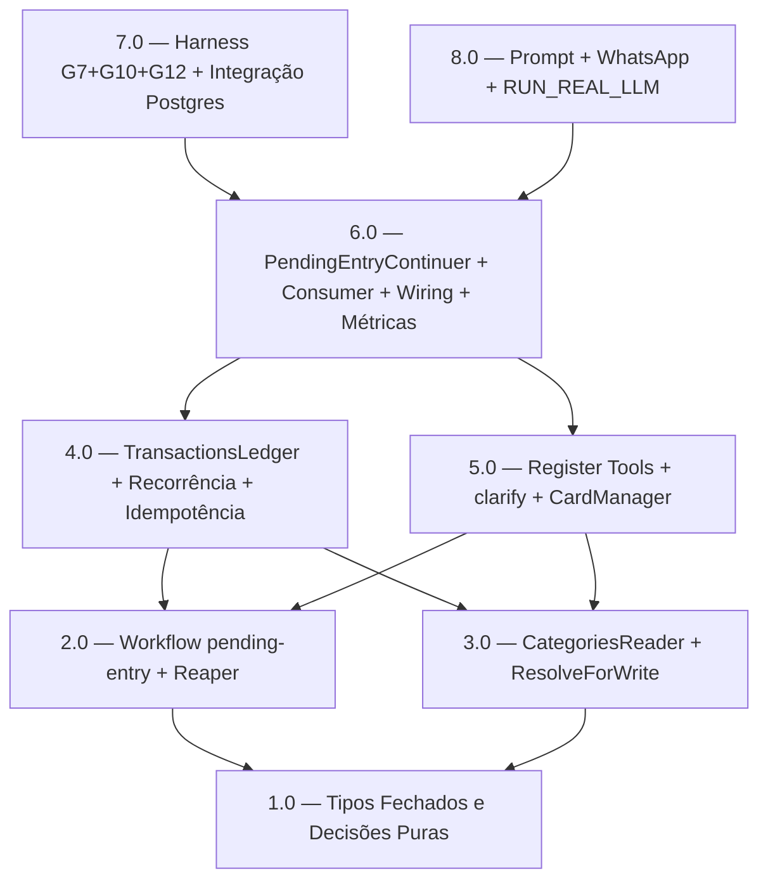

<!-- spec-hash-prd: 1134ba7717b0f9dea2a79fc428631ad01153d5f0275fafff4d883e26ddc2765d -->
<!-- spec-hash-techspec: 8d21f8bb788b5c8ca05d0249c32b7d439943e3a10384e67b0fc0365d2f457621 -->
# Resumo das Tarefas de Implementação — Conversa Agentiva Fluida

## Metadados
- **PRD:** `.specs/prd-conversa-agentiva-fluida/prd.md`
- **Especificação Técnica:** `.specs/prd-conversa-agentiva-fluida/techspec.md`
- **Cenários:** `.specs/prd-conversa-agentiva-fluida/scenarios.md`
- **Total de tarefas:** 8
- **Tarefas paralelizáveis:** 3.0 com 2.0 — 5.0 com 4.0 — 8.0 com 7.0

## Decisões Fechadas

| Decisão | Resolução |
|---------|-----------|
| Harness 7.0 | G7+G10+G12 no harness; G1–G6 como unit tests table-driven |
| Gate de confirmação (spec-v3, ADR-004) | `DecideConfirmation` puro em 1.0; `AwaitingSlotConfirmation` terminal em 2.0; toda escrita passa pela pendência (nenhuma escrita síncrona) |
| Recorrência RF-25/RF-43 | `TransactionsLedger.CreateRecurringTemplate` (extensão fina) em 4.0, delegando a `internal/transactions` |
| Edição RF-25/CA-17 | `TargetTransactionID`/`TargetVersion` no estado (1.0); tool de edição abre pendência (5.0); `UpdateTransaction` em 4.0 |
| Seleção por número OU nome (RF-42) | `DecideCategoryChoice` aceita índice e nome — tarefa 1.0/3.0 |
| ThreadID no contexto de tool | `InboundExecutionFromContext` (extensão de `internal/platform/agent/identity_context.go`) em 2.0/5.0 |
| Reaper de pendências | Subtarefa de 2.0; wiring registrado em 6.0 |
| Métricas `agents_pending_entry_*` | Tarefa 6.0 com wiring e `module.go` |
| CardManager | Já existe — integrar na tarefa 5.0 |
| `PendingCategoryCandidate` | Tarefa 1.0 com os demais tipos fechados |
| Validação 8.0 | Harness determinístico (gate primário) + `RUN_REAL_LLM=1` obrigatório antes de `done` |

## Tarefas

<!-- Colunas e formato canônico (MANDATÓRIO):
     - `#`: id decimal `X.Y` (sempre X.0 para tarefas de topo).
     - `Status`: ^(pending|in_progress|needs_input|blocked|failed|done)$
     - `Dependências`: ^(—|\d+\.\d+(,\s*\d+\.\d+)*)$  (em-dash unicode quando vazio)
     - `Paralelizável`: ^(—|Não|Com\s+\d+\.\d+(,\s*\d+\.\d+)*)$
     - `Skills`: skills processuais extras (descoberta agnóstica em `.agents/skills/`). Use `—` quando
       não houver. Nunca listar skills auto-carregadas (governance/linguagem) nem `*-implementation`. -->

| # | Título | Status | Dependências | Paralelizável | Skills |
|---|--------|--------|-------------|---------------|--------|
| 1.0 | Tipos Fechados e Decisões Puras (incl. `DecideConfirmation`, `PendingOperationKind`, alvo de edição) | done | — | — | mastra |
| 2.0 | Workflow `pending-entry`: Start/Resume/Cancel/Expire/Replaced + gate `AwaitingSlotConfirmation` + Reaper + `InboundExecutionFromContext` | done | 1.0 | Não | mastra |
| 3.0 | Integração CategoriesReader: candidatos raiz+folha, escolha por número/nome e ResolveForWrite | done | 1.0 | Com 2.0 | mastra |
| 4.0 | Integração TransactionsLedger (create/update/`CreateRecurringTemplate`), Idempotência e CategoryWriteGate | done | 2.0, 3.0 | Não | mastra |
| 5.0 | Tools de Registro/Edição/Recorrência: abertura de pendência sempre (clarify/confirmação), sem escrita síncrona, alvo de edição e CardManager | done | 2.0, 3.0 | Com 4.0 | mastra |
| 6.0 | PendingEntryContinuer, Consumer (ordem de resolvers), Wiring e Métricas | done | 4.0, 5.0 | Não | mastra |
| 7.0 | Harness Determinístico: G7+G10+G12 + Integração Postgres (CA-01..CA-17, M-07=0) | done | 6.0 | Não | mastra |
| 8.0 | Prompt, Resposta Final WhatsApp e Validação RUN_REAL_LLM | done | 6.0 | Com 7.0 | — |

## Dependências Críticas

- **1.0 é base hard**: todos os tipos fechados devem compilar e ter `String`/`Parse`/`IsValid` antes de qualquer tarefa downstream.
- **2.0 e 3.0 podem ser paralelas** após 1.0 concluída: workflow engine não depende de CategoriesReader e vice-versa.
- **4.0 exige 2.0 + 3.0**: a escrita real requer o workflow (para retomada de pendência) e a resolução categórica (para `ResolveForWrite`).
- **5.0 pode ser paralela a 4.0**: o mecanismo de abertura de pendência (`outcome=clarify`) depende do workflow (2.0) e dos candidatos (3.0), não do ledger (4.0).
- **6.0 exige 4.0 + 5.0**: o consumer orquestra a ordem de resolução; exige ledger, continuer e tools montados.
- **7.0 e 8.0 exigem 6.0**: harness e prompt só valem sobre sistema montado.
- **7.0 e 8.0 são paralelas**: harness não depende de prompt e vice-versa.

## Riscos de Integração

- `workflow.Engine[PendingEntryState]` usa merge-patch (R-WF-KERNEL-001.7); regressão no resume destrói estado suspenso rico. Gate: `grep -n "current = rs\|current = decoded" internal/platform/workflow/engine.go`.
- `CategoriesReader.SearchDictionary` pode não retornar `rootSlug`/`subcategorySlug` diretamente — enriquecimento via `ResolveForWrite` ou `ListCategories` é obrigatório antes de persistir.
- Concorrência em mensagens simultâneas: chave `<resourceID>:<threadID>:pending-entry` com CAS no workflow store. Conflito deve retornar resultado seguro sem escrita duplicada.
- Harness (7.0) depende de doubles de `CategoriesReader`, `TransactionsLedger`, `CardManager` e workflow store em memória; se algum double não existir, 7.0 bloqueia.
- `RUN_REAL_LLM=1` em 8.0 requer variáveis `OPENROUTER_*` do `.env`; ausência bloqueia gate final de `done`.
- Gate de confirmação obrigatório (spec-v3): nenhuma tool pode escrever de forma síncrona; toda escrita ocorre no resume que carrega o aceite. Regressão que escreva antes da confirmação viola M-07. Gate: harness assere ordem `confirmation → write` e `expectConfirmationBeforeWrite=true` (G12, G11).
- `InboundExecutionFromContext` estende `internal/platform/agent/identity_context.go` para expor `threadID` opaco às tools; sem isso a tool não consegue montar a key `<resourceID>:<threadID>:pending-entry`. Mudança de substrato deve permanecer genérica (sem semântica de domínio).
- `TransactionsLedger.CreateRecurringTemplate` é a única ampliação da autoridade de persistência; o adapter de binding delega a `internal/transactions/create_recurring_template.go` sem reimplementar template.

## Cobertura de Requisitos

| Tarefa | Requisitos cobertos |
|--------|-------------------|
| 1.0 | RF-02, RF-15, RF-16, RF-17, RF-19, RF-26, RF-31, RF-32, RF-39, RF-41 |
| 2.0 | RF-01, RF-06, RF-07, RF-08, RF-09, RF-20, RF-23, RF-38, RF-40 |
| 3.0 | RF-10, RF-11, RF-13, RF-14, RF-27, RF-28, RF-29, RF-30, RF-35, RF-42 |
| 4.0 | RF-03, RF-12, RF-20, RF-21, RF-22, RF-25, RF-43 |
| 5.0 | RF-01, RF-04, RF-05, RF-18, RF-24, RF-25, RF-38, RF-43 |
| 6.0 | RF-03, RF-24 |
| 7.0 | RF-33, RF-34, RF-36, RF-37, RF-38 (M-07=0) |
| 8.0 | RF-24 (resposta WhatsApp) |

> RF-36 e RF-37 são validados pelos gates da skill `go-implementation` (auto-carregada) e pelos greps de pureza do kernel em todas as tarefas. RF-01 aparece em 1.0, 2.0 e 5.0 porque a abertura de pendência envolve tipos (1.0), workflow engine (2.0) e a tool que dispara `clarify`/confirmação (5.0). RF-38 (gate de confirmação obrigatório) atravessa 2.0 (estado terminal), 5.0 (tools nunca escrevem síncrono) e 7.0 (harness prova M-07=0).

## Grafo de Dependências

## Legenda de Status
- `pending`: aguardando execução
- `in_progress`: em execução
- `needs_input`: aguardando informação do usuário
- `blocked`: bloqueado por dependência ou falha externa
- `failed`: falhou após limite de remediação
- `done`: completado e aprovado
