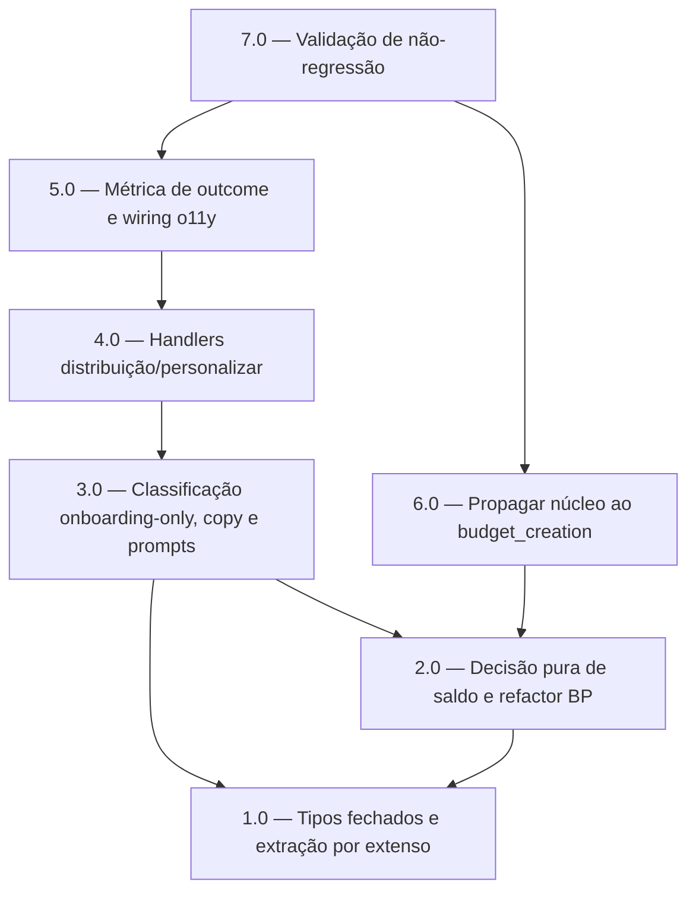

<!-- spec-hash-prd: 29e6b1f85b7ab124ddcebf489a232415486ded02879f703c621e9c43294fed0b -->
<!-- spec-hash-techspec: b5e83260b9736d7a36539ad8171f8fb5e42eaab37ef0c99d0ace6c1146787be8 -->
# Resumo das Tarefas de Implementação para Distribuição personalizada do orçamento no onboarding

## Metadados
- **PRD:** `.specs/prd-distribuicao-personalizada-onboarding/prd.md`
- **Especificação Técnica:** `.specs/prd-distribuicao-personalizada-onboarding/techspec.md`
- **Total de tarefas:** 7
- **Tarefas paralelizáveis:** 3.0 e 6.0 (ambas após 2.0, arquivos distintos)

## Tarefas

| # | Título | Status | Dependências | Paralelizável | Skills |
|---|--------|--------|-------------|---------------|--------|
| 1.0 | Tipos fechados de estado e extração por extenso | done | — | — | domain-modeling-production, mastra |
| 2.0 | Decisão pura de saldo e refactor da conversão em basis points | done | 1.0 | — | domain-modeling-production, design-patterns-mandatory, mastra |
| 3.0 | Classificação de intenção onboarding-only, copy e prompts | done | 1.0, 2.0 | Com 6.0 | mastra, domain-modeling-production |
| 4.0 | Handlers de distribuição e personalizar com persistência do sub-estado | done | 3.0 | — | mastra, domain-modeling-production |
| 5.0 | Métrica de outcome da distribuição e wiring de observabilidade | done | 4.0 | — | mastra |
| 6.0 | Propagar núcleo compartilhado ao budget_creation sem regressão | done | 2.0 | Com 3.0 | mastra, domain-modeling-production |
| 7.0 | Validação de não-regressão: integração, golden real-LLM e gates | done | 5.0, 6.0 | — | mastra |

## Dependências Críticas
- 1.0 é base de todos: sem os tipos fechados, 2.0 e 3.0 não compilam.
- 2.0 (núcleo compartilhado `DecideDistributionBalance` + refactor `DecideAllocationsBP`) é pré-requisito de 3.0 (onboarding) e 6.0 (budget_creation); ambas consomem o núcleo.
- 4.0 depende de 3.0 (prompts/classificação prontos) para rotear a intenção.
- 5.0 depende de 4.0 (handlers existem) para instrumentar cada caminho de outcome.
- 7.0 fecha o ciclo: depende de 5.0 (onboarding completo) e 6.0 (budget_creation propagado) para validar não-regressão ponta a ponta.

## Riscos de Integração
- Núcleo compartilhado (`DecideAllocationsBP`) toca onboarding e budget_creation ao mesmo tempo (ADR-005). Mitigação: 2.0 isola a decisão de saldo; 6.0 atualiza budget_creation e seus testes; 7.0 roda ambas as suítes.
- Wiring de `observability.Observability` amplia assinaturas de `BuildBudgetReviewStep`/`BuildOnboardingWorkflow`/`module.go` (5.0). Mitigação: contador nil-safe; precedente existente (reaper/continuers).
- Onboarding passa a usar pré-classificador de intenção antes da extração compartilhada; risco de regressão no caminho `values`. Mitigação: extração compartilhada preservada intacta (NR-02); golden real-LLM em 7.0.
- Paralelismo 3.0 ⟷ 6.0: seguro por tocarem arquivos distintos (onboarding_workflow.go vs budget_creation_workflow.go) sobre o núcleo já congelado em 2.0.

## Cobertura de Requisitos

| Tarefa | Requisitos cobertos |
|--------|-------------------|
| 1.0 | RF-08, RF-14 |
| 2.0 | RF-04, RF-05, RF-06, RF-09, RF-11 |
| 3.0 | RF-01, RF-02, RF-03, RF-07, RF-10 |
| 4.0 | RF-01, RF-12, RF-13 |
| 5.0 | RF-16 |
| 6.0 | RF-15 |
| 7.0 | RF-12, RF-17 |

## Grafo de Dependencias

## Legenda de Status
- `pending`: aguardando execução
- `in_progress`: em execução
- `needs_input`: aguardando informação do usuário
- `blocked`: bloqueado por dependência ou falha externa
- `failed`: falhou após limite de remediação
- `done`: completado e aprovado
