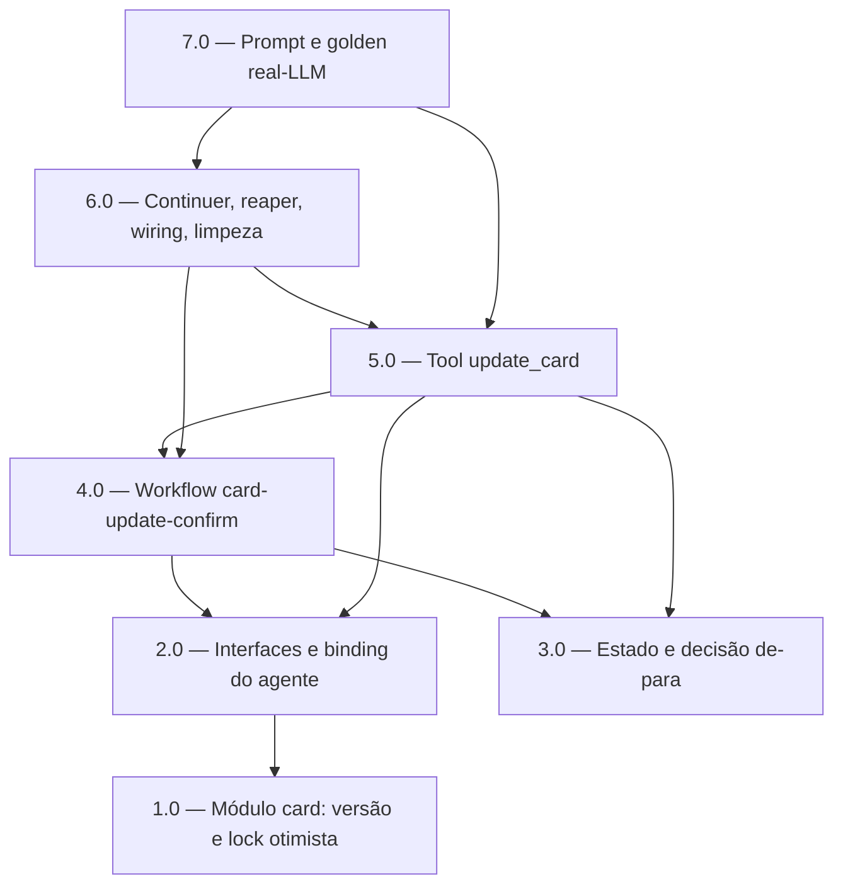

<!-- spec-hash-prd: 2b7b7937760529072f88464a49a36799f7f20c4b27e4b559b456ed26637b3b9d -->
<!-- spec-hash-techspec: c51cee7cc0b327a4853aa49999db54a0ffb2a8a982b75f5b658f6031226d0d91 -->
# Resumo das Tarefas de Implementação para Editar Cartão pela Conversa (WhatsApp)

## Metadados
- **PRD:** `.specs/prd-editar-cartao-conversacional/prd.md`
- **Especificação Técnica:** `.specs/prd-editar-cartao-conversacional/techspec.md`
- **Total de tarefas:** 7
- **Tarefas paralelizáveis:** 1.0 e 3.0 (entre si)

## Tarefas

<!-- Colunas e formato canônico (MANDATÓRIO):
     - `#`: id decimal `X.Y` (sempre X.0 para tarefas de topo).
     - `Status`: ^(pending|in_progress|needs_input|blocked|failed|done)$
     - `Dependências`: ^(—|\d+\.\d+(,\s*\d+\.\d+)*)$  (em-dash unicode quando vazio)
     - `Paralelizável`: ^(—|Não|Com\s+\d+\.\d+(,\s*\d+\.\d+)*)$
     - `Skills`: skills processuais extras (descoberta agnóstica em `.agents/skills/`). Use `—` quando
       não houver. Nunca listar skills auto-carregadas (governance/linguagem) nem `*-implementation`.
     - `Fase` (OPCIONAL): inteiro positivo para agrupamento visual de fases de entrega. Pode ser
       omitida em PRDs pequenos; `execute-all-tasks` não consome esta coluna. Se incluída, mantenha
       em todas as linhas para não quebrar o parser de tabela markdown. -->

| # | Título | Status | Dependências | Paralelizável | Skills |
|---|--------|--------|-------------|---------------|--------|
| 1.0 | Módulo card: expor versão e lock otimista atômico | pending | — | Com 3.0 | domain-modeling-production, postgresql-production-standards |
| 2.0 | Interfaces e binding do agente: Version e ExpectedVersion | pending | 1.0 | — | mastra |
| 3.0 | Estado fechado e decisão pura com confirmação de-para | pending | — | Com 1.0 | domain-modeling-production, mastra |
| 4.0 | Workflow card-update-confirm com escrita idempotente | pending | 2.0, 3.0 | — | mastra, domain-modeling-production |
| 5.0 | Reescrita da tool update_card para o workflow dedicado | pending | 2.0, 3.0, 4.0 | — | mastra |
| 6.0 | Continuer, reaper, wiring e limpeza do enum compartilhado | pending | 4.0, 5.0 | — | mastra |
| 7.0 | Prompt do agente e cobertura golden real-LLM | pending | 5.0, 6.0 | — | mastra |

## Dependências Críticas
- 1.0 é a base: expõe `Version` e o lock otimista atômico no módulo card; 2.0 e todo o caminho do agente dependem dela.
- 4.0 (workflow) só começa após 2.0 (contrato de versão no agente) e 3.0 (estado/decisão).
- 5.0 (tool) integra estado, workflow e binding; depende de 2.0, 3.0 e 4.0.
- 6.0 conecta o fluxo ao runtime (continuer, resume-chain, reaper) e remove o caminho antigo do `destructive-confirm`; depende de 4.0 e 5.0.
- 7.0 (prompt + gate real-LLM) é o fechamento comportamental; depende de 5.0 e 6.0.

## Riscos de Integração
- Alteração da assinatura `UpdateByIDForUser` (novo `expectedVersion`) tem um único chamador (use case), mas afeta o caminho REST — mitigado por `ExpectedVersion` opcional (nil = comportamento atual) e teste de integração cobrindo os dois caminhos.
- Remoção de `OpUpdateCard` do `destructive-confirm` compartilhado (última constante do enum, sem reordenar) exige build/vet e testes do workflow compartilhado verdes.
- Ordem de resume: `tryContinueCardUpdate` deve entrar logo após `tryContinueCardCreate`; chaves distintas (`:card-update` vs `:card-create`) evitam colisão.
- Gate real-LLM historicamente frágil: casos golden dirigem por seleção de tool e propriedade semântica, sem strings frágeis; régua 0,90 mantida.

## Cobertura de Requisitos

| Tarefa | Requisitos cobertos |
|--------|-------------------|
| 1.0 | RF-06, RF-16, RF-17, RF-18, RF-20, RF-23, RF-27, RF-28 |
| 2.0 | RF-06, RF-27 |
| 3.0 | RF-05, RF-10, RF-11, RF-12, RF-13, RF-14, RF-19 |
| 4.0 | RF-08, RF-09, RF-18, RF-20, RF-21, RF-22, RF-23, RF-24, RF-26 |
| 5.0 | RF-01, RF-04, RF-05, RF-06, RF-07, RF-15, RF-16, RF-17, RF-20 |
| 6.0 | RF-09, RF-14, RF-29, RF-30, RF-31 |
| 7.0 | RF-02, RF-03, RF-25, RF-26, RF-32 |

## Grafo de Dependencias

## Legenda de Status
- `pending`: aguardando execução
- `in_progress`: em execução
- `needs_input`: aguardando informação do usuário
- `blocked`: bloqueado por dependência ou falha externa
- `failed`: falhou após limite de remediação
- `done`: completado e aprovado
