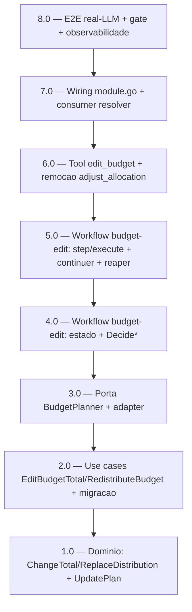

<!-- spec-hash-prd: 6c5c64e617f5b58ae7e30bc8da95c9f428985534767b19ba68a89826182f4bc3 -->
<!-- spec-hash-techspec: 6659fde013f5017bbf5465cec8552b8f7c77fa6b29917a316ccc676557ce9e95 -->
# Resumo das Tarefas de Implementação — Editar Orçamento por Conversa (WhatsApp)

## Metadados
- **PRD:** `.specs/prd-editar-orcamento-conversacional/prd.md`
- **Especificação Técnica:** `.specs/prd-editar-orcamento-conversacional/techspec.md`
- **ADRs:** adr-001..adr-005
- **Total de tarefas:** 8
- **Tarefas paralelizáveis:** nenhuma (cadeia estritamente sequencial)

## Tarefas

| # | Título | Status | Dependências | Paralelizável | Skills |
|---|--------|--------|-------------|---------------|--------|
| 1.0 | Domínio `budgets`: `ChangeTotal`/`ReplaceDistribution` + repo `UpdatePlan` | pending | — | Não | domain-modeling-production, postgresql-production-standards |
| 2.0 | Use cases `EditBudgetTotal`/`RedistributeBudget` + migração `EditCategoryPercentage` + exports | pending | 1.0 | Não | domain-modeling-production |
| 3.0 | Porta `BudgetPlanner` + adapter (agents) | pending | 2.0 | Não | mastra |
| 4.0 | Workflow `budget-edit`: estado fechado + `Decide*` puras | pending | 3.0 | Não | mastra, domain-modeling-production, design-patterns-mandatory |
| 5.0 | Workflow `budget-edit`: step/execute + continuer + reaper | pending | 4.0 | Não | mastra, domain-modeling-production |
| 6.0 | Tool `edit_budget` (prefill + pré-check) + remoção `adjust_allocation` | pending | 5.0 | Não | mastra |
| 7.0 | Wiring `module.go` + consumer resolver + reaper job | pending | 6.0 | Não | mastra |
| 8.0 | Testes E2E real-LLM + golden + gate + observabilidade | pending | 7.0 | Não | mastra |

## Dependências Críticas
- Cadeia estritamente sequencial 1.0 → 2.0 → 3.0 → 4.0 → 5.0 → 6.0 → 7.0 → 8.0.
- 1.0 define os métodos de agregado e `UpdatePlan` consumidos por 2.0; 2.0 exporta use cases consumidos pelo adapter em 3.0; 3.0 define a porta usada pelo workflow em 4.0/5.0; 6.0 depende do workflow completo; 7.0 faz o wiring de tudo; 8.0 valida o fluxo ponta a ponta.

## Riscos de Integração
- `module.go` (agents) é tocado apenas em 7.0 — evita conflito de merge entre tarefas.
- `EditCategoryPercentage` migra de `repo.Activate` para `repo.UpdatePlan` em 2.0 (corrige re-stamp de `activated_at`); teste de regressão obrigatório assertando `activated_at` inalterado (ADR-003).
- Remoção de `adjust_allocation` (6.0) exige ajustar/retirar seus testes e golden na mesma tarefa (ADR-002).
- Chave de correlação = `resourceID` (sem competência), idêntica em tool (6.0) e continuer (5.0) — divergência quebraria o resume (ADR-004).
- Justificativa de 8 tarefas (≤10): fatias coerentes por camada (domínio → use cases → porta → workflow-estado → workflow-execução → tool → wiring → gate); consolidar mais reduziria revisibilidade independente.

## Cobertura de Requisitos

| Tarefa | Requisitos cobertos |
|--------|-------------------|
| 1.0 | RF-15, RF-16, RF-19, RF-20, RF-23 |
| 2.0 | RF-11, RF-12, RF-14, RF-15, RF-16, RF-17, RF-18, RF-19, RF-20, RF-21, RF-22, RF-23 |
| 3.0 | RF-11, RF-12, RF-14, RF-17, RF-21 |
| 4.0 | RF-22, RF-24, RF-25, RF-26, RF-27, RF-30, RF-32 |
| 5.0 | RF-05, RF-24, RF-25, RF-27, RF-28, RF-29, RF-30, RF-31, RF-34, RF-35, RF-36, RF-38 |
| 6.0 | RF-01, RF-02, RF-03, RF-04, RF-06, RF-07, RF-08, RF-09, RF-10, RF-13, RF-18, RF-33, RF-37, RF-39 |
| 7.0 | RF-05, RF-31, RF-33, RF-38 |
| 8.0 | RF-03, RF-35, RF-36, RF-38, RF-40 |

## Grafo de Dependencias

## Legenda de Status
- `pending`: aguardando execução
- `in_progress`: em execução
- `needs_input`: aguardando informação do usuário
- `blocked`: bloqueado por dependência ou falha externa
- `failed`: falhou após limite de remediação
- `done`: completado e aprovado
