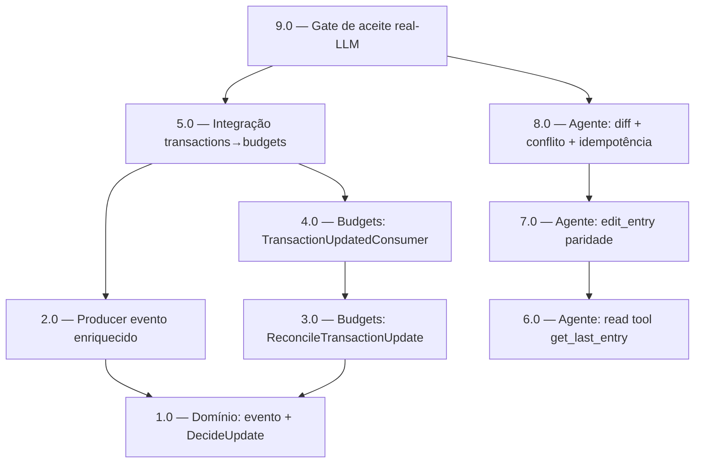

<!-- spec-hash-prd: 9c29a68725558f4e41de01882ffa1a8dc11da2e4a8350505f5761bd9964adcbd -->
<!-- spec-hash-techspec: 98464eb0fcf0ca79c1dd6d61d60b2eb8af53a1453f50fbc3bb8910495b9a1b48 -->
# Resumo das Tarefas de Implementação para Editar Transação Conversacional

## Metadados
- **PRD:** `.specs/prd-editar-transacao-conversacional/prd.md`
- **Especificação Técnica:** `.specs/prd-editar-transacao-conversacional/techspec.md`
- **Total de tarefas:** 9
- **Tarefas paralelizáveis:** 3.0 ‖ 6.0

## Tarefas

| # | Título | Status | Dependências | Paralelizável | Skills |
|---|--------|--------|-------------|---------------|--------|
| 1.0 | Domínio transactions: enriquecer `TransactionUpdated` + `DecideUpdate` popular campos + no-op | pending | — | — | domain-modeling-production, design-patterns-mandatory |
| 2.0 | Producer: serializar evento enriquecido (só mapeia) + teste | pending | 1.0 | — | — |
| 3.0 | Budgets: usecase `ReconcileTransactionUpdate` + Input DTO `Validate()` + mocks + testes | pending | 1.0 | Com 6.0 | domain-modeling-production, design-patterns-mandatory |
| 4.0 | Budgets: `TransactionUpdatedConsumer` fino + registro em `module.go` + testes | pending | 3.0 | — | — |
| 5.0 | Integração transactions→budgets (testcontainers) | pending | 2.0, 4.0 | — | — |
| 6.0 | Agente: read tool `get_last_entry` + porta `ListRecentEntries` no ledger + testes | pending | — | Com 3.0 | mastra |
| 7.0 | Agente: alargar `edit_entry` (paridade) + comando/estado/`buildRawUpdate` + re-resolução categoria + `WithWriteToolSet` | pending | 6.0 | — | mastra, domain-modeling-production |
| 8.0 | Agente: confirmação diff antes→depois + conflito version→re-confirm + no-op + idempotência + anti-simulação | pending | 7.0 | — | mastra, domain-modeling-production |
| 9.0 | Gate de aceite: golden real-LLM ≥0,90/cat + consistência transação↔orçamento + gates de governança | pending | 5.0, 8.0 | — | mastra |

## Dependências Críticas
- 1.0 define o contrato do evento `TransactionUpdated` enriquecido; destrava 2.0 (producer), 3.0/4.0/5.0 (reflexo no orçamento) e 8.0 (gravação).
- 6.0 (resolução determinística do alvo) destrava 7.0 (edição com paridade) e, em cascata, 8.0.
- 9.0 (gate de aceite) só fecha após a integração (5.0) e o fluxo de agente completo (8.0).

## Riscos de Integração
- Parcelas fantasma no orçamento (ADR-001): a integração 5.0 deve validar 3x→2x e migração pix↔crédito, senão a edição de compra parcelada reintroduz consumo defasado.
- Conflito de `version` (ADR-003): 8.0 deve re-ler e re-apresentar confirmação; ausência disso reintroduz sobrescrita silenciosa.
- Caminho legado `destructive_confirm.OpEditEntry` (ADR-002): manter intocado; não roteá-lo. Regressão se algum wiring passar por ele.
- Gate real-LLM (D-05): brittleness de teste pode mascarar defeito; dirigir ao estado/invariante semântico sem baixar a régua de 0,90/categoria.

## Cobertura de Requisitos

| Tarefa | Requisitos cobertos |
|--------|-------------------|
| 1.0 | RF-15, RF-22, RF-24, RF-27 |
| 2.0 | RF-27 |
| 3.0 | RF-28, RF-29, RF-30 |
| 4.0 | RF-28, RF-32 |
| 5.0 | RF-24, RF-27, RF-28, RF-29, RF-30 |
| 6.0 | RF-01, RF-02 |
| 7.0 | RF-03, RF-04, RF-05, RF-06, RF-07, RF-08, RF-09, RF-10, RF-11, RF-12, RF-13, RF-14, RF-15, RF-31 |
| 8.0 | RF-16, RF-17, RF-18, RF-19, RF-20, RF-21, RF-22, RF-23, RF-25, RF-26, RF-32 |
| 9.0 | RF-32, RNF-01, RNF-02, RNF-03, RNF-04, RNF-05, RNF-06 |

## Grafo de Dependencias

## Legenda de Status
- `pending`: aguardando execução
- `in_progress`: em execução
- `needs_input`: aguardando informação do usuário
- `blocked`: bloqueado por dependência ou falha externa
- `failed`: falhou após limite de remediação
- `done`: completado e aprovado
