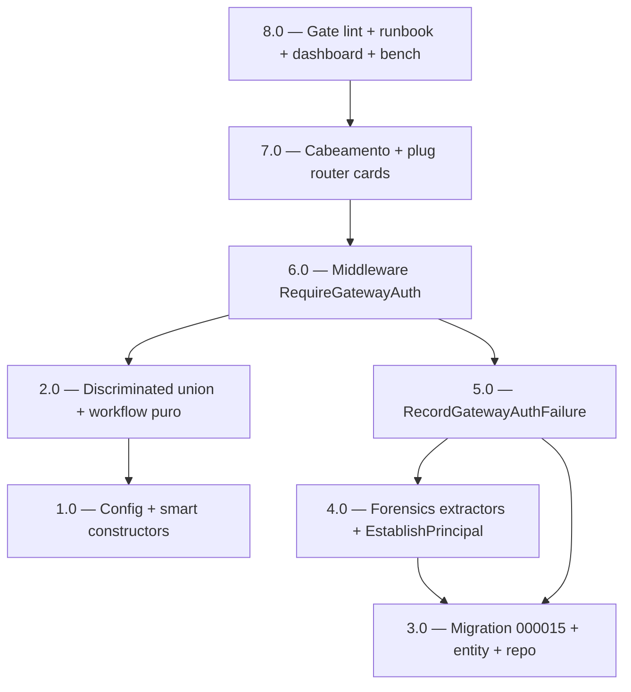

<!-- spec-hash-prd: 5ee72819335fdd7e6416099724992d9d16d7d75fc87ec5bb9d67f02b72b5fb14 -->
<!-- spec-hash-techspec: 24135a3046fd3bf87f7cc829e1865570df0d925bfcea1443371715e55b5fd741 -->
# Resumo das Tarefas de Implementação para Gateway Authentication + Auth Event Forensics

## Metadados
- **PRD:** `.specs/prd-gateway-auth-forensics/prd.md`
- **Especificação Técnica:** `.specs/prd-gateway-auth-forensics/techspec.md`
- **Total de tarefas:** 8
- **Tarefas paralelizáveis:** 1.0 ‖ 3.0

## Tarefas

| # | Título | Status | Dependências | Paralelizável | Skills |
|---|--------|--------|-------------|---------------|--------|
| 1.0 | Config + smart constructors GatewaySignature/GatewayTimestamp | done | — | Com 3.0 | — |
| 2.0 | Discriminated union GatewayAuthResult + workflow puro VerifyGatewayRequest | done | 1.0 | Não | — |
| 3.0 | Migration 000015 auth_events forensics + entity + repo mapping | done | — | Com 1.0 | — |
| 4.0 | Forensics extractors RequestID/ClientIP + EstablishPrincipal update | done | 3.0 | Não | — |
| 5.0 | Use case RecordGatewayAuthFailure (outbox auth.failed) | done | 3.0, 4.0 | Não | — |
| 6.0 | Middleware RequireGatewayAuth fino + métricas + spans | done | 2.0, 5.0 | Não | — |
| 7.0 | Cabeamento module.go + plug router cards + integration test | done | 6.0 | Não | — |
| 8.0 | Gate lint:auth-bypass + runbook + dashboard + microbenchmark | done | 7.0 | Não | otel-grafana-dashboards, taskfile-production |

## Dependências Críticas
- **6.0 (middleware) é o convergente**: depende de 2.0 (workflow puro) e 5.0 (failure use case). Bloqueia 7.0 e 8.0.
- **7.0 (plug router cards)** é o ponto em que o gate M-09 (`lint:auth-bypass`) começa a valer; sem ela, o gate de 8.0 não tem alvo real para validar.
- **3.0 (migration)** deve ser aplicada antes de 4.0 e 5.0 — `auth_events` ganha colunas novas e 4 valores de `reason` que o use case e o producer dependem.
- **Cutover atômico (ADR-005)**: 7.0 deploy do app + Caddyfile (item B3 do plano-fonte, fora deste PRD) devem ocorrer na mesma janela. Coordenar.

## Riscos de Integração
- **Drift cliente LLM ↔ servidor Go** na canonicalização HMAC (ADR-001). Mitigação: 2.0 expõe vetor de teste fixo (input → hex esperado) reproduzível em Python; 8.0 publica vetor no runbook.
- **Ordem da chain de middleware** (ADR-004): 7.0 atualiza `internal/card/.../router.go` com sequência exata `RequireGatewayAuth → InjectPrincipal → RequireUser → idempotency`. 8.0 implementa gate mecânico que falha CI se ordem regredir.
- **Mock `PendingEventRepository`** já foi regenerado em bugfix paralelo; verificar `task mocks` continua verde após 5.0/6.0 adicionarem use cases.
- **Integration tests pre-existentes broken** em `internal/budgets` (drift de assinaturas) — fora do escopo deste PRD; não tentar consertar aqui.

## Cobertura de Requisitos

| Tarefa | Requisitos cobertos |
|--------|-------------------|
| 1.0 | RF-06, RF-11 (smart constructors), RF-19, RF-20, RF-23 |
| 2.0 | RF-04, RF-05, RF-07, RF-11 (DU + workflow) |
| 3.0 | RF-14, RF-15 |
| 4.0 | RF-16, RF-17, RF-18 |
| 5.0 | RF-08 |
| 6.0 | RF-02, RF-03, RF-09, RF-10, RF-13 |
| 7.0 | RF-01, RF-12 |
| 8.0 | RF-21, RF-22 |

## Grafo de Dependencias

## Legenda de Status
- `pending`: aguardando execução
- `in_progress`: em execução
- `needs_input`: aguardando informação do usuário
- `blocked`: bloqueado por dependência ou falha externa
- `failed`: falhou após limite de remediação
- `done`: completado e aprovado
