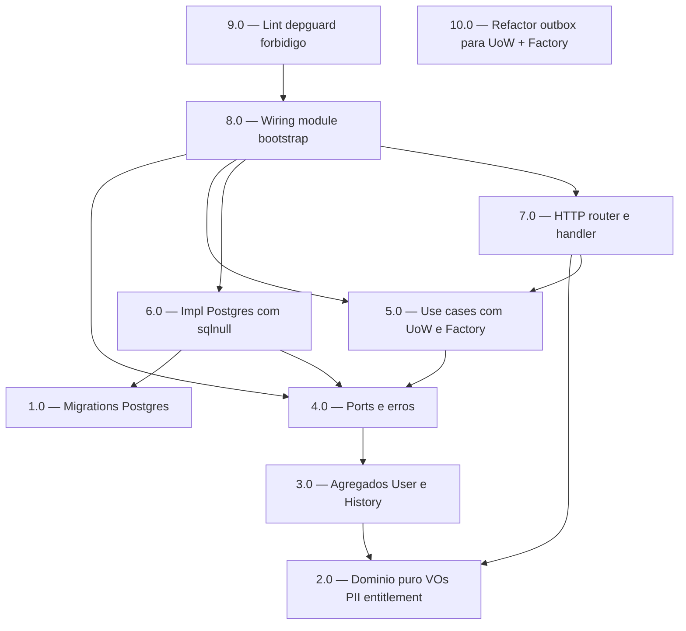

<!-- spec-hash-prd: a450afc022d8e4eba4e0fc74802e7690c9c3b6e7b242a622982a0024612c60c1 -->
<!-- spec-hash-techspec: bd62ade7a89222b68bf24f43c03d8e65aa5f65d40b105c0cf47b7de21020fee0 -->
# Resumo das Tarefas de Implementação para Identity Foundation (E1)

## Metadados
- **PRD:** `.specs/prd-identity-foundation/prd.md`
- **Especificação Técnica:** `.specs/prd-identity-foundation/techspec.md`
- **Runbook canônico:** `docs/runbooks/handler-usecase-uow-repository.md`
- **ADRs:** 001–008
- **Total de tarefas:** 10
- **Tarefas paralelizáveis:** 1.0 ↔ 2.0 ↔ 10.0; 8.0 ↔ 9.0

## Tarefas

<!-- Colunas e formato canônico (MANDATÓRIO):
     - `#`: id decimal `X.Y` (sempre X.0 para tarefas de topo).
     - `Status`: ^(pending|in_progress|needs_input|blocked|failed|done)$
     - `Dependências`: ^(—|\d+\.\d+(,\s*\d+\.\d+)*)$  (em-dash unicode quando vazio)
     - `Paralelizável`: ^(—|Não|Com\s+\d+\.\d+(,\s*\d+\.\d+)*)$
     - `Skills`: skills processuais extras (descoberta agnóstica em `.agents/skills/`). Use `—` quando
       não houver. Nunca listar skills auto-carregadas (governance/linguagem) nem `*-implementation`. -->

| # | Título | Status | Dependências | Paralelizável | Skills |
|---|--------|--------|-------------|---------------|--------|
| 1.0 | Migrations Postgres + invariantes (users + user_whatsapp_history) | pending | — | Com 2.0, 10.0 | — |
| 2.0 | Domínio puro: VOs, PII, entitlement, policies, entities.NewID | pending | — | Com 1.0, 10.0 | — |
| 3.0 | Agregados User e WhatsAppHistoryEntry com construtores autossuficientes | pending | 2.0 | Não | — |
| 4.0 | Ports application/interfaces (UserRepository, RepositoryFactory) + erros tipados | pending | 3.0 | Não | — |
| 5.0 | Use cases com uow.UnitOfWork[T] da devkit + RepositoryFactory | pending | 4.0 | Não | — |
| 6.0 | Impl Postgres: RepositoryFactory + user_repository com sqlnull | pending | 1.0, 4.0 | Não | — |
| 7.0 | HTTP: router placeholder + handler com devkit-go/pkg/responses | pending | 2.0, 5.0 | Não | — |
| 8.0 | Wiring: NewIdentityModule + doc.go + bootstrap em cmd/server | pending | 4.0, 5.0, 6.0, 7.0 | Com 9.0 | — |
| 9.0 | Lint depguard + forbidigo enforçando fronteiras e proibições | pending | 8.0 | Com 8.0 | — |
| 10.0 | Refactor internal/platform/outbox para UoW + RepositoryFactory (§17) | pending | — | Com 1.0, 2.0 | — |

## Dependências Críticas

- **Cadeia rígida `1.0 → 6.0 → 8.0`**: schema → impl Postgres → wiring. Sem schema, testes de integração não rodam; sem wiring, sistema não compõe.
- **Cadeia rígida `2.0 → 3.0 → 4.0 → 5.0 → 8.0`**: domínio puro → agregados → ports → UCs → wiring.
- `7.0` depende de `5.0` (handler chama UC) e `2.0` (decode JSON → VOs).
- `9.0` deve rodar **depois** de `8.0` para que paths de `internal/identity/**` existam e o lint valide código real.
- `10.0` (refactor outbox) é independente do caminho identity — só compartilha o helper `internal/platform/sqlnull` já criado.

## Riscos de Integração

- **R-T1 — coerência de nomes de constraint entre 1.0 e 6.0**: o mapping `pgerrcode.UniqueViolation` + `ConstraintName` → sentinel em 6.0 depende dos nomes exatos `users_whatsapp_number_active_uniq` e `users_email_active_uniq` definidos em ADR-007 e migration 1.0. Qualquer renomeação posterior quebra silenciosamente o mapping. Mitigação: 6.0 inclui teste de integração que força violação de cada constraint e valida o sentinel emitido.
- **R-T2 — refactor outbox (10.0) altera construtores**: testes existentes em `internal/platform/outbox/` (`dispatcher_test.go`, `storage_postgres_test.go` se existir) precisam ser atualizados ou retornam falso-vermelho. Mitigação: 10.0 inclui adaptação completa dos testes existentes como subtarefa explícita; não fecha enquanto `go test -race -count=1 ./internal/platform/outbox/...` não estiver verde.
- **R-T3 — 9.0 (lint) só fecha gates RF-02/RF-15 com código real presente**: rodar `forbidigo` antes de `internal/identity/**` existir produz "nenhuma violação" trivialmente. Mitigação: 9.0 depende de 8.0; CI executa `golangci-lint run` no escopo alterado.
- **R-T4 — testcontainers em CI (R-02 do PRD)**: smoke E2E de 6.0 exige Docker. Mitigação: se a esteira CI não suportar, fallback é job manual local até a esteira receber Docker (já registrado em S-02 do PRD).

## Cobertura de Requisitos

| Tarefa | Requisitos cobertos |
|--------|-------------------|
| 1.0 | RF-06 (DDL invariante), RF-07 (DDL prepara filtro), RF-08 (UNIQUE parcial), RF-09 (schema histórico), RF-16 (golang-migrate) |
| 2.0 | RF-03 (WhatsAppNumber VO), RF-04 (VOs evitam string), RF-05 (Email VO), RF-12 (IsEntitled 11 transições + nil), RF-13 (Subscription contract), RF-14 (Masked() + MaskDisplayName) |
| 3.0 | RF-01 (UUID v4 estável via entities.NewID), RF-06 (estado + MarkDeleted), RF-08-bis (SetDisplayNameIfEmpty), RF-08-ter (CanReanimate) |
| 4.0 | RF-10 (port UserRepository), RF-13 (Subscription consumido via port) |
| 5.0 | RF-08-ter (orquestração de reanimação no UC), RF-10 (touch garantido na semântica do UC) |
| 6.0 | RF-07 (SQL filtra deleted_at IS NULL), RF-08 (constraint → sentinel), RF-11 (Postgres com database.DBTX) |
| 7.0 | RF-04 (VOs no boundary HTTP), RF-14 (PII mascarada em logs do handler) |
| 8.0 | RF-17 (doc.go sem RBAC/JWT), RF-18 (NewIdentityModule) |
| 9.0 | RF-02 (ausência reforçada por forbidigo), RF-15 (depguard fronteiras hexagonais) |
| 10.0 | (não-RF — escopo §17 do techspec; refactor outbox para mesmo padrão UoW + Factory) |

## Grafo de Dependencias

## Legenda de Status
- `pending`: aguardando execução
- `in_progress`: em execução
- `needs_input`: aguardando informação do usuário
- `blocked`: bloqueado por dependência ou falha externa
- `failed`: falhou após limite de remediação
- `done`: completado e aprovado
