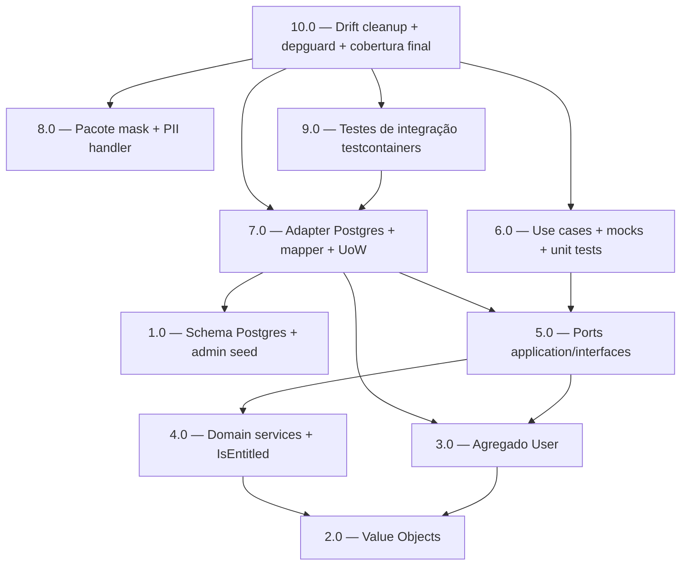

<!-- spec-hash-prd: 1a8ffbdf1a9d8dc441b8ce22ec4cdc645f56f9d63a93a95324403bc685653f40 -->
<!-- spec-hash-techspec: 30ce27610d8b4e9c5165f32151d6e52e0f55366b13375c673785e08f36778376 -->
# Resumo das Tarefas de Implementação para Identity Foundation

## Metadados
- **PRD:** `.specs/prd-identity-foundation/prd.md`
- **Especificação Técnica:** `.specs/prd-identity-foundation/techspec.md`
- **Total de tarefas:** 10
- **Tarefas paralelizáveis:** 1.0 ‖ 2.0 ‖ 8.0; 3.0 ‖ 4.0; 6.0 ‖ 8.0

## Tarefas

| # | Título | Status | Dependências | Paralelizável | Skills |
|---|--------|--------|--------------|---------------|--------|
| 1.0 | Schema Postgres `0003_identity` + admin seed `0004_identity_admin_seed` | done | — | Com 2.0, 8.0 | — |
| 2.0 | Value Objects `WhatsAppNumber`, `Email`, `UserStatus` com normalizer/validator privados | done | — | Com 1.0, 8.0 | — |
| 3.0 | Agregado `User` + `UserID` + `RehydrateUser` + sentinelas de domain | done | 2.0 | Com 4.0 | — |
| 4.0 | Domain services: interface `Subscription` + `EntitlementChecker.IsEntitled` cobrindo 6 transições + nil | done | 2.0 | Com 3.0 | — |
| 5.0 | Ports `UserRepository` e `IDGenerator` em `application/interfaces` | done | 3.0, 4.0 | — | — |
| 6.0 | Use cases finos + mocks via mockery + unit tests table-driven | done | 5.0 | Com 8.0 | — |
| 7.0 | Adapter Postgres `PgxUserRepository` + `rowMapper` + UoW interna + `uuid_generator` | done | 1.0, 3.0, 5.0 | — | — |
| 8.0 | Pacote `internal/platform/observability/mask` + extensão de `PIIFields` no `piiHandler` | done | — | Com 1.0, 2.0, 6.0 | — |
| 9.0 | Testes de integração com `testcontainers-go/postgres` cobrindo upsert idempotente, soft delete + cascata, link new number, índice único parcial | done | 7.0 | — | — |
| 10.0 | Drift cleanup (`doc.go`, `README.md`, `AGENTS.md` do módulo) + `depguard` confirmação + `mockery.yml` declarando interfaces + cobertura final | done | 6.0, 7.0, 8.0, 9.0 | — | — |

## Dependências Críticas

- **1.0** (schema) bloqueia **7.0** (adapter precisa das tabelas reais) e **9.0** (integração via testcontainers aplica todas as migrations).
- **2.0** (VOs) bloqueia **3.0**, **4.0** e **5.0** — assinaturas dos ports usam tipos dos VOs.
- **5.0** (ports) bloqueia **6.0** (use cases consomem) e **7.0** (adapter implementa).
- **7.0** bloqueia **9.0** (integração depende do adapter real).
- **10.0** é gate final: valida que `RF-15` (drift cleanup), `RF-16` (depguard) e `RF-17` (cobertura consolidada) atingem o threshold definido pelas métricas MS-01..MS-03.

## Riscos de Integração

- Drift entre VOs (`2.0`) e mapper (`7.0`) — se assinatura de `NewWhatsAppNumber` mudar após `7.0` iniciar, mapper precisa rerun do test.
- `9.0` depende de `database.RunMigrations` (já existente) processar as migrations de `1.0` corretamente; falha de sintaxe SQL só aparece em integração.
- `10.0` re-roda cobertura agregada de `MS-01` e pode falhar se algum caminho de erro de `2.0`/`3.0`/`4.0` não estiver coberto.

## Cobertura de Requisitos

| Tarefa | Requisitos cobertos |
|--------|---------------------|
| 1.0 | RF-08, RF-09, RF-10 |
| 2.0 | RF-02, RF-03, RF-04, RF-05, RF-17 (parcial) |
| 3.0 | RF-01, RF-06, RF-07 (método de domínio) |
| 4.0 | RF-13, RF-14, RF-17 (parcial) |
| 5.0 | RF-11 |
| 6.0 | RF-07 (orquestração de soft delete via use case) |
| 7.0 | RF-12 |
| 8.0 | RF-19 |
| 9.0 | RF-18 |
| 10.0 | RF-15, RF-16, RF-17 (consolidação) |

## Grafo de Dependencias

## Legenda de Status
- `pending`: aguardando execução
- `in_progress`: em execução
- `needs_input`: aguardando informação do usuário
- `blocked`: bloqueado por dependência ou falha externa
- `failed`: falhou após limite de remediação
- `done`: completado e aprovado
