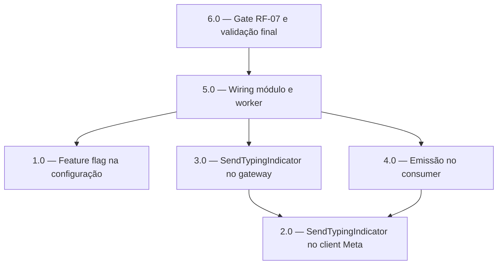

<!-- spec-hash-prd: 961a35c1e75f094b71fb5ce31358202e9eca1386f336c4f9f1defb254c39f849 -->
<!-- spec-hash-techspec: a678b548b9abfe98d01d15d810682c56f24ab9ce7111f1038be10d18e9950b10 -->
# Resumo das Tarefas de Implementação para Indicador de Digitação no WhatsApp

## Metadados
- **PRD:** `.specs/prd-indicador-digitando-whatsapp/prd.md`
- **Especificação Técnica:** `.specs/prd-indicador-digitando-whatsapp/techspec.md`
- **Total de tarefas:** 6
- **Tarefas paralelizáveis:** 1.0 com 2.0; 3.0 com 4.0

## Tarefas

| # | Título | Status | Dependências | Paralelizável | Skills |
|---|--------|--------|--------------|---------------|--------|
| 1.0 | Feature flag AGENT_WHATSAPP_TYPING_INDICATOR_ENABLED na configuração | done | — | Com 2.0 | — |
| 2.0 | Método SendTypingIndicator no client Meta com payload oficial | done | — | Com 1.0 | — |
| 3.0 | Método SendTypingIndicator no gateway de onboarding | done | 2.0 | Com 4.0 | — |
| 4.0 | Emissão best-effort no WhatsAppInboundConsumer com métrica | done | 2.0 | Com 3.0 | mastra |
| 5.0 | Wiring do módulo agents e do worker com ajuste do stub de boot | done | 1.0, 3.0, 4.0 | Não | mastra |
| 6.0 | Gate de versão RF-07 e validação completa de zero regressão | blocked | 5.0 | Não | — |

## Dependências Críticas
- 3.0 depende de 2.0 porque o gateway delega ao método novo do client Meta.
- 4.0 depende de 2.0 apenas por contrato de payload; a interface do consumidor é local, mas a integração final exige o client real.
- 5.0 é o ponto de integração: exige 1.0 (flag), 3.0 (gateway) e 4.0 (consumer) prontos.
- 6.0 é o gate de ativação: exige a cadeia completa mergeada (5.0) e ambiente de teste com número WhatsApp real.

## Riscos de Integração
- Interface local `whatsAppGateway` do módulo agents (module.go:54-56) ganha método: o stub de `module_boot_integration_test.go` quebra até a tarefa 5.0 ajustá-lo; por isso 5.0 é sequencial e não paralelizável.
- Suíte existente (unitária com asserts exatos, integração com `.Once()`, e2e com contagem de mensagens) é a evidência de zero regressão: nenhuma tarefa pode exigir alteração de asserts existentes com a flag desligada.
- RF-07 depende de fato externo (versão da Graph API); a tarefa 6.0 pode bloquear a ativação sem bloquear o merge.

## Cobertura de Requisitos

| Tarefa | Requisitos cobertos |
|--------|---------------------|
| 1.0 | RF-05, RF-06 |
| 2.0 | RF-01, RF-04, RF-07, RF-09 |
| 3.0 | RF-04, RF-09 |
| 4.0 | RF-01, RF-02, RF-03, RF-04, RF-06, RF-08, RF-10 |
| 5.0 | RF-05, RF-06, RF-09 |
| 6.0 | RF-06, RF-07 |

## Grafo de Dependencias

## Legenda de Status
- `pending`: aguardando execução
- `in_progress`: em execução
- `needs_input`: aguardando informação do usuário
- `blocked`: bloqueado por dependência ou falha externa
- `failed`: falhou após limite de remediação
- `done`: completado e aprovado
