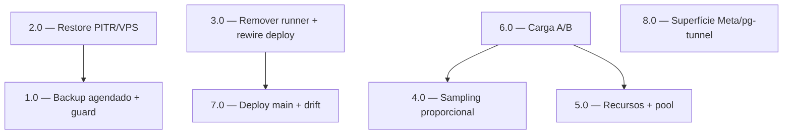

<!-- spec-hash-prd: d7a97a8fa98a63232897442fa44617bc6e7ef670cf9fbd519f40989469e35b47 -->
<!-- spec-hash-techspec: a5609732dff81359c40acdfa65cc35a417cd283fbdc1ca65652e86f07d6260b9 -->
# Resumo das Tarefas de Implementação para Evolução de Infraestrutura KVM 2 (envelope B)

## Metadados
- **PRD:** `.specs/prd-infra-evolucao-kvm2-10k/prd.md` (spec-version 1)
- **Especificação Técnica:** `.specs/prd-infra-evolucao-kvm2-10k/techspec.md`
- **Total de tarefas:** 8
- **Tarefas paralelizáveis:** 1.0 e 7.0 (entre si)

## Tarefas

| # | Título | Status | Dependências | Paralelizável | Skills |
|---|--------|--------|-------------|---------------|--------|
| 1.0 | Backup pgBackRest agendado, alertado e com guard de imagem | pending | — | Com 7.0 | taskfile-production, otel-grafana-dashboards |
| 2.0 | Ensaio de restore PITR e restore de VPS com evidência | pending | 1.0 | Não | — |
| 3.0 | Remover runner do host de produção e migrar deploy para GitHub-hosted via SSH | pending | 7.0 | Não | taskfile-production |
| 4.0 | Sampling de traces proporcional e ajuste do gate anti-storm | pending | — | Não | otel-grafana-dashboards |
| 5.0 | Orçamento de recursos, pool de conexões e alerta de saturação | pending | — | Não | otel-grafana-dashboards |
| 6.0 | Harness de carga k6 e prova dos envelopes A e B | pending | 4.0, 5.0 | Não | taskfile-production, otel-grafana-dashboards |
| 7.0 | Deploy da main em produção e alerta de drift de versão | pending | — | Com 1.0 | otel-grafana-dashboards |
| 8.0 | Endurecimento de superfície: rate-limit Meta e bind do pg-tunnel | pending | — | Não | — |

## Dependências Críticas
- **2.0 depende de 1.0**: o ensaio de restore valida a cadeia de backup (imagem custom + agendamento + WAL) — sem o guard de imagem e o agendamento confirmados, o restore testaria um estado inconsistente.
- **3.0 depende de 7.0**: a `main` é deployada pelo caminho atual (7.0) antes de reescrever/remover o pipeline; evita deploy durante a troca de runner.
- **6.0 depende de 4.0 e 5.0**: o teste de carga mede p95 já com o sampling e o orçamento de recursos ajustados, senão os números não refletem a configuração-alvo.

## Riscos de Integração
- **Arquivos compartilhados no `compose.swarm.yml`**: as tarefas 4.0 (sampling), 5.0 (limits/pool) e 8.0 (pg-tunnel) editam o mesmo manifesto — por isso são marcadas `Não` paralelizáveis entre si, para evitar conflito de merge e ocultar risco de integração.
- **Rewire de deploy (3.0)** altera `ci-cd.yml` e o caminho de entrega; deve ser validado em staging via SSH antes de produção, com rollback automático preservado.
- **Ordem operacional recomendada (fases do relatório)**: F0 = 1.0 + 7.0 (+2.0); F1 = 3.0; F2 = 4.0; F3 = 5.0 + 6.0; 8.0 pode entrar em qualquer janela de baixa demanda.
- Total de 8 tarefas está dentro do teto padrão de 10; nenhuma justificativa de expansão necessária.

## Cobertura de Requisitos

| Tarefa | Requisitos cobertos |
|--------|-------------------|
| 1.0 | RF-01, RF-02, RF-03, REQ-01 |
| 2.0 | RF-04, RF-05, RF-06, REQ-02 |
| 3.0 | RF-07, RF-08, RF-09, RF-10, REQ-03 |
| 4.0 | RF-11, RF-12, RF-13, REQ-04 |
| 5.0 | RF-14, RF-15, RF-16, REQ-05 |
| 6.0 | RF-17, RF-18, REQ-06 |
| 7.0 | RF-19, RF-20, REQ-07 |
| 8.0 | RF-21, RF-22, REQ-08 |

## Grafo de Dependencias

## Legenda de Status
- `pending`: aguardando execução
- `in_progress`: em execução
- `needs_input`: aguardando informação do usuário
- `blocked`: bloqueado por dependência ou falha externa
- `failed`: falhou após limite de remediação
- `done`: completado e aprovado
