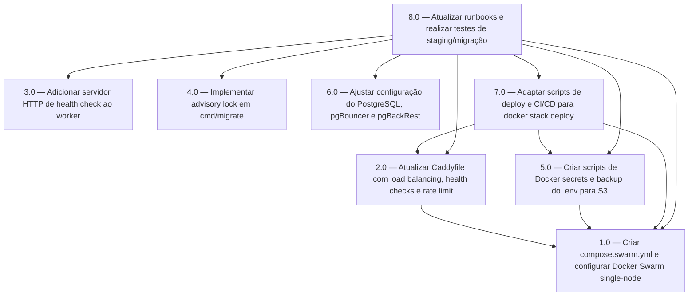

<!-- spec-hash-prd: fafa3f89f1c694ad4c5c845ccda25ece7ad70b700a055a94c8f770db67c76895 -->
<!-- spec-hash-techspec: e6d49d39d0c252d51323e5e9d5d095384738b669331e6602f923d5fda2805f8b -->
# Resumo das Tarefas de Implementação — Infraestrutura de Produção Robusta

## Metadados
- **PRD:** `.specs/prd-infra-producao-robusta-10k-dez-2026/prd.md`
- **Especificação Técnica:** `.specs/prd-infra-producao-robusta-10k-dez-2026/techspec.md`
- **Total de tarefas:** 8
- **Tarefas paralelizáveis:** 3.0 (Com 1.0), 4.0 (Com 1.0), 6.0 (Com 1.0)

## Tarefas

| # | Título | Status | Dependências | Paralelizável | Skills |
|---|--------|--------|-------------|---------------|--------|
| 1.0 | Criar compose.swarm.yml e configurar Docker Swarm single-node | done | — | — | — |
| 2.0 | Atualizar Caddyfile com load balancing, health checks e rate limit | done | 1.0 | Não | — |
| 3.0 | Adicionar servidor HTTP de health check ao worker | done | — | Com 1.0 | — |
| 4.0 | Implementar advisory lock em cmd/migrate | done | — | Com 1.0 | — |
| 5.0 | Criar scripts de Docker secrets e backup do .env para S3 | done | 1.0 | Não | — |
| 6.0 | Ajustar configuração do PostgreSQL, pgBouncer e pgBackRest | done | — | Com 1.0 | — |
| 7.0 | Adaptar scripts de deploy e CI/CD para docker stack deploy | done | 1.0, 2.0, 5.0 | Não | — |
| 8.0 | Atualizar runbooks e realizar testes de staging/migração | done | 1.0, 2.0, 3.0, 4.0, 5.0, 6.0, 7.0 | Não | otel-grafana-dashboards |

## Dependências Críticas

- A tarefa **1.0** é a base de toda a stack Swarm. Sem ela, 2.0, 5.0 e 7.0 não podem ser testadas.
- A tarefa **7.0** exige que 1.0, 2.0 e 5.0 estejam concluídas, pois o deploy só faz sentido quando Swarm, Caddy e secrets estão prontos.
- A tarefa **8.0** é a única que depende de todas as anteriores, pois envolve validação end-to-end e migração real.

## Riscos de Integração

- **Oversubscription de CPU na KVM2:** 2+2 réplicas exigem ~4,75 vCPU em 2 disponíveis. Durante os testes de staging, monitorar thresholds para validar se a performance é aceitável.
- **Migração de Compose para Swarm:** não há snapshot/rollback formal. Qualquer falha na migração exige recuperação manual a partir de backups S3.
- **Docker secrets imutáveis:** rotação de segredos exige recriar secrets com nomes únicos e atualizar services. O script de criação deve lidar com isso.
- **Caddyfile vs Compose:** ao adicionar a terceira réplica no futuro, tanto `compose.swarm.yml` quanto `Caddyfile` precisarão ser atualizados.

## Cobertura de Requisitos

| Tarefa | Requisitos cobertos |
|--------|-------------------|
| 1.0 | RF-01, RF-02, RF-06, RF-08, RF-09, RF-20 |
| 2.0 | RF-03, RF-04, RF-21 |
| 3.0 | RF-05, RF-07 |
| 4.0 | RF-25 |
| 5.0 | RF-10, RF-11 |
| 6.0 | RF-13, RF-14, RF-15, RF-16 |
| 7.0 | RF-12, RF-19, RF-20 |
| 8.0 | RF-17, RF-18, RF-22, RF-23, RF-24, RF-26 |

## Grafo de Dependências

## Legenda de Status
- `pending`: aguardando execução
- `in_progress`: em execução
- `needs_input`: aguardando informação do usuário
- `blocked`: bloqueado por dependência ou falha externa
- `failed`: falhou após limite de remediação
- `done`: completado e aprovado
