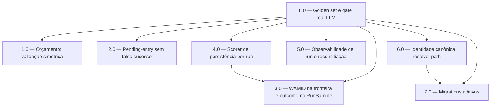

<!-- spec-hash-prd: b3ed073a189476b0b0f275e097a35dc8f4a128ab9b9bf3343052e07ce17ffd2e -->
<!-- spec-hash-techspec: 995466e4eb1e1639fafcf1fd410880c9ad49abb1f5fc368ef4c81e04da28c3b3 -->
# Resumo das Tarefas de Implementação para Jornada WhatsApp financeira sem falso sucesso

## Metadados
- **PRD:** `.specs/prd-jornada-whatsapp-financeira-sem-falso-sucesso/prd.md`
- **Especificação Técnica:** `.specs/prd-jornada-whatsapp-financeira-sem-falso-sucesso/techspec.md`
- **Total de tarefas:** 8
- **Tarefas paralelizáveis:** 1.0‖2.0‖3.0‖7.0 (onda 1); 4.0‖5.0‖6.0 (onda 2)

## Tarefas

| # | Título | Status | Dependências | Paralelizável | Skills |
|---|--------|--------|-------------|---------------|--------|
| 1.0 | Orçamento: validação simétrica e personalização preservada | done | — | Com 2.0, 3.0, 7.0 | domain-modeling-production, mastra, design-patterns-mandatory |
| 2.0 | Pending-entry: registro determinístico sem falso sucesso | done | — | Com 1.0, 3.0, 7.0 | mastra, domain-modeling-production, design-patterns-mandatory |
| 3.0 | Plataforma: WAMID na fronteira e outcome no RunSample | done | — | Com 1.0, 2.0, 7.0 | mastra, design-patterns-mandatory |
| 4.0 | Scorer de persistência per-run e diferenciação operacional | done | 3.0 | Com 5.0, 6.0 | mastra, design-patterns-mandatory |
| 5.0 | Observabilidade de run: continuers, reconciliação e status distinguível | done | — | Com 4.0, 6.0 | mastra, postgresql-production-standards |
| 6.0 | Identidade canônica com resolve_path | done | 7.0 | Com 4.0, 5.0 | domain-modeling-production, mastra, postgresql-production-standards |
| 7.0 | Migrations aditivas: resolve_path e backfill/CHECK de correlation_key | done | — | Com 1.0, 2.0, 3.0 | postgresql-production-standards |
| 8.0 | Golden set, gate real-LLM e gates de governança ponta a ponta | done | 1.0, 2.0, 3.0, 4.0, 5.0, 6.0, 7.0 | Não | mastra, postgresql-production-standards |

## Dependências Críticas
- **7.0 → 6.0**: a coluna `auth_events.resolve_path` (migration 000008) precisa existir antes do código de identidade escrever nela.
- **3.0 → 4.0**: o scorer de persistência consome `scorer.ToolCallRecord.Outcome`, introduzido na fronteira de plataforma pela 3.0 (propagação via `ScoringHooks.AfterTool`).
- **1.0–7.0 → 8.0**: o golden set e o gate real-LLM validam a jornada completa; exigem todas as correções aplicadas.
- Onda 1 sem dependências (1.0, 2.0, 3.0, 7.0) — arquivos disjuntos, seguras em paralelo. Onda 2 (4.0, 5.0, 6.0) após liberar 3.0 e 7.0.

## Riscos de Integração
- **Chave do ledger imutável (ADR-002)**: 2.0 NÃO altera `(wamid, item_seq, operation)`; a idempotência por pendência vem de `wamid = state.MessageID` original. Alterar a chave quebraria idempotência histórica.
- **`DecideAllocationsBP` compartilhado (ADR-003)**: 1.0 muda ramo `confirm`/prompt que afeta onboarding E budget-creation — a tarefa testa os dois fluxos.
- **`ScoringHooks.AfterTool` deve parar de descartar `resultBytes` E tools com erro (ADR-004)**: se 3.0 descartar só um, o scorer da 4.0 permanece cego ao pior caso.
- **Migration com CHECK (ADR-005)**: 7.0 executa backfill dos 4 runs legados ANTES do `ADD CONSTRAINT`, senão a migration aborta em produção.
- **UoW aninhada (ADR-006)**: 6.0 cria o vínculo na mesma tx de `resolvePrincipal`; não chamar `LinkChannelToUser` (abre uow própria).
- **Adapters finos (RF-28)**: a query de reconciliação (5.0) vive no adapter postgres como leitura invocada por use case; nenhuma tarefa introduz regra de negócio em adapter.

## Cobertura de Requisitos

| Tarefa | Requisitos cobertos |
|--------|-------------------|
| 1.0 | RF-01, RF-02, RF-03, RF-04, RF-29 |
| 2.0 | RF-05, RF-06, RF-07, RF-08, RF-09, RF-10, RF-11, RF-12, RF-30 |
| 3.0 | RF-13, RF-17, RF-22 |
| 4.0 | RF-17, RF-18 |
| 5.0 | RF-13, RF-14, RF-15, RF-16, RF-19, RF-22, RF-23, RF-24 |
| 6.0 | RF-20, RF-21 |
| 7.0 | RF-15, RF-21 |
| 8.0 | RF-08, RF-16, RF-25, RF-26, RF-27, RF-28 |

## Grafo de Dependencias

## Legenda de Status
- `pending`: aguardando execução
- `in_progress`: em execução
- `needs_input`: aguardando informação do usuário
- `blocked`: bloqueado por dependência ou falha externa
- `failed`: falhou após limite de remediação
- `done`: completado e aprovado
