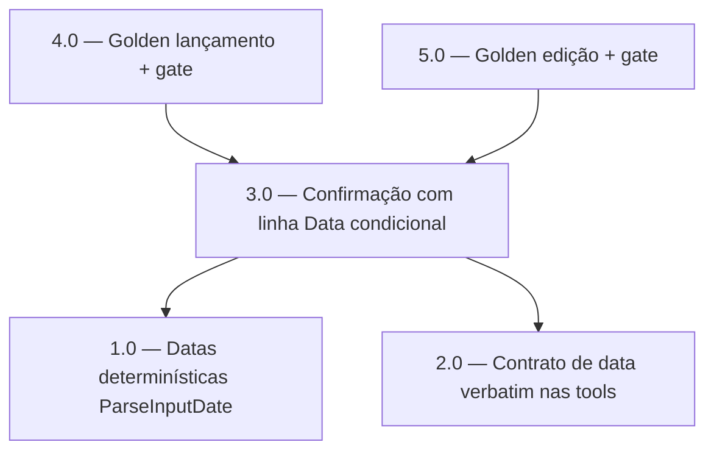

<!-- spec-hash-prd: 67567b60f7514c1b2c7f9e59399d98775b767be1fdc4b09e1777cd17f77da09b -->
<!-- spec-hash-techspec: 24fa2d459c0d0a4d0825c9162f7d4526c06fa1a04c3e8af6a92f290db0cbfb55 -->
# Resumo das Tarefas de Implementação para Lançamento e Edição de Receitas em Linguagem Natural

## Metadados
- **PRD:** `.specs/prd-lancamento-edicao-receitas/prd.md`
- **Especificação Técnica:** `.specs/prd-lancamento-edicao-receitas/techspec.md`
- **Total de tarefas:** 5
- **Tarefas paralelizáveis:** 1.0 com 2.0; 4.0 com 5.0

## Tarefas

| # | Título | Status | Dependências | Paralelizável | Skills |
|---|--------|--------|-------------|---------------|--------|
| 1.0 | Datas determinísticas: estender ParseInputDate + helpers puros | done | — | Com 2.0 | domain-modeling-production, design-patterns-mandatory |
| 2.0 | Contrato de data verbatim nos schemas de register_income e edit_entry | done | — | Com 1.0 | mastra |
| 3.0 | Confirmação de receita com linha Data condicional | done | 1.0, 2.0 | — | mastra, design-patterns-mandatory |
| 4.0 | Golden real-LLM de lançamento (grupos + valor + data) + gate | done | 1.0, 2.0, 3.0 | Com 5.0 | mastra |
| 5.0 | Golden real-LLM de edição de receita + gate | done | 1.0, 2.0, 3.0 | Com 4.0 | mastra |

## Dependências Críticas
- 3.0 depende de 1.0 (data resolvida para exibir na confirmação) e de 2.0 (token verbatim tem resolvedor).
- 4.0 e 5.0 dependem de 1.0, 2.0 e 3.0 (provam o comportamento fim-a-fim já com data determinística, contrato verbatim e confirmação ajustada).

## Riscos de Integração
- O gate real-LLM (4.0, 5.0) exige `RUN_REAL_LLM=1` e credenciais OpenRouter no ambiente de teste; sem elas, a prova de aceite não roda (mocks não substituem — política do projeto).
- Alteração de mensagem verbatim de confirmação (3.0) pode quebrar asserts existentes; atualizar testes de confirmação de receita para o formato condicional.
- Contrato verbatim (2.0): se o LLM computar data ISO em vez de enviar a expressão, a resolução determinística é contornada; o golden de datas (4.0/5.0) é a rede de proteção.

## Cobertura de Requisitos

| Tarefa | Requisitos cobertos |
|--------|-------------------|
| 1.0 | RF-05, RF-06, RF-07, RF-22 |
| 2.0 | RF-16 |
| 3.0 | RF-10, RF-26 |
| 4.0 | RF-01, RF-02, RF-03, RF-04, RF-08, RF-09, RF-11, RF-12, RF-13, RF-14, RF-15, RF-25, RF-27 |
| 5.0 | RF-17, RF-18, RF-19, RF-20, RF-21, RF-23, RF-24 |

## Grafo de Dependencias

## Legenda de Status
- `pending`: aguardando execução
- `in_progress`: em execução
- `needs_input`: aguardando informação do usuário
- `blocked`: bloqueado por dependência ou falha externa
- `failed`: falhou após limite de remediação
- `done`: completado e aprovado
