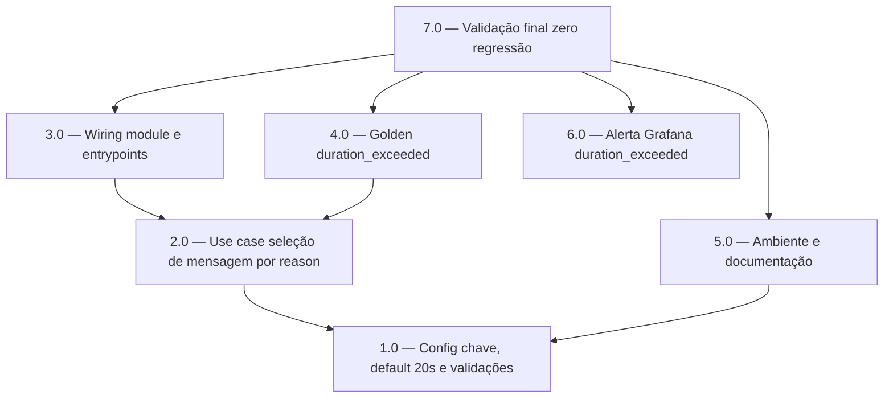

<!-- spec-hash-prd: d876d06c905ac89f41a13356af3bb113b44b6aee400410ff4cd56edaa3998b96 -->
<!-- spec-hash-techspec: 24d7e2a15c7037a1361cb23e100ec759145ac8ac4dca0509b1607a04348dc8c6 -->
# Resumo das Tarefas de Implementação para Limite de Áudio de 20 Segundos no WhatsApp

## Metadados
- **PRD:** `.specs/prd-limite-audio-20-segundos-whatsapp/prd.md`
- **Especificação Técnica:** `.specs/prd-limite-audio-20-segundos-whatsapp/techspec.md`
- **Total de tarefas:** 7
- **Tarefas paralelizáveis:** 3.0 Com 4.0; 5.0 Com 2.0; 6.0 Com 1.0

## Tarefas

<!-- Colunas e formato canônico (MANDATÓRIO):
     - `#`: id decimal `X.Y` (sempre X.0 para tarefas de topo).
     - `Status`: ^(pending|in_progress|needs_input|blocked|failed|done)$
     - `Dependências`: ^(—|\d+\.\d+(,\s*\d+\.\d+)*)$  (em-dash unicode quando vazio)
     - `Paralelizável`: ^(—|Não|Com\s+\d+\.\d+(,\s*\d+\.\d+)*)$
     - `Skills`: skills processuais extras (descoberta agnóstica em `.agents/skills/`). Use `—` quando
       não houver. Nunca listar skills auto-carregadas (governance/linguagem) nem `*-implementation`.
     - `Fase` (OPCIONAL): inteiro positivo para agrupamento visual de fases de entrega. Pode ser
       omitida em PRDs pequenos; `execute-all-tasks` não consome esta coluna. Se incluída, mantenha
       em todas as linhas para não quebrar o parser de tabela markdown. -->

| # | Título | Status | Dependências | Paralelizável | Skills |
|---|--------|--------|-------------|---------------|--------|
| 1.0 | Config: chave WA_MSG_AUDIO_DURATION_EXCEEDED, default 20s e validações | pending | — | Com 6.0 | design-patterns-mandatory |
| 2.0 | Use case: seleção de mensagem por reason com testes unitários e de fronteira | pending | 1.0 | Não | mastra, design-patterns-mandatory |
| 3.0 | Wiring: repasse do novo campo em module.go e nos entrypoints server e worker | pending | 2.0 | Com 4.0 | mastra, design-patterns-mandatory |
| 4.0 | Golden: cenário duration_exceeded com prova de zero chamada ao STT | pending | 2.0 | Com 3.0 | mastra |
| 5.0 | Ambiente e documentação: .env.example, prod.env e runbooks de áudio | pending | 1.0 | Com 2.0 | — |
| 6.0 | Alerta Grafana mc-audio-duration-exceeded-rate | pending | — | Com 1.0 | — |
| 7.0 | Validação final e evidência de zero regressão | pending | 3.0, 4.0, 5.0, 6.0 | Não | — |

## Dependências Críticas
- A tarefa 1.0 é bloqueante para 2.0, 3.0, 4.0 e 5.0: sem o campo em `AgentConfig`, o registro em `envKeys()`, as validações e o default, o use case não tem configuração para consumir e a env var seria silenciosamente ignorada.
- A tarefa 3.0 depende da 2.0 porque o wiring repassa um campo de `ProcessAudioInboundConfig` que só existe após a extensão do use case.
- A tarefa 7.0 depende de todas as anteriores por ser o gate final de validação e evidência.

## Riscos de Integração
- O bloco `AudioConfig` é duplicado em `cmd/server/server.go:247-258` e `cmd/worker/worker.go:444-455`; esquecer um entrypoint deixa server e worker divergentes. A tarefa 3.0 cobre os dois no mesmo pacote.
- Não existe gate de CI de paridade `.env.example` x `config.go` x `prod.env`; a tarefa 5.0 cobre os três artefatos no mesmo pacote para impedir drift documental.
- O cenário 3.4 de `deployment/runbooks/audio-whatsapp-pos-deploy.md:185-188` usa áudio de 55-60s e ficaria invalidado silenciosamente; está no escopo da 5.0.
- A assinatura interna de `replyFor` muda na 2.0; o único call-site é `resultFromRecord` (`process_audio_inbound.go:482`), mantendo o raio de impacto controlado.

## Cobertura de Requisitos

| Tarefa | Requisitos cobertos |
|--------|-------------------|
| 1.0 | RF-05 |
| 2.0 | RF-01, RF-02, RF-03, RF-04 |
| 3.0 | RF-03 |
| 4.0 | RF-01, RF-02, RF-03 |
| 5.0 | RF-08 |
| 6.0 | Critério de sucesso do PRD (guardrail monitorado, ADR-004) |
| 7.0 | RF-06, RF-07, RF-09 |

## Grafo de Dependencias

## Legenda de Status
- `pending`: aguardando execução
- `in_progress`: em execução
- `needs_input`: aguardando informação do usuário
- `blocked`: bloqueado por dependência ou falha externa
- `failed`: falhou após limite de remediação
- `done`: completado e aprovado
