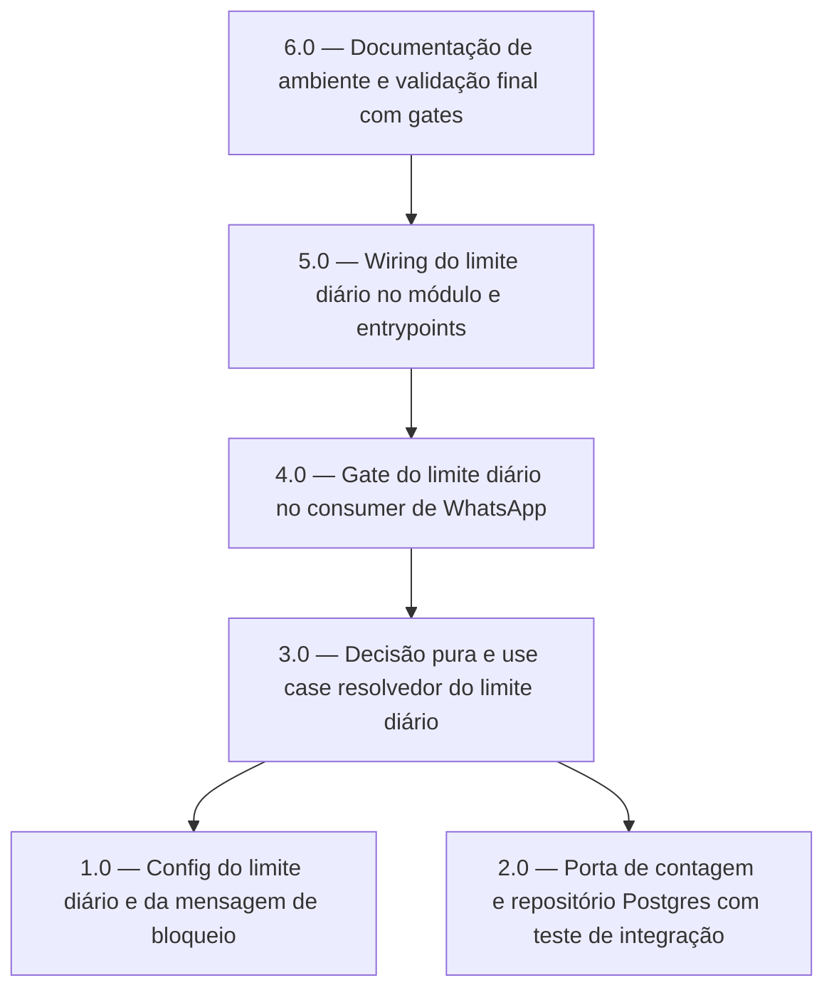

<!-- spec-hash-prd: cd02d0df73fe39ccd93c198ca927f951ef6ec55338490bb7375268344e975d62 -->
<!-- spec-hash-techspec: 32bf883e398c2c34ab5a259321c82977afbd9f5001466d872c8329ff08f18264 -->
# Resumo das Tarefas de Implementação para Limite de 30 Interações Diárias no Assistente WhatsApp

## Metadados
- **PRD:** `.specs/prd-limite-interacoes-diarias-assistente/prd.md`
- **Especificação Técnica:** `.specs/prd-limite-interacoes-diarias-assistente/techspec.md`
- **Total de tarefas:** 6
- **Tarefas paralelizáveis:** 1.0 com 2.0

## Tarefas

<!-- Colunas e formato canônico (MANDATÓRIO):
     - `#`: id decimal `X.Y` (sempre X.0 para tarefas de topo).
     - `Status`: ^(pending|in_progress|needs_input|blocked|failed|done)$
     - `Dependências`: ^(—|\d+\.\d+(,\s*\d+\.\d+)*)$  (em-dash unicode quando vazio)
     - `Paralelizável`: ^(—|Não|Com\s+\d+\.\d+(,\s*\d+\.\d+)*)$
     - `Skills`: skills processuais extras (descoberta agnóstica em `.agents/skills/`). Use `—` quando
       não houver. Nunca listar skills auto-carregadas (governance/linguagem) nem `*-implementation`. -->

| # | Título | Status | Dependências | Paralelizável | Skills |
|---|--------|--------|-------------|---------------|--------|
| 1.0 | Config do limite diário e da mensagem de bloqueio | pending | — | — | — |
| 2.0 | Porta de contagem e repositório Postgres com teste de integração | pending | — | Com 1.0 | — |
| 3.0 | Decisão pura e use case resolvedor do limite diário | pending | 1.0, 2.0 | Não | domain-modeling-production, design-patterns-mandatory, mastra |
| 4.0 | Gate do limite diário no consumer de WhatsApp | pending | 3.0 | Não | mastra, design-patterns-mandatory |
| 5.0 | Wiring do limite diário no módulo e entrypoints | pending | 4.0 | Não | — |
| 6.0 | Documentação de ambiente e validação final com gates | pending | 5.0 | Não | — |

## Dependências Críticas
- 3.0 depende de 1.0 (semântica e faixa da config) e de 2.0 (porta `dailyInteractionCounter` declarada e implementada).
- 4.0 depende de 3.0 (contrato `DailyLimitResult` e use case resolvedor prontos).
- 5.0 depende de 4.0 (option `WithDailyLimitResolver` existente para ser ligada no wiring).
- 6.0 depende de 5.0 (validação final só faz sentido com o wiring completo).

## Riscos de Integração
- Ordem da cadeia no consumer (dedup, resume, limite, agente) é o ponto de maior risco de regressão; mitigada por teste de ordenação dedicado na tarefa 4.0 no padrão de `TestResumeDispatcherPrecedesOnboarding`.
- A porta `dailyInteractionCounter` é criada na tarefa 2.0 em arquivo próprio no pacote `usecases`; a tarefa 3.0 consome essa porta sem redesenhá-la. Divergência aqui quebra o contrato entre as duas tarefas.
- Dois entrypoints (`cmd/server` e `cmd/worker`) precisam do mesmo repasse de config na tarefa 5.0; esquecer um deles deixa o gate ativo em um processo e inativo no outro.

## Cobertura de Requisitos

| Tarefa | Requisitos cobertos |
|--------|-------------------|
| 1.0 | RF-05, RF-08 |
| 2.0 | RF-02 |
| 3.0 | RF-03, RF-04, RF-09, RF-11, RF-12 |
| 4.0 | RF-01, RF-06, RF-07, RF-10, RF-12, RF-13, RF-14 |
| 5.0 | RF-08 |
| 6.0 | RF-05 |

## Grafo de Dependencias

## Legenda de Status
- `pending`: aguardando execução
- `in_progress`: em execução
- `needs_input`: aguardando informação do usuário
- `blocked`: bloqueado por dependência ou falha externa
- `failed`: falhou após limite de remediação
- `done`: completado e aprovado
