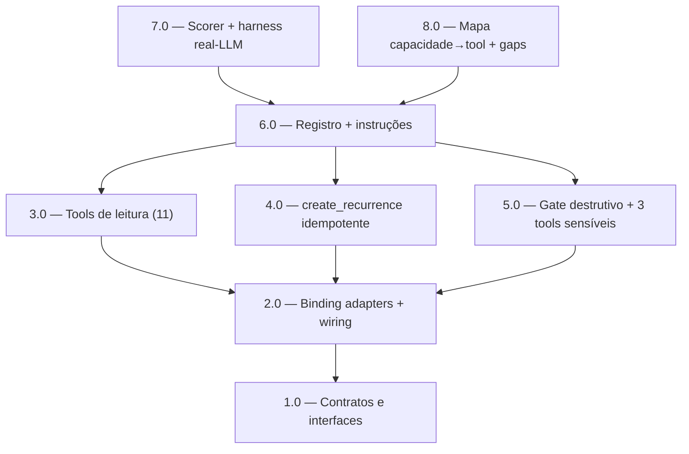

<!-- spec-hash-prd: 67cf1b9b69f5ca5b244b64ffaff8e62de3d91e22972f934e78bb3849711bba59 -->
<!-- spec-hash-techspec: 6828af3e025bcd97c9f70b9db522fb1e54289572396a656c2ea59f5b0bcf75bf -->
# Resumo das Tarefas de Implementação para Superfície de Tools do MeControla Agent

## Metadados
- **PRD:** `.specs/prd-mecontrola-agent-tools/prd.md`
- **Especificação Técnica:** `.specs/prd-mecontrola-agent-tools/techspec.md`
- **Total de tarefas:** 8
- **Tarefas paralelizáveis:** 3.0, 4.0, 5.0 (entre si); 7.0, 8.0 (entre si)

## Tarefas

| # | Título | Status | Dependências | Paralelizável | Skills |
|---|--------|--------|-------------|---------------|--------|
| 1.0 | Contratos: interfaces de consumidor, tipos agent-owned e RecurrenceManager | pending | — | — | mastra |
| 2.0 | Binding adapters + wiring dos use cases nos módulos | pending | 1.0 | Não | mastra |
| 3.0 | Tools de leitura (11) sobre budgets/card/transactions | pending | 2.0 | Com 4.0, 5.0 | mastra |
| 4.0 | Tool create_recurrence com IdempotentWrite | pending | 2.0 | Com 3.0, 5.0 | mastra |
| 5.0 | OperationKinds novos + gate destrutivo + 3 tools sensíveis | pending | 2.0 | Com 3.0, 4.0 | mastra |
| 6.0 | Registro no agente + instruções determinísticas e anti-simulação | pending | 3.0, 4.0, 5.0 | Não | mastra |
| 7.0 | Scorer de tool esperada + harness real-LLM + observabilidade | pending | 6.0 | Com 8.0 | mastra |
| 8.0 | Mapa capacidade→tool, relatório de gaps e gate anti-falso-positivo | pending | 6.0 | Com 7.0 | mastra |

## Dependências Críticas
- 1.0 → 2.0: os adapters dependem das interfaces e tipos agent-owned definidos em 1.0.
- 2.0 → 3.0/4.0/5.0: todas as tools dependem dos bindings e do wiring dos use cases.
- 3.0/4.0/5.0 → 6.0: o registro em `buildFinancialTools` e as instruções só fecham quando as 15 tools existem.
- 6.0 → 7.0/8.0: a validação de uso efetivo (7.0) e a verificação de cobertura/gaps (8.0) exigem a superfície completa registrada.

## Riscos de Integração
- `go-implementation` e `object-calisthenics-go` são `category: language` e NÃO aparecem na coluna Skills — `execute-task` Stage 2 as auto-carrega por detecção de diff Go. O mandato de CLAUDE.md (go-implementation obrigatória em Go) é honrado em execução, não por declaração aqui.
- 3.0, 4.0 e 5.0 tocam arquivos disjuntos (tools de leitura vs. `create_recurrence` vs. `confirm_state`/`destructive_confirm_workflow` + tools destrutivas); o único ponto de convergência é `module.go`, isolado na tarefa 6.0 para evitar conflito de merge.
- 5.0 amplia a superfície destrutiva (3 operações); risco mitigado pelo reuso do gate `destructive-confirm` já endurecido (ADR-001).
- 7.0 exige LLM real (`RUN_REAL_LLM=1` + `OPENROUTER_*`); mocks não contam como evidência.

## Cobertura de Requisitos

| Tarefa | Requisitos cobertos |
|--------|-------------------|
| 1.0 | RF-19 |
| 2.0 | RF-02, RF-05, RF-19 |
| 3.0 | RF-09, RF-10, RF-11, RF-12, RF-13, RF-14, RF-18a, RF-18b, RF-18c, RF-18d |
| 4.0 | RF-15, RF-35 |
| 5.0 | RF-16, RF-17, RF-18, RF-22, RF-23, RF-26 |
| 6.0 | RF-20, RF-21, RF-24, RF-25, RF-31, RF-32 |
| 7.0 | RF-27, RF-28, RF-29, RF-30, RF-33, RF-34 |
| 8.0 | RF-01, RF-03, RF-04, RF-06, RF-07, RF-08, RF-36 |

## Grafo de Dependencias

## Legenda de Status
- `pending`: aguardando execução
- `in_progress`: em execução
- `needs_input`: aguardando informação do usuário
- `blocked`: bloqueado por dependência ou falha externa
- `failed`: falhou após limite de remediação
- `done`: completado e aprovado
