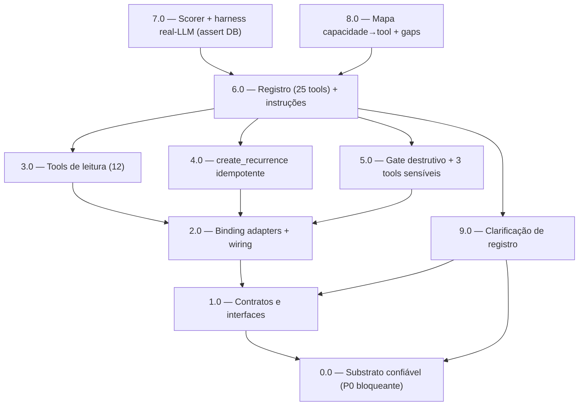

<!-- spec-hash-prd: aeebc1a1f0702c58ddd0002ba503af5b4fc7a0702686a948bb7152477fed9830 -->
<!-- spec-hash-techspec: 24c67c34e4e43284c785453edf6caed1f4d4b8badc65f53515b8d2e844fb6af6 -->
# Resumo das Tarefas de Implementação para Superfície de Tools do MeControla Agent

## Metadados
- **PRD:** `.specs/prd-mecontrola-agent-tools/prd.md` (spec-version 3)
- **Especificação Técnica:** `.specs/prd-mecontrola-agent-tools/techspec.md`
- **Total de tarefas:** 10
- **Tarefas paralelizáveis:** 3.0, 4.0, 5.0, 9.0 (entre si); 7.0, 8.0 (entre si)

## Tarefas

| # | Título | Status | Dependências | Paralelizável | Skills |
|---|--------|--------|-------------|---------------|--------|
| 0.0 | Substrato de escrita/leitura confiável (P0 bloqueante): identidade server-side, guard anti-simulação, Run com role=tool | pending | — | Não (raiz do DAG) | mastra, go-implementation |
| 1.0 | Contratos: interfaces de consumidor (incl. CategoriesReader.ListCategories), tipos agent-owned e RecurrenceManager | pending | 0.0 | — | mastra |
| 2.0 | Binding adapters + wiring dos use cases nos módulos (incl. ListCategories) | pending | 1.0 | Não | mastra |
| 3.0 | Tools de leitura (12) sobre budgets/card/categories/transactions | pending | 2.0 | Com 4.0, 5.0, 9.0 | mastra |
| 4.0 | Tool create_recurrence com IdempotentWrite | pending | 2.0 | Com 3.0, 5.0, 9.0 | mastra |
| 5.0 | OperationKinds novos + gate destrutivo + 3 tools sensíveis | pending | 2.0 | Com 3.0, 4.0, 9.0 | mastra |
| 9.0 | Clarificação de registro (categoria/data) via ConfirmState não-destrutivo | pending | 0.0, 1.0 | Com 3.0, 4.0, 5.0 | mastra |
| 6.0 | Registro no agente (25 tools) + instruções determinísticas e anti-simulação | pending | 3.0, 4.0, 5.0, 9.0 | Não | mastra |
| 7.0 | Scorer de tool esperada + harness real-LLM (assert de linhas no banco) + observabilidade | pending | 6.0 | Com 8.0 | mastra |
| 8.0 | Mapa capacidade→tool, relatório de gaps e gate anti-falso-positivo | pending | 6.0 | Com 7.0 | mastra |

## Dependências Críticas
- 0.0 → tudo: **P0 bloqueante**. A correção do substrato (RF-37..RF-40) é raiz do DAG; enquanto não concluída e verificada por escrita real no banco (RF-40), nenhuma tool nova é considerada coberta/exercida — todas herdariam o defeito de sucesso alucinado comprovado em produção (EP-01..EP-05).
- 0.0 → 1.0: os contratos e todo o resto encadeiam a partir da correção do substrato (task-0.0 é dependência transitiva de todas as tarefas de implementação de tools).
- 1.0 → 2.0: os adapters dependem das interfaces e tipos agent-owned definidos em 1.0 (incl. `CategoriesReader.ListCategories`).
- 2.0 → 3.0/4.0/5.0: todas as tools dependem dos bindings e do wiring dos use cases.
- 0.0 + 1.0 → 9.0: a clarificação de registro reutiliza `ConfirmState`/`OperationKind` (contratos, 1.0) e só confirma sucesso de escrita com o substrato corrigido (0.0).
- 3.0/4.0/5.0/9.0 → 6.0: o registro em `buildFinancialTools` e as instruções só fecham quando as 16 tools novas e a clarificação existem.
- 6.0 → 7.0/8.0: a validação de uso efetivo (7.0, com assert de linhas no banco) e a verificação de cobertura/gaps (8.0) exigem a superfície completa registrada.

## Riscos de Integração
- `go-implementation` e `object-calisthenics-go` são `category: language` e são auto-carregadas por `execute-task` Stage 2 via detecção de diff Go. A tarefa 0.0 declara `go-implementation` explicitamente por ser correção de infraestrutura crítica de plataforma (`internal/platform/agent`); o mandato de CLAUDE.md (go-implementation obrigatória em Go) é honrado em execução para todas as tarefas.
- 3.0, 4.0, 5.0 e 9.0 tocam arquivos majoritariamente disjuntos; os pontos de convergência são `module.go` (isolado na tarefa 6.0) e `confirm_state.go`/`destructive_confirm_workflow.go` (compartilhado entre 5.0 — kinds destrutivos — e 9.0 — `OpConfirmRegister` não-destrutivo): coordenar a ordem para evitar conflito de merge no enum `OperationKind` e no dispatch por mapa.
- 5.0 e 9.0 ampliam a superfície de confirmação; risco mitigado pelo reuso do gate `destructive-confirm` já endurecido (ADR-001) e do mesmo tipo fechado `OperationKind`.
- 7.0 exige LLM real (`RUN_REAL_LLM=1` + `OPENROUTER_*`); mocks não contam como evidência. Cenários de **escrita** exigem assert de linhas reais no banco (D-10/RF-29/M-05); texto de sucesso do agente não conta.
- 0.0 corrige defeito comprovado em produção; sem ela, cada tool nova nasce com o mesmo sucesso alucinado (D-07). É a única tarefa que altera `internal/platform/agent` (substrato), mantendo o kernel `internal/platform/workflow` intocado.

## Cobertura de Requisitos

| Tarefa | Requisitos cobertos |
|--------|-------------------|
| 0.0 | RF-37, RF-38, RF-39, RF-40 (M-07, e M-05 no eixo de escrita) |
| 1.0 | RF-18e, RF-19 |
| 2.0 | RF-02, RF-05, RF-18e, RF-19 |
| 3.0 | RF-09, RF-10, RF-11, RF-12, RF-13, RF-14, RF-18a, RF-18b, RF-18c, RF-18d, RF-18e |
| 4.0 | RF-15, RF-35 |
| 5.0 | RF-16, RF-17, RF-18, RF-22, RF-23, RF-26 |
| 9.0 | RF-41, RF-42, RF-43 |
| 6.0 | RF-18e, RF-20, RF-21, RF-24, RF-25, RF-31, RF-32 |
| 7.0 | RF-27, RF-28, RF-29, RF-30, RF-33, RF-34 (M-05, M-07 verificados por assert de linhas) |
| 8.0 | RF-01, RF-03, RF-04, RF-06, RF-07, RF-08, RF-36 |

## Grafo de Dependencias

## Legenda de Status
- `pending`: aguardando execução
- `in_progress`: em execução
- `needs_input`: aguardando informação do usuário
- `blocked`: bloqueado por dependência ou falha externa
- `failed`: falhou após limite de remediação
- `done`: completado e aprovado
