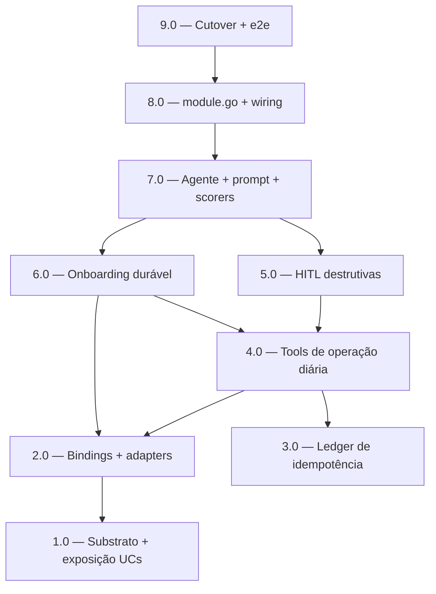

<!-- spec-hash-prd: c8ae9e47917a5181897f19e006928ce22f79a94ca74d69fecfc70dd2b4063acd -->
<!-- spec-hash-techspec: e303a4a2fb4b61a54d5a4c68d0b6f65146730417e00c19a509c17364b82658fb -->
# Resumo das Tarefas de Implementação para MeControlaAgent

## Metadados
- **PRD:** `.specs/prd-mecontrola-agent/prd.md`
- **Especificação Técnica:** `.specs/prd-mecontrola-agent/techspec.md`
- **Total de tarefas:** 9
- **Tarefas paralelizáveis:** 2.0 ↔ 3.0; 5.0 ↔ 6.0

## Tarefas

| # | Título | Status | Dependências | Paralelizável | Skills |
|---|--------|--------|-------------|---------------|--------|
| 1.0 | Substrato: `WithMaxToolRounds` + exposição de use cases no TransactionsModule | pending | — | — | mastra |
| 2.0 | Interfaces consumer-side + adapters de binding (categories/card/budgets/transactions) | pending | 1.0 | Com 3.0 | mastra |
| 3.0 | Ledger de idempotência agent-owned (`agents_write_ledger` + `IdempotentWrite`) | pending | — | Com 2.0 | mastra |
| 4.0 | Tools de operação diária (registrar/consultar/editar/remover/ajustar/classificar) | pending | 2.0, 3.0 | — | mastra |
| 5.0 | HITL de operações destrutivas (ConfirmState fechado, resume antes do parse) | pending | 4.0 | Com 6.0 | mastra |
| 6.0 | Onboarding workflow durável de 8 etapas (fases fechadas, suspend/resume) | pending | 2.0, 4.0 | Com 5.0 | mastra |
| 7.0 | Agente + system prompt + scorers + memória/histórico/roteamento | pending | 5.0, 6.0 | — | mastra |
| 8.0 | `module.go` + wiring `cmd/server`/`cmd/worker` (Deps 4 módulos, modelo, observabilidade) | pending | 7.0 | — | mastra |
| 9.0 | Cutover: remoção total do weather sem resíduo + e2e + gates verdes | pending | 8.0 | — | mastra |

## Dependências Críticas
- **1.0 desbloqueia 2.0**: bindings precisam dos use cases expostos no `TransactionsModule` (`UpdateCardPurchase`, `DeleteCardPurchase`, `GetMonthlySummary`, `ListMonthlyEntries`) e do `WithMaxToolRounds` no substrato.
- **2.0 + 3.0 desbloqueiam 4.0**: tools dependem dos bindings (escrita só via transactions) e do `IdempotentWrite` (exatamente-uma-vez).
- **4.0 desbloqueia 5.0 e 6.0**: HITL reusa as tools de edição/remoção; onboarding reusa bindings/tools.
- **5.0 + 6.0 desbloqueiam 7.0**: o agente monta tools + onboarding + confirmação e injeta memória/roteamento.
- **7.0 → 8.0 → 9.0**: wiring depende do agente pronto; cutover é a última etapa (remoção do weather sem resíduo), depende de tudo.

## Riscos de Integração
- **Consistência eventual** (lançamento→`budgets_expenses` via outbox): teste de integração em 4.0 deve provar atualização do resumo sem dupla contagem; consultas (4.0/7.0) respondem do estado consolidado.
- **`maxToolRounds` × múltiplos lançamentos**: 1.0 torna o teto configurável; 4.0 valida múltiplos itens por mensagem sem estouro, com idempotência por `item_seq`.
- **`ClosingDay := DueDay`** (RF-15.2): 6.0 documenta a simplificação; impacta competência de parcelas — coberto por teste de borda.
- **Cutover sem resíduo** (9.0): `grep` por `weather`/`WeatherClient` deve retornar vazio; build/e2e/governança verdes antes de `done`.
- **Justificativa de 9 tarefas (≤10)**: build order 0→9 consolidada (passo 0+1 unidos em 1.0) para fatias coerentes; cada tarefa entrega valor verificável.

## Cobertura de Requisitos

| Tarefa | Requisitos cobertos |
|--------|-------------------|
| 1.0 | RF-21.2, RF-24, RF-25, RF-26, RF-38 |
| 2.0 | RF-31, RF-32, RF-33, RF-34, RF-35, RF-36 |
| 3.0 | RF-38 |
| 4.0 | RF-20, RF-21, RF-21.1, RF-21.2, RF-22, RF-23, RF-24, RF-25, RF-25.1, RF-25.2, RF-26, RF-32, RF-35, RF-36 |
| 5.0 | RF-27 |
| 6.0 | RF-10, RF-11, RF-11.1, RF-12, RF-13, RF-13.1, RF-14, RF-15, RF-15.1, RF-15.2, RF-16, RF-16.1, RF-17, RF-18, RF-19, RF-19.1, RF-28, RF-30.1 |
| 7.0 | RF-01, RF-05, RF-06, RF-07, RF-08, RF-09, RF-28, RF-29, RF-30, RF-30.1, RF-37, RF-39 |
| 8.0 | RF-01, RF-37 |
| 9.0 | RF-02, RF-03, RF-04 |

## Grafo de Dependencias

## Legenda de Status
- `pending`: aguardando execução
- `in_progress`: em execução
- `needs_input`: aguardando informação do usuário
- `blocked`: bloqueado por dependência ou falha externa
- `failed`: falhou após limite de remediação
- `done`: completado e aprovado
