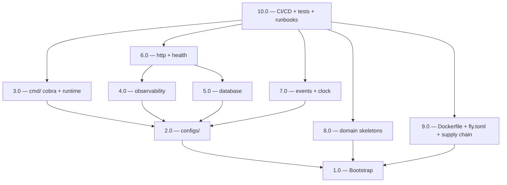

<!-- spec-hash-prd: 9e6ca834f250a525a0e1864992f77741d850f55bd22405fb8e0d5807d2fce7f4 -->
<!-- spec-hash-techspec: 5bfa5fbd8dbadc37e7540b3a1a05a2a49bbb3eda7af73a278c368f8d46cba6a7 -->
# Resumo das Tarefas de Implementação para MeControla Foundation

## Metadados
- **PRD:** `.specs/prd-mecontrola-foundation/prd.md` (v9)
- **Especificação Técnica:** `.specs/prd-mecontrola-foundation/techspec.md`
- **Total de tarefas:** 10
- **Tarefas paralelizáveis:** 3.0, 4.0, 5.0, 7.0 (após 2.0); 8.0 e 9.0 (após 1.0)

## Tarefas

| # | Título | Status | Dependências | Paralelizável | Skills |
|---|--------|--------|-------------|---------------|--------|
| 1.0 | Bootstrap — Taskfile production + governança + hooks + tooling pinning + CODEOWNERS + SECURITY.md | done | — | — | `taskfile-production` |
| 2.0 | `configs/` — Viper + grupos + Validate + DSN/SafeDSN + .env.example | done | 1.0 | Não | — |
| 3.0 | `cmd/` cobra root + subcomandos `server`/`worker`/`migrate` + `internal/infrastructure/runtime` | pending | 2.0 | Com 4.0, 5.0, 7.0 | — |
| 4.0 | `internal/infrastructure/observability` — OTel OTLP + slog + redaction de PII | pending | 2.0 | Com 3.0, 5.0, 7.0 | `otel-grafana-dashboards` |
| 5.0 | `internal/infrastructure/database` — Manager + UnitOfWork[T] + migrations //go:embed + sentinels | pending | 2.0 | Com 3.0, 4.0, 7.0 | — |
| 6.0 | `internal/infrastructure/http` — server + middleware stack + health endpoints + Problem Details mapper | pending | 4.0, 5.0 | Não | — |
| 7.0 | `internal/infrastructure/events` — typed eventbus via generics + `internal/infrastructure/clock` | pending | 2.0 | Com 3.0, 4.0, 5.0 | — |
| 8.0 | Esqueletos dos 6 módulos de domínio (`identity`, `conversation`, `agent`, `finance`, `notifications`, `telemetry`) + depguard fronteiras hexagonais | pending | 1.0 | Com 9.0 | — |
| 9.0 | Dockerfile distroless + `fly.toml` 2 processes + cosign keyless + Dependabot + supply chain scan tarefas | pending | 1.0 | Com 8.0 | — |
| 10.0 | CI/CD workflows + cmd_integration_test + coverage PR comment + runbooks + README + branch protection | pending | 3.0, 6.0, 7.0, 8.0, 9.0 | Não | `pull-request`, `semantic-commit` |

## Dependências Críticas

- **1.0 → tudo**: bootstrap do harness/Taskfile/tooling é pré-requisito de qualquer execução de `task ...`.
- **2.0 → 3.0/4.0/5.0/7.0**: `configs.Config` é injetado em todos os subsistemas de infraestrutura e no `runtime.Bootstrap`; sem o pacote, nenhum outro componente compila.
- **4.0 + 5.0 → 6.0**: o handler `/ready` consome `Manager.HealthCheck` (de 5.0) e instrumenta via `pkg/observability` (de 4.0); requer ambos prontos.
- **3.0/6.0/7.0/8.0/9.0 → 10.0**: integration test do binário (`cmd_integration_test.go`) exige todos os subsistemas compiláveis + Dockerfile pronto + fly.toml; coverage PR comment exige testes unitários de todos os pacotes.

## Riscos de Integração

- **Generics no eventbus (7.0)** podem inflar binário/compile-time → medir após 7.0 e ajustar antes de 9.0/10.0 (cap 30 MB documentado na techspec).
- **`depguard` (8.0)** muito estrito pode bloquear composição em `cmd/`/`internal/infrastructure/` → validar com PR de exemplo de import legítimo antes de 10.0.
- **cosign keyless (9.0)** requer GitHub OIDC ativo no workflow + permissões `id-token: write`; falha silenciosa se setting de repo não permitir → validar manualmente após 9.0.
- **Fly 2 processes (9.0+10.0)** dobra o budget vs single (R$ 60 vs R$ 25); confirmado em ADR-011, mas requer alerta de billing configurado no Fly antes do primeiro deploy.
- **`gitsign` em CI** precisa de OIDC; PR de Dependabot é assinado pelo bot — confirmar interoperação antes de fechar 10.0.

## Cobertura de Requisitos

| Tarefa | Requisitos cobertos |
|--------|-------------------|
| 1.0 | RF-05 (Taskfile), RF-08 (CODEOWNERS), RF-13 (baseline `ai-spec`), RF-16 parcial (commit-msg hook local), RF-17 (`task setup` instala pre-commit), RF-19 (layout Taskfile), RF-20 (`validate-taskfile.py`), RF-21 (TASK_VERSION pin), RF-22 (`.task/` gitignore + schema comment) |
| 2.0 | RF-04 (Viper + Validate + DSN/SafeDSN) |
| 3.0 | RF-02 (cobra subcomandos), RF-03 (subcomando `migrate`), RF-09 parcial (layout `cmd/`) |
| 4.0 | RF-11 (OTel correlated traces/metrics/logs + redaction) |
| 5.0 | RF-03 parcial (migrations executadas pelo subcomando `migrate`), RF-12 (migration de exemplo aplicável e revertível) |
| 6.0 | RF-01 (`/health`, `/ready`, `/live` com dependências) |
| 7.0 | RF-10 (eventbus tipado em `internal/infrastructure/events`) |
| 8.0 | RF-09 parcial (6 módulos hexagonais + depguard) |
| 9.0 | RF-07 (Dockerfile distroless + Fly 2 processes + cosign + SBOM + tags) |
| 10.0 | RF-06 (CI), RF-14 (`ai-spec doctor/lint` em CI), RF-15 (runbooks), RF-16 parcial (CI check), RF-18 (integration testcontainers + coverage), RF-21 parcial (TASK_VERSION via Action no CI) |

## Grafo de Dependencias

## Legenda de Status
- `pending`: aguardando execução
- `in_progress`: em execução
- `needs_input`: aguardando informação do usuário
- `blocked`: bloqueado por dependência ou falha externa
- `failed`: falhou após limite de remediação
- `done`: completado e aprovado
