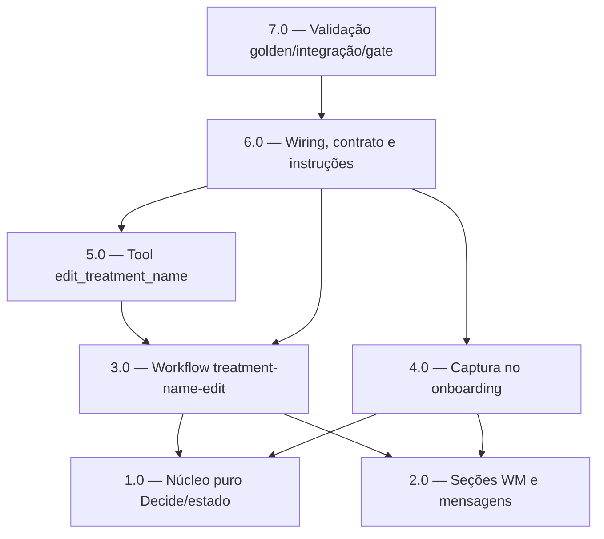

<!-- spec-hash-prd: b45c1dbc63fae3ad42064108461db0b6ed1823c3f375ec6e907bf8b30976a904 -->
<!-- spec-hash-techspec: 10f871a3a786c63f681b1109bece0dfd2d4bd6d79e05a8c3a76a1522e803c5f3 -->
# Resumo das Tarefas de Implementação para Nome de Tratamento do Usuário

## Metadados
- **PRD:** `.specs/prd-nome-de-tratamento-usuario/prd.md`
- **Especificação Técnica:** `.specs/prd-nome-de-tratamento-usuario/techspec.md`
- **Total de tarefas:** 7
- **Tarefas paralelizáveis:** 1.0↔2.0, 3.0↔4.0

## Tarefas

<!-- Colunas e formato canônico (MANDATÓRIO):
     - `#`: id decimal `X.Y` (sempre X.0 para tarefas de topo).
     - `Status`: ^(pending|in_progress|needs_input|blocked|failed|done)$
     - `Dependências`: ^(—|\d+\.\d+(,\s*\d+\.\d+)*)$  (em-dash unicode quando vazio)
     - `Paralelizável`: ^(—|Não|Com\s+\d+\.\d+(,\s*\d+\.\d+)*)$
     - `Skills`: skills processuais extras (descoberta agnóstica em `.agents/skills/`). Use `—` quando
       não houver. Nunca listar skills auto-carregadas (governance/linguagem) nem `*-implementation`.
     - `Fase` (OPCIONAL): inteiro positivo para agrupamento visual de fases de entrega. Pode ser
       omitida em PRDs pequenos; `execute-all-tasks` não consome esta coluna. Se incluída, mantenha
       em todas as linhas para não quebrar o parser de tabela markdown. -->

| # | Título | Status | Dependências | Paralelizável | Skills |
|---|--------|--------|-------------|---------------|--------|
| 1.0 | Núcleo puro do fluxo de edição: estado fechado e funções Decide | pending | — | Com 2.0 | domain-modeling-production, design-patterns-mandatory |
| 2.0 | Helpers de seção de working memory e mensagens determinísticas | pending | — | Com 1.0 | design-patterns-mandatory, mastra |
| 3.0 | Workflow durável treatment-name-edit sem gate de confirmação | pending | 1.0, 2.0 | Com 4.0 | mastra, domain-modeling-production, design-patterns-mandatory |
| 4.0 | Captura do nome no onboarding com writer único na conclusão | pending | 1.0, 2.0 | Com 3.0 | mastra, domain-modeling-production |
| 5.0 | Tool fina edit_treatment_name delegando ao workflow | pending | 3.0 | — | mastra, design-patterns-mandatory |
| 6.0 | Wiring do módulo, contrato de regressão e instruções do agente | pending | 3.0, 4.0, 5.0 | Não | mastra |
| 7.0 | Validação: golden, invariantes, integração Postgres e gate real-LLM | pending | 6.0 | Não | mastra, postgresql-production-standards |

## Dependências Críticas
- 1.0 e 2.0 são fundações puras (sem IO) e habilitam 3.0 e 4.0; devem vir primeiro.
- 3.0 (workflow) bloqueia 5.0 (tool que dá `Start` no engine) e, junto com 4.0 e 5.0, bloqueia 6.0 (wiring).
- 6.0 (wiring + instruções + tool anexada ao agente) é pré-requisito de 7.0, pois o gate real-LLM executa o agente real chamando a tool.
- Writer único de `working_memory` na conclusão do onboarding (ADR-001/ADR-003): 4.0 não pode introduzir um segundo `Upsert` de conteúdo.

## Riscos de Integração
- Clobber de `working_memory` (`Upsert` sobrescreve a coluna inteira): mitigado por writer único (4.0) e merge de seção (2.0/3.0). Validado em 7.0 (integração + invariante).
- Ordenação do enum `OnboardingPhase`: 4.0 mantém `PhaseWelcome` (reaproveita `step-welcome`), sem renumerar snapshots suspensos.
- Um-fluxo-por-recurso: 6.0 adiciona `treatment-name-edit` ao `SuspendedRunIndex`, herdando `ErrMultipleSuspendedRuns` (desejado).
- Janela de inconsistência conteúdo↔metadata (RF-13): coberta como risco aceito na techspec; ambas as falhas → `StepStatusFailed`.

## Cobertura de Requisitos

| Tarefa | Requisitos cobertos |
|--------|-------------------|
| 1.0 | RF-02, RF-11 |
| 2.0 | RF-03, RF-09, RF-12 |
| 3.0 | RF-06, RF-07, RF-08, RF-09, RF-10, RF-13 |
| 4.0 | RF-01, RF-02, RF-03, RF-04, RF-11, RF-16 |
| 5.0 | RF-06, RF-07 |
| 6.0 | RF-05, RF-06, RF-08, RF-10, RF-15 |
| 7.0 | RF-05, RF-10, RF-12, RF-14, RF-16 |

## Grafo de Dependencias

## Legenda de Status
- `pending`: aguardando execução
- `in_progress`: em execução
- `needs_input`: aguardando informação do usuário
- `blocked`: bloqueado por dependência ou falha externa
- `failed`: falhou após limite de remediação
- `done`: completado e aprovado
