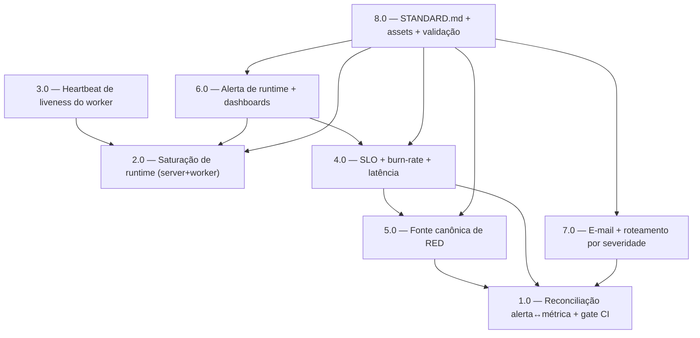

<!-- spec-hash-prd: 5b903694f14214c5f0683252fce5838b97a94465f3d3f7ecf8b7210174ced803 -->
<!-- spec-hash-techspec: 69a4a38dbb36ed5f9d0d3c3621453684ae328a500f7c571923e88f5a28731d9d -->
# Resumo das Tarefas de Implementação para Observabilidade — Fechamento de Gaps e Reconciliação

## Metadados
- **PRD:** `.specs/prd-observabilidade-golden-signals-otel/prd.md`
- **Especificação Técnica:** `.specs/prd-observabilidade-golden-signals-otel/techspec.md`
- **Total de tarefas:** 8
- **Tarefas paralelizáveis:** 1.0 ‖ 2.0 (arquivos disjuntos: YAML/CI vs. código Go)

## Tarefas

| # | Título | Status | Dependências | Paralelizável | Skills |
|---|--------|--------|-------------|---------------|--------|
| 1.0 | Reconciliação alerta↔métrica + gate de CI de auditoria | done | — | Com 2.0 | — |
| 2.0 | Saturação de runtime do processo Go (server + worker) | done | — | Com 1.0 | — |
| 3.0 | Heartbeat de liveness do worker + alerta de staleness | done | 2.0 | Não | — |
| 4.0 | SLO + alertas de burn-rate multi-janela + alerta de latência SLO | done | 1.0, 5.0 | Não | golden-signals-otel-standards |
| 5.0 | Fonte canônica de RED (série do histograma) | done | 1.0 | Não | golden-signals-otel-standards |
| 6.0 | Alerta de causa de runtime + painéis de runtime e SLO | done | 2.0, 4.0 | Não | golden-signals-otel-standards, otel-grafana-dashboards |
| 7.0 | Contact-point de e-mail + roteamento por severidade + runbooks | done | 1.0 | Não | — |
| 8.0 | STANDARD.md + assets + validação + cardinalidade/sampling | done | 2.0, 4.0, 5.0, 6.0, 7.0 | Não | golden-signals-otel-standards |

## Dependências Críticas
- 1.0 deixa o `rules.yaml` provisionado íntegro (sem alertas de métrica morta) antes de qualquer nova regra; todas as tarefas que editam `rules.yaml` (3.0, 4.0, 5.0, 6.0) dependem direta ou transitivamente dela.
- 2.0 provê as métricas `go.*` de runtime — pré-requisito de 3.0 (compartilha o bootstrap do worker) e de 6.0 (painel/alerta de runtime).
- 5.0 fixa a série canônica de RED que o SLI de disponibilidade de 4.0 consome; por isso 4.0 depende de 5.0.
- 8.0 consolida o padrão e só fecha após 2.0, 4.0, 5.0, 6.0 e 7.0.

## Riscos de Integração
- Múltiplas tarefas editam `deployment/telemetry/grafana/provisioning/alerting/rules.yaml` (1.0, 3.0, 4.0, 5.0, 6.0). Só 1.0 ‖ 2.0 são paralelas (arquivos disjuntos); as demais edições de alerta são sequenciais para evitar conflito de merge no mesmo YAML.
- Ativar o MeterProvider global (2.0) muda estado de processo antes desligado; risco mitigado por auditoria de `otel.Get*Provider` (esperado zero) e teste de não-regressão das métricas de instância.
- Nome Prometheus das séries `go.*` depende do exporter; 2.0 confirma o nome antes de 6.0/8.0 fixá-lo em alerta/dashboard/STANDARD.

## Cobertura de Requisitos

| Tarefa | Requisitos cobertos |
|--------|-------------------|
| 1.0 | RF-07, RF-20 |
| 2.0 | RF-01, RF-02, RF-14, RF-17 |
| 3.0 | RF-11 |
| 4.0 | RF-04, RF-05, RF-06 |
| 5.0 | RF-08 |
| 6.0 | RF-03, RF-19 |
| 7.0 | RF-09, RF-10 |
| 8.0 | RF-12, RF-13, RF-15, RF-16, RF-18 |

## Grafo de Dependencias

## Legenda de Status
- `pending`: aguardando execução
- `in_progress`: em execução
- `needs_input`: aguardando informação do usuário
- `blocked`: bloqueado por dependência ou falha externa
- `failed`: falhou após limite de remediação
- `done`: completado e aprovado
