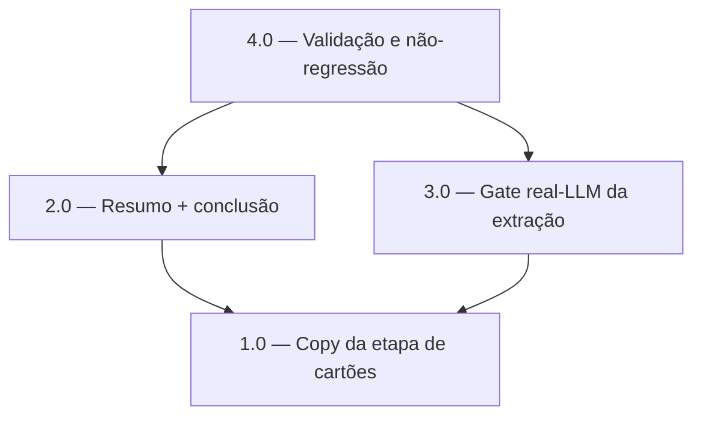

<!-- spec-hash-prd: e224d1c169b0515b28bde355eb50b3bec8b2ae0f74605a747a428422c62d0f3d -->
<!-- spec-hash-techspec: e7af458ffd52824b91b0e405f3ceda14e2331dc2086b094032c5babab8f8b79b -->
# Resumo das Tarefas de Implementação para Onboarding: Cartão por Extenso, Exemplo de Cadastro e Resumo/Conclusão Final

## Metadados
- **PRD:** `.specs/prd-onboarding-cartao-resumo-conclusao/prd.md`
- **Especificação Técnica:** `.specs/prd-onboarding-cartao-resumo-conclusao/techspec.md`
- **Total de tarefas:** 4
- **Tarefas paralelizáveis:** 2.0 e 3.0 (arquivos distintos, ambas após 1.0)

## Tarefas

| # | Título | Status | Dependências | Paralelizável | Skills |
|---|--------|--------|-------------|---------------|--------|
| 1.0 | Copy da etapa de cartões: palavra "cartão"+💳, "outro" em negrito, exemplo de cadastro | done | — | — | mastra, domain-modeling-production, design-patterns-mandatory |
| 2.0 | Resumo + conclusão do onboarding no passo de conclusão | done | 1.0 | Com 3.0 | mastra, domain-modeling-production, design-patterns-mandatory |
| 3.0 | Gate real-LLM da extração de cartão (dia primeiro, banco sem apelido) | done | 1.0 | Com 2.0 | mastra, domain-modeling-production, design-patterns-mandatory |
| 4.0 | Validação production-ready e não-regressão (gates + R0-R7) | done | 2.0, 3.0 | Não | mastra, domain-modeling-production, design-patterns-mandatory |

## Dependências Críticas
- 2.0 e 3.0 dependem de 1.0: a copy do exemplo (formas com/sem apelido, "dia 1"/"dia primeiro") precisa existir antes de o resumo e o gate de extração referenciarem essas formas.
- 4.0 depende de 2.0 e 3.0: a validação final só roda com a copy, o resumo e o gate real-LLM já implementados.

## Riscos de Integração
- 1.0 e 2.0 editam o mesmo arquivo (`onboarding_workflow.go`); por isso 2.0 é sequencial a 1.0 (não paralelizar) para evitar conflito e regressão. 3.0 edita arquivo distinto (`onboarding_workflow_integration_test.go`), logo pode rodar em paralelo com 2.0.
- Testes de copy load-bearing (`onboarding_workflow_test.go:1959` e asserts de `FinalMessage`) precisam ser atualizados junto da mudança de copy — atualização declarada explicitamente em 1.0/2.0, não é regressão oculta.
- `conclusionFinalMessage` permanece inalterado (preserva o teste exact-copy existente); o resumo apenas o antecede.
- Nenhuma mudança em `internal/platform/workflow`, `module.go`, schemas de extração LLM ou estado de domínio — não-regressão validada em 4.0 (RF-17).

## Cobertura de Requisitos

| Tarefa | Requisitos cobertos |
|--------|-------------------|
| 1.0 | RF-01, RF-02, RF-03, RF-04, RF-05, RF-06, RF-07, RF-08, RF-09 |
| 2.0 | RF-10, RF-11, RF-12, RF-13, RF-14, RF-15, RF-16, RF-17 |
| 3.0 | RF-07, RF-09, RF-18 |
| 4.0 | RF-17, RF-18 |

## Grafo de Dependencias

## Legenda de Status
- `pending`: aguardando execução
- `in_progress`: em execução
- `needs_input`: aguardando informação do usuário
- `blocked`: bloqueado por dependência ou falha externa
- `failed`: falhou após limite de remediação
- `done`: completado e aprovado
</content>
