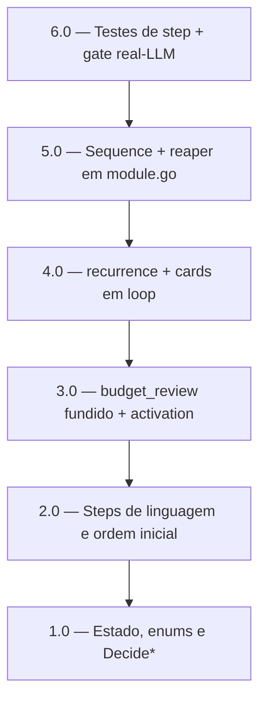

<!-- spec-hash-prd: 8440885b0fb7b6f83f4ce3ac22060c27ba4987e060799f7fd61f7a9b01dc0571 -->
<!-- spec-hash-techspec: 4643b7b991e2db3e9c2cfe3635dbc19cdde56daad371028c886892c8448a8acb -->
# Resumo das Tarefas de Implementação para Onboarding com categorias, orçamento mensal e cartões

## Metadados
- **PRD:** `.specs/prd-onboarding-categorias-orcamento-cartoes/prd.md`
- **Especificação Técnica:** `.specs/prd-onboarding-categorias-orcamento-cartoes/techspec.md`
- **Total de tarefas:** 6
- **Tarefas paralelizáveis:** nenhuma (cadeia sequencial — tarefas 1.0–4.0 editam o mesmo arquivo `onboarding_workflow.go`)

## Tarefas

<!-- Colunas e formato canônico (MANDATÓRIO):
     - `#`: id decimal `X.Y` (sempre X.0 para tarefas de topo).
     - `Status`: ^(pending|in_progress|needs_input|blocked|failed|done)$
     - `Dependências`: ^(—|\d+\.\d+(,\s*\d+\.\d+)*)$  (em-dash unicode quando vazio)
     - `Paralelizável`: ^(—|Não|Com\s+\d+\.\d+(,\s*\d+\.\d+)*)$
     - `Skills`: skills processuais extras (descoberta agnóstica em `.agents/skills/`). Use `—` quando
       não houver. Nunca listar skills auto-carregadas (governance/linguagem) nem `*-implementation`.
     - `Fase` (OPCIONAL): inteiro positivo para agrupamento visual de fases de entrega. Pode ser
       omitida em PRDs pequenos; `execute-all-tasks` não consome esta coluna. Se incluída, mantenha
       em todas as linhas para não quebrar o parser de tabela markdown. -->

| # | Título | Status | Dependências | Paralelizável | Skills |
|---|--------|--------|-------------|---------------|--------|
| 1.0 | Estado, enums fechados e `Decide*` puros (rename orçamento mensal) | pending | — | — | domain-modeling-production, mastra |
| 2.0 | Steps de linguagem e ordem inicial (welcome, goal, monthly_budget, conclusion) | pending | 1.0 | Não | mastra |
| 3.0 | Step fundido `budget_review` (submáquina) + step `activation` | pending | 2.0 | Não | mastra, domain-modeling-production |
| 4.0 | Step `recurrence` + step `cards` em loop um-por-vez | pending | 3.0 | Não | mastra |
| 5.0 | Montagem da `Sequence` + reaper de onboarding em `module.go` | pending | 4.0 | Não | mastra |
| 6.0 | Testes de step (mock) + gate real-LLM + gate M-02 | pending | 5.0 | Não | mastra |

## Dependências Críticas
- 1.0 é fundação: os enums fechados (`OnboardingPhase` novo conjunto, `reviewAwaitKind`) e o rename
  `IncomeCents`→`MonthlyBudgetCents` são consumidos por todas as tarefas seguintes.
- 2.0 → 3.0 → 4.0 → 5.0 → 6.0 formam uma cadeia estrita: cada uma edita `onboarding_workflow.go`
  (2.0–4.0) e depende dos steps anteriores para montar a `Sequence` (5.0) e testar ponta a ponta (6.0).
- 5.0 depende de todos os steps existirem (2.0, 3.0, 4.0) para montar a nova ordem e wirar o reaper.

## Riscos de Integração
- **Mesmo arquivo (`onboarding_workflow.go`)**: 1.0–4.0 tocam o mesmo arquivo; paralelizar esconderia
  risco de merge. Por isso a cadeia é `Não` paralelizável — decisão deliberada de robustez.
- **Snapshot in-flight (D-06)**: o rename da chave JSON pode fazer onboarding em andamento re-perguntar
  o orçamento uma vez; aceito (RF-43). O teste de resume Postgres deve refletir a nova chave.
- **Competência por step (D-13)**: risco raro de virada de mês entre criar draft e ativar; aceito, sem
  persistir competência no estado (ADR-004).
- **Gate real-LLM**: usar drive-until-state e invariante semântico (sem keyword frágil) para evitar
  falso-vermelho, conforme lições de features anteriores.

## Cobertura de Requisitos

| Tarefa | Requisitos cobertos |
|--------|-------------------|
| 1.0 | RF-35, RF-36, RF-43 |
| 2.0 | RF-01, RF-02, RF-03, RF-03a, RF-04, RF-05, RF-06, RF-07, RF-08, RF-09, RF-10, RF-11, RF-12, RF-13, RF-14, RF-15, RF-33, RF-34, RF-37 |
| 3.0 | RF-16, RF-17, RF-18, RF-19, RF-20, RF-21, RF-22, RF-23 |
| 4.0 | RF-24, RF-25, RF-26, RF-27, RF-28, RF-29, RF-30, RF-31, RF-31a, RF-32 |
| 5.0 | RF-38, RF-39, RF-40, RF-41 |
| 6.0 | RF-42 |

## Grafo de Dependencias

## Legenda de Status
- `pending`: aguardando execução
- `in_progress`: em execução
- `needs_input`: aguardando informação do usuário
- `blocked`: bloqueado por dependência ou falha externa
- `failed`: falhou após limite de remediação
- `done`: completado e aprovado
