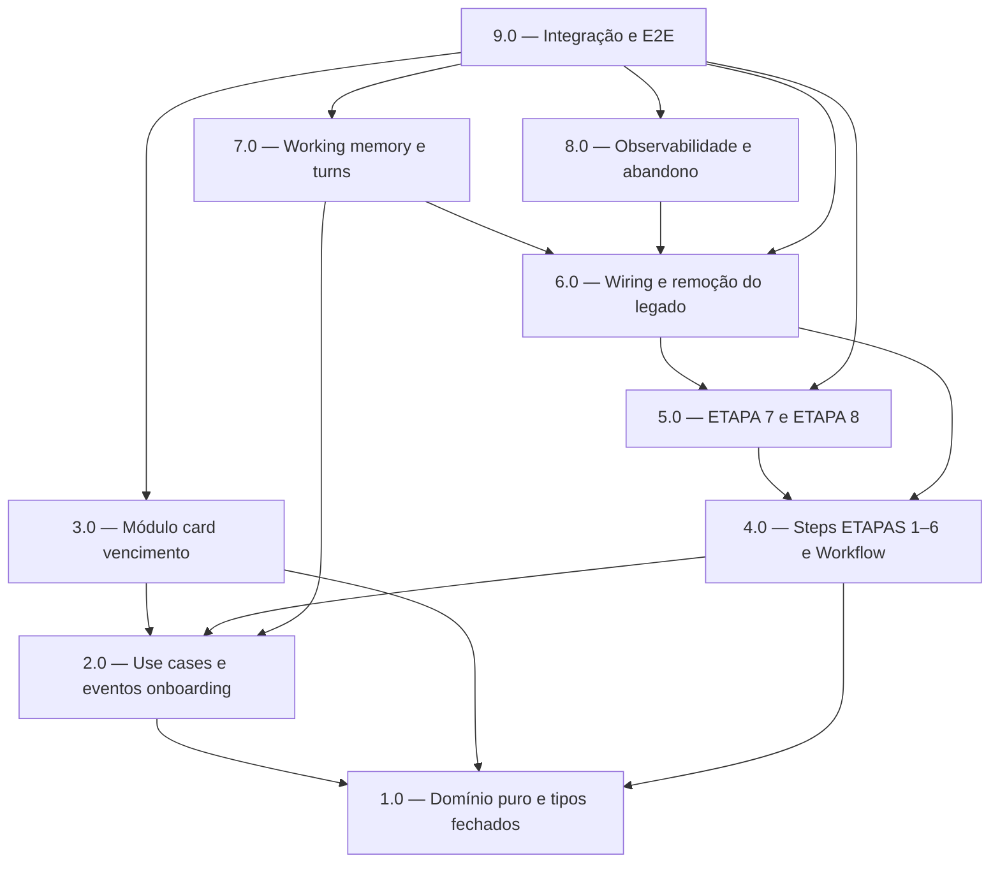

<!-- spec-hash-prd: cdca23b5b8c2a440473e9d0ed3ab4ea609af53edfd522c70aa6b0cb2dfa6b5b7 -->
<!-- spec-hash-techspec: 07b0d68b06bf0ca013414ea4fa2edd60584ebc05579e5191641b972736745c05 -->
# Resumo das Tarefas de Implementação para Onboarding Conversacional

## Metadados
- **PRD:** `.specs/prd-onboarding-conversacional/prd.md`
- **Especificação Técnica:** `.specs/prd-onboarding-conversacional/techspec.md`
- **Total de tarefas:** 9
- **Tarefas paralelizáveis:** 3.0 ∥ 4.0 · 7.0 ∥ 8.0

## Tarefas

| # | Título | Status | Dependências | Paralelizável | Skills |
|---|--------|--------|-------------|---------------|--------|
| 1.0 | Domínio puro e tipos fechados (DMMF state-as-type) | done | — | — | — |
| 2.0 | Use cases e eventos do internal/onboarding | done | 1.0 | — | — |
| 3.0 | Módulo card — vencimento + fechamento derivado | done | 1.0, 2.0 | Com 4.0 | — |
| 4.0 | Steps ETAPAS 1–6 e OnboardingWorkflow no kernel | done | 1.0, 2.0 | Com 3.0 | mastra |
| 5.0 | ETAPA 7 (Resumo + gate HITL) e ETAPA 8 (Conclusão) | done | 4.0 | — | mastra |
| 6.0 | Wiring OnboardingAgent e remoção do legado | done | 4.0, 5.0 | — | mastra |
| 7.0 | Working memory e limpeza de turns | done | 2.0, 6.0 | Com 8.0 | mastra |
| 8.0 | Observabilidade e job de abandono | done | 6.0 | Com 7.0 | — |
| 9.0 | Testes de integração e E2E | done | 3.0, 5.0, 6.0, 7.0, 8.0 | — | mastra |

## Dependências Críticas
- **1.0** é fundação (domínio puro, tipos fechados, `Decide*`, `DeriveClosingDay`) e desbloqueia 2.0 e 4.0.
- **2.0** (use cases/eventos onboarding) precede 3.0 (payload do evento de cartão) e 4.0 (bindings das etapas).
- **4.0 ∥ 3.0** após 2.0 (steps e módulo card são independentes).
- **5.0** depende de 4.0 (gate HITL e conclusão fecham a sequência de steps).
- **6.0** (wiring + remoção do legado) só após 4.0 e 5.0 — não remover `run_onboarding_turn.go` antes do novo fluxo pronto.
- **9.0** fecha tudo (integração + e2e da jornada completa).

## Riscos de Integração
- **Dupla fonte de estado** (snapshot do kernel × `onboarding_sessions`): disciplinar na 4.0/6.0 — snapshot é fonte do resume, sessão é fonte dos dados (techspec R3).
- **Remoção do legado (6.0)** após validação dos steps; risco de regressão se feita antes — mitigado pela ordem de dependência.
- **Contrato `card.CreateCard` (3.0)**: impor vencimento no seam do onboarding sem quebrar a API HTTP pública (ADR-003 R2).
- **Offset de fechamento uniforme (3.0)**: configurável; competência aproximada aceita no MVP (ADR-003 R1).
- **Migração-reset (2.0)**: sessões em andamento reiniciam no deploy (ADR-002); deploy em janela de baixa atividade.

## Cobertura de Requisitos

| Tarefa | Requisitos cobertos |
|--------|-------------------|
| 1.0 | RF-07, RF-08, RF-13, RF-14, RF-17, RF-22, RF-25, RF-26 |
| 2.0 | RF-05, RF-06, RF-10, RF-15, RF-19, RF-22, RF-24 |
| 3.0 | RF-08, RF-10, RF-27, RF-28 |
| 4.0 | RF-04, RF-09, RF-11, RF-12, RF-13, RF-26 |
| 5.0 | RF-16, RF-17, RF-18, RF-19, RF-20, RF-25 |
| 6.0 | RF-01, RF-02, RF-03, RF-23 |
| 7.0 | RF-21, RF-24 |
| 8.0 | RF-29, RF-30 |
| 9.0 | RF-23, RF-27, RF-28 |

## Grafo de Dependencias

## Legenda de Status
- `pending`: aguardando execução
- `in_progress`: em execução
- `needs_input`: aguardando informação do usuário
- `blocked`: bloqueado por dependência ou falha externa
- `failed`: falhou após limite de remediação
- `done`: completado e aprovado
