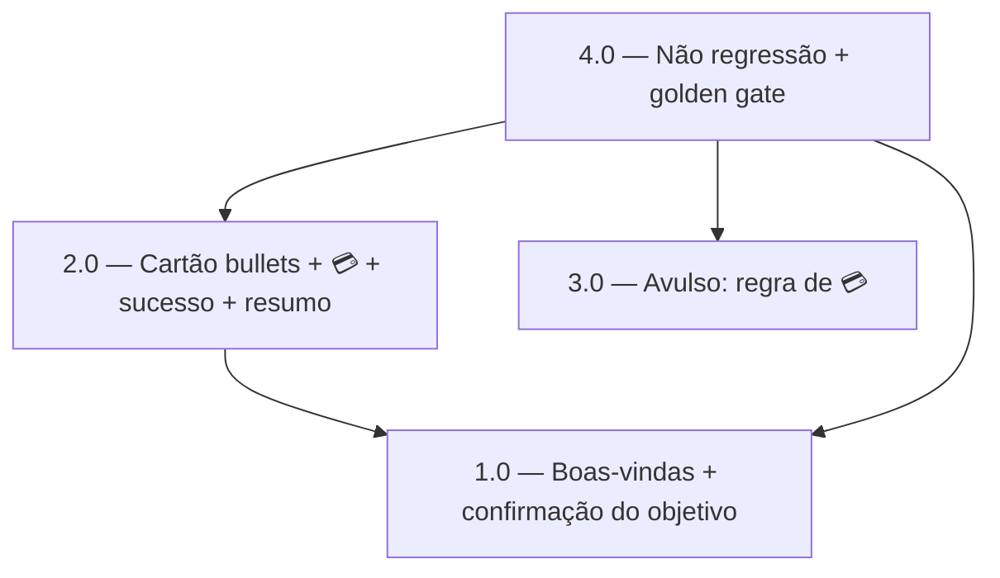

<!-- spec-hash-prd: 628a71737328fe4e5f10c7b1f222ffa7721919f536f12f91145bbb90bc7c8958 -->
<!-- spec-hash-techspec: 445369d1d33d9bccf2cfe6559143b9cd17a841b820fe59358b9ac742654eded4 -->
# Resumo das Tarefas de Implementação para Onboarding: Boas-vindas, Confirmação do Objetivo, Emoji de Cartão, Sucesso de Cartão e Objetivo Único no Resumo

## Metadados
- **PRD:** `.specs/prd-onboarding-copy-confirmacao-objetivo/prd.md`
- **Especificação Técnica:** `.specs/prd-onboarding-copy-confirmacao-objetivo/techspec.md`
- **Total de tarefas:** 4
- **Tarefas paralelizáveis:** 3.0 (com 1.0 e 2.0)

## Tarefas

| # | Título | Status | Dependências | Paralelizável | Skills |
|---|--------|--------|-------------|---------------|--------|
| 1.0 | Onboarding: boas-vindas (celular) + confirmação/reforço do objetivo determinístico + exemplo de valor | done | — | Com 3.0 | mastra, domain-modeling-production, design-patterns-mandatory |
| 2.0 | Onboarding: cartão em bullets + regra de 💳 + selo de sucesso + objetivo único no resumo | done | 1.0 | Com 3.0 | mastra, design-patterns-mandatory |
| 3.0 | Avulso card_create_confirm: regra de 💳 (mantém confirmação inicial + selo de sucesso) | done | — | Com 1.0, 2.0 | mastra |
| 4.0 | Não regressão + escopo + gate golden real-LLM | done | 1.0, 2.0, 3.0 | — | mastra |

## Dependências Críticas
- 2.0 depende de 1.0: ambas editam `internal/agents/application/workflows/onboarding_workflow.go`; execução sequencial evita conflito no mesmo arquivo.
- 4.0 depende de 1.0, 2.0 e 3.0: é a fase de verificação cruzada (build/vet/test-race/lint do módulo, escopo e gate golden), que só faz sentido com todo o código de copy aplicado.

## Riscos de Integração
- Muitos asserts de teste travam strings exatas de copy (mapeados por file:line na techspec, seção "Abordagem de Testes"). Cada tarefa que altera copy deve atualizar seus asserts no mesmo passo e deixar `go test` verde antes de `done`.
- Journey de integração `whatsapp_inbound_consumer_integration_test.go` (`replies[6]/[7]` com 💳): o reposicionamento do emoji pode mudar quais replies contêm 💳; a Tarefa 2.0 deve reverificar índice a índice.
- Escopo do 💳 é restrito a 2 fluxos determinísticos (RF-08): a Tarefa 4.0 verifica por grep que `mecontrola_agent.go`, tools, `pending_entry`, `destructive_confirm` e golden cases não foram alterados.

## Cobertura de Requisitos

| Tarefa | Requisitos cobertos |
|--------|-------------------|
| 1.0 | RF-01, RF-02, RF-03, RF-04, RF-05, RF-06 |
| 2.0 | RF-07, RF-09, RF-10, RF-11, RF-12, RF-13, RF-14 |
| 3.0 | RF-07, RF-15 |
| 4.0 | RF-08, RF-16, RF-17 |

## Grafo de Dependencias

## Legenda de Status
- `pending`: aguardando execução
- `in_progress`: em execução
- `needs_input`: aguardando informação do usuário
- `blocked`: bloqueado por dependência ou falha externa
- `failed`: falhou após limite de remediação
- `done`: completado e aprovado
