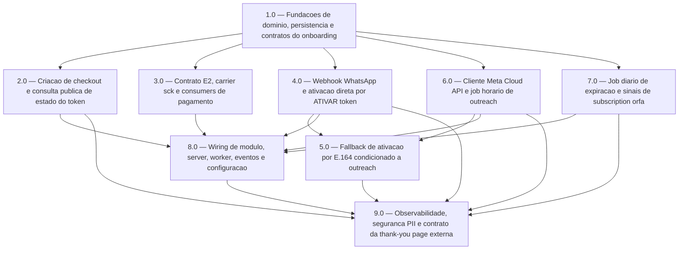

<!-- spec-hash-prd: 6950ed0b2bba313d9e949e49bf711646b7ea04e015d1d7ab44f1aaac960f06f7 -->
<!-- spec-hash-techspec: e5724b44e07d41821287c18d34247303b21792acdd12063e6de39c88e46b4e74 -->
# Resumo das Tarefas de Implementação para Onboarding via Magic Token

## Metadados
- **PRD:** `.specs/prd-onboarding-magic-token/prd.md`
- **Especificação Técnica:** `.specs/prd-onboarding-magic-token/techspec.md`
- **Total de tarefas:** 9
- **Tarefas paralelizáveis:** `2.0`, `3.0`, `4.0`, `6.0`, `7.0` após `1.0`

## Tarefas

<!-- Colunas e formato canônico (MANDATÓRIO):
     - `#`: id decimal `X.Y` (sempre X.0 para tarefas de topo).
     - `Status`: ^(pending|in_progress|needs_input|blocked|failed|done)$
     - `Dependências`: ^(—|\d+\.\d+(,\s*\d+\.\d+)*)$  (em-dash unicode quando vazio)
     - `Paralelizável`: ^(—|Não|Com\s+\d+\.\d+(,\s*\d+\.\d+)*)$
     - `Skills`: skills processuais extras (descoberta agnóstica em `.agents/skills/`). Use `—` quando
       não houver. Nunca listar skills auto-carregadas (governance/linguagem) nem `*-implementation`.
     - `Fase` (OPCIONAL): inteiro positivo para agrupamento visual de fases de entrega. Pode ser
       omitida em PRDs pequenos; `execute-all-tasks` não consome esta coluna. Se incluída, mantenha
       em todas as linhas para não quebrar o parser de tabela markdown. -->

| # | Título | Status | Dependências | Paralelizável | Skills |
|---|--------|--------|-------------|---------------|--------|
| 1.0 | Fundacoes de dominio, persistencia e contratos do onboarding | done | — | — | — |
| 2.0 | Criacao de checkout e consulta publica de estado do token | done | 1.0 | Com 3.0, 4.0, 6.0, 7.0 | — |
| 3.0 | Contrato E2, carrier sck e consumers de pagamento | done | 1.0 | Com 2.0, 4.0, 6.0, 7.0 | — |
| 4.0 | Webhook WhatsApp e ativacao direta por ATIVAR token | done | 1.0 | Com 2.0, 3.0, 6.0, 7.0 | — |
| 5.0 | Fallback de ativacao por E.164 condicionado a outreach | done | 4.0, 6.0 | Não | — |
| 6.0 | Cliente Meta Cloud API e job horario de outreach | done | 1.0 | Com 2.0, 3.0, 4.0, 7.0 | — |
| 7.0 | Job diario de expiracao e sinais de subscription orfa | done | 1.0 | Com 2.0, 3.0, 4.0, 6.0 | — |
| 8.0 | Wiring de modulo, server, worker, eventos e configuracao | done | 2.0, 3.0, 4.0, 6.0, 7.0 | Não | — |
| 9.0 | Observabilidade, seguranca PII e contrato da thank-you page externa | done | 2.0, 4.0, 5.0, 6.0, 7.0, 8.0 | Não | — |

## Dependências Críticas
- `1.0` cria o alicerce de schema, dominio, repositorios e contratos consumidos pelas demais tarefas.
- `5.0` depende de `4.0` e `6.0` porque o fallback E.164 reutiliza o inbound WhatsApp e exige `outreach_sent_at`.
- `8.0` deve ocorrer depois dos handlers, consumers e jobs existirem para evitar wiring ficticio.
- `9.0` fecha cross-cutting de metricas, logs, PII e contrato externo depois da superficie principal estar implementada.

## Riscos de Integração
- O carrier oficial do magic token e `tracking.sck`; o codigo atual de billing ainda usa `s1`/`src` como fonte principal.
- A thank-you page fica no repositorio externo da landing; este PRD entrega o endpoint Go e o contrato JSON, nao a pagina Astro.
- O template Meta `activation_reminder` e o numero oficial do WhatsApp Business sao dependencias operacionais externas.
- A implementacao deve partir de `cmd/server/server.go` e `cmd/worker/worker.go` para wiring real; `internal/platform/runtime` nao deve ser usado como ponto de partida.

## Cobertura de Requisitos

| Tarefa | Requisitos cobertos |
|--------|-------------------|
| 1.0 | RF-01, RF-03, RF-06, RF-07, RF-08, RF-11, RF-12, RF-15, RF-18 |
| 2.0 | RF-01, RF-02, RF-04, RF-05, RF-13, RF-17 |
| 3.0 | RF-03, RF-13, RF-14, RF-16, RF-18 |
| 4.0 | RF-06, RF-07, RF-08, RF-13, RF-14, RF-15, RF-16 |
| 5.0 | RF-07, RF-10, RF-13, RF-14, RF-16 |
| 6.0 | RF-09, RF-13, RF-14, RF-16 |
| 7.0 | RF-11, RF-12, RF-13, RF-14 |
| 8.0 | RF-03, RF-09, RF-11, RF-17 |
| 9.0 | RF-04, RF-05, RF-13, RF-14, RF-17, RF-19 |

## Grafo de Dependencias

## Legenda de Status
- `pending`: aguardando execução
- `in_progress`: em execução
- `needs_input`: aguardando informação do usuário
- `blocked`: bloqueado por dependência ou falha externa
- `failed`: falhou após limite de remediação
- `done`: completado e aprovado
