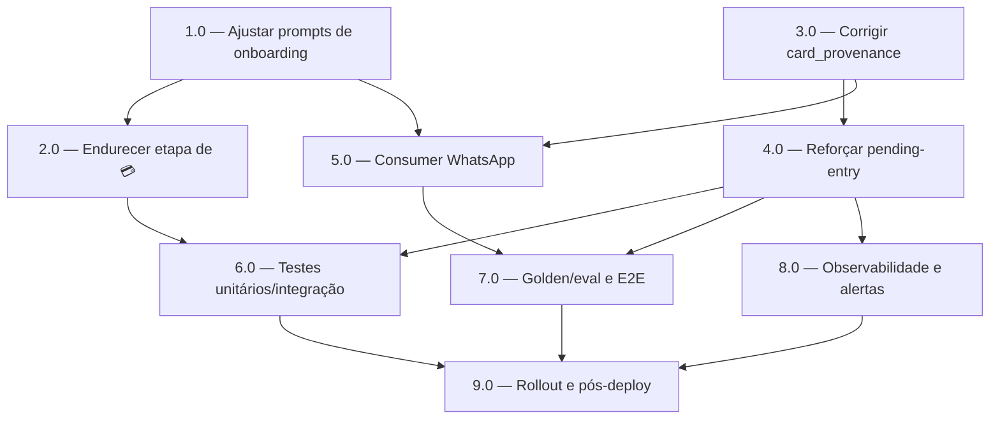

<!-- spec-hash-prd: 3841dfedcc8147e79c764fa15a3c40d67438f9fea8a1f7afef343f45c970c2ad -->
<!-- spec-hash-techspec: 8fc8333d14b985e8c18d2a6f5da8d46ce5ac38465abf177f286a84ba9e2699b7 -->
# Resumo das Tarefas de Implementação — Onboarding sem Fricção até o Primeiro Lançamento Financeiro

## Metadados
- **PRD:** `.specs/prd-onboarding-sem-friccao-ate-primeiro-lancamento/prd.md`
- **Especificação Técnica:** `.specs/prd-onboarding-sem-friccao-ate-primeiro-lancamento/techspec.md`
- **Total de tarefas:** 9
- **Tarefas paralelizáveis:** 3.0 com 1.0; 5.0 com 3.0; 7.0 com 6.0; 8.0 com 6.0.

## Tarefas

| # | Título | Status | Dependências | Paralelizável | Skills |
|---|--------|--------|-------------|---------------|--------|
| 1.0 | Ajustar prompts de onboarding: saudação + objetivo e categorias | done | — | — | mastra |
| 2.0 | Endurecer etapa de 💳 opcional e contextual | done | 1.0 | Não | mastra |
| 3.0 | Corrigir `card_provenance` para pagamentos não-credit_card | done | — | Com 1.0 | mastra |
| 4.0 | Reforçar `pending-entry` para pix sem cartão e receita simples | done | 3.0 | Não | mastra, domain-modeling-production |
| 5.0 | Atualizar consumer WhatsApp e prioridade de retomada | done | 1.0 | Com 3.0 | mastra |
| 6.0 | Adicionar testes unitários e de integração obrigatórios | done | 2.0, 4.0 | Não | mastra |
| 7.0 | Atualizar golden/eval e E2E de primeiro lançamento | done | 4.0, 5.0 | Com 6.0 | mastra |
| 8.0 | Atualizar observabilidade, alertas e runbook | done | 3.0, 4.0 | Com 6.0 | mastra, otel-grafana-dashboards |
| 9.0 | Checklist de rollout sem feature flag e validação pós-deploy | done | 6.0, 7.0, 8.0 | Não | — |

## Dependências Críticas
- As tarefas 2.0 e 5.0 dependem de 1.0 porque alteram a sequência do workflow de onboarding e a ordem de retomada do consumer.
- A tarefa 4.0 depende de 3.0 porque a correção de `card_provenance` desbloqueia o caminho de pix sem cartão.
- As tarefas 6.0, 7.0 e 8.0 são de validação/observabilidade e só podem ser concluídas após as decisões de workflow, guard e pending-entry estarem implementadas.
- A tarefa 9.0 só pode ser fechada após evidência de testes passando e jornada manual validada.

## Riscos de Integração
- As tarefas 1.0 e 2.0 tocam o mesmo arquivo `internal/agents/application/workflows/onboarding_workflow.go`; embora 2.0 dependa de 1.0, conflitos de merge devem ser monitorados.
- A correção de `card_provenance` (3.0) e o consumer WhatsApp (5.0) alteram a experiência de entrada; testes de integração devem cobrir a ordem de retomada.
- A ausência de feature flag/allowlist/canary exige que todas as regressões esteja verdes antes do deploy.
- O alerta crítico de confirmação sem transação (8.0) depende de métricas já existentes ou de instrumentação adicional mínima.

## Cobertura de Requisitos

| Tarefa | Requisitos cobertos |
|--------|-------------------|
| 1.0 | RF-01, RF-02, RF-03, RF-04, RF-05, RF-06, RF-07, RF-08 |
| 2.0 | RF-07, RF-08, RF-09, RF-10, RF-11, RF-12, RF-13, RF-14, RF-15 |
| 3.0 | RF-07, RF-08, RF-16, RF-17, RF-18, RF-19 |
| 4.0 | RF-17, RF-18, RF-19, RF-20, RF-21, RF-22, RF-23, RF-26, RF-27 |
| 5.0 | RF-28, RF-29, RF-30 |
| 6.0 | RF-35, RF-36, RF-37, RF-38, RF-39 |
| 7.0 | RF-20, RF-21, RF-22, RF-23, RF-35, RF-36, RF-37, RF-38, RF-39 |
| 8.0 | RF-31, RF-32, RF-33, RF-34 |
| 9.0 | RF-24, RF-25 |

## Grafo de Dependencias

## Legenda de Status
- `pending`: aguardando execução
- `in_progress`: em execução
- `needs_input`: aguardando informação do usuário
- `blocked`: bloqueado por dependência ou falha externa
- `failed`: falhou após limite de remediação
- `done`: completado e aprovado
