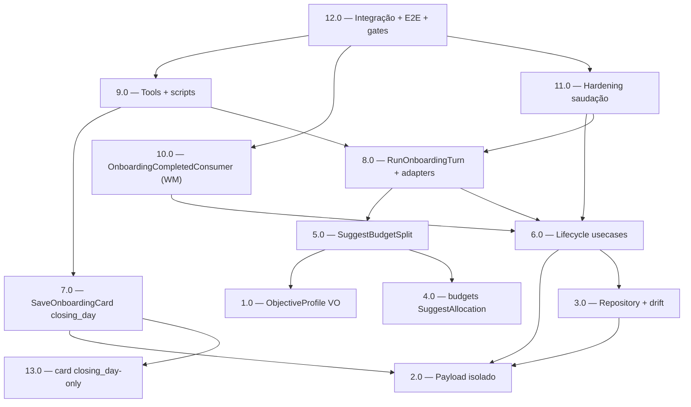

<!-- spec-hash-prd: df2f65638247544f7c78344d28f2e5d2c949e2dad7c107ad7b2f25a8ccfe5384 -->
<!-- spec-hash-techspec: b5c3d4a870ade794de67f4e63949dc2a03d3a62657250dc4f29befaded7ad4d8 -->
# Resumo das Tarefas de Implementação para Onboarding V2

## Metadados
- **PRD:** `.specs/prd-onboarding-v2/prd.md`
- **Especificação Técnica:** `.specs/prd-onboarding-v2/techspec.md`
- **Total de tarefas:** 13
- **Tarefas paralelizáveis:** 1.0↔2.0↔4.0↔13.0; 5.0↔6.0↔7.0; 10.0↔11.0

## Tarefas

| # | Título | Status | Dependências | Paralelizável | Skills |
|---|--------|--------|-------------|---------------|--------|
| 1.0 | [onboarding] ObjectiveProfile VO + SplitTemplate (basis points) | done | — | Com 2.0, 4.0 | — |
| 2.0 | [onboarding] Payload isolado: OnboardingTurn + campos + métodos With* | done | — | Com 1.0, 4.0 | — |
| 3.0 | [onboarding] Repository: JSON dos novos campos + drift no Find | done | 2.0 | — | — |
| 4.0 | [budgets] SuggestAllocation (encapsula AllocationDistributor) + binding | done | — | Com 1.0, 2.0 | — |
| 5.0 | [onboarding] SuggestBudgetSplit (resolve perfil → delega cents a budgets) + binding | done | 1.0, 4.0 | Com 6.0, 7.0 | — |
| 6.0 | [onboarding] Lifecycle: turnos + MarkWelcomeSent + CompleteOnboardingSession + binding | done | 2.0, 3.0 | Com 5.0, 7.0 | — |
| 7.0 | [onboarding] SaveOnboardingCard por closing_day (via SynchronousCardCreator) | done | 2.0, 13.0 | Com 5.0, 6.0 | — |
| 8.0 | [agent] RunOnboardingTurn refatorado + adapters de binding | done | 5.0, 6.0 | — | mastra |
| 9.0 | [agent] Tools + scripts: closing_day, enum objective_profile, copy literal | done | 7.0, 8.0 | — | mastra |
| 10.0 | [agent] OnboardingCompletedConsumer (WM assíncrona) + wiring | done | 6.0 | Com 11.0 | mastra |
| 11.0 | [agent] Hardening da saudação (GAP-1: erro→retry + idempotência) | done | 6.0, 8.0 | Com 10.0 | mastra |
| 12.0 | [ambos] Validação integração + E2E + gates de fronteira/conformidade | done | 9.0, 10.0, 11.0 | — | mastra |
| 13.0 | [card] Contrato closing_day-only (due_day opcional + derivado no card) | done | — | Com 1.0, 2.0, 4.0 | — |

## Dependências Críticas
- **3.0 → 2.0**: mapeamento JSON depende dos campos do domínio.
- **5.0 → 1.0, 4.0**: SuggestBudgetSplit resolve o perfil (1.0) e delega o cálculo cents a budgets (4.0).
- **6.0 → 2.0, 3.0**: lifecycle depende do payload e da persistência.
- **8.0 → 5.0, 6.0**: o agente só chama os bindings depois que os usecases do onboarding existirem (ADR-006).
- **7.0 → 13.0**: o onboarding só envia `closing_day` depois que o `card` aceitar `due_day` opcional.
- **9.0 → 7.0, 8.0**: tools de cartão/objetivo dependem do usecase de cartão e do fluxo refatorado.
- **13.0 → —**: mudança no `internal/card` (dono), independente; pode rodar em paralelo ao domínio do onboarding.
- **10.0 → 6.0**: WM assíncrona reage a `OnboardingCompleted` publicado por `CompleteOnboardingSession`.
- **11.0 → 6.0, 8.0**: idempotência usa `MarkWelcomeSent` (6.0) e o caminho de turno (8.0).
- **12.0 → 9.0, 10.0, 11.0**: validação integração/E2E só após todos os caminhos prontos.

## Riscos de Integração
- **Plano com 13 tarefas (> default 10)** — justificado: 37 RFs, fronteira de bounded contexts
  (ADR-006) exigindo separação estrita por módulo/camada (onboarding, budgets, card, transactions,
  agent) com uma responsabilidade por task. Consolidar misturaria módulos/camadas.
- **GAP-V1 — contrato do cartão (T13.0)**: `internal/card` passa a aceitar `due_day` opcional
  (derivado internamente); retrocompatível com callers existentes (HTTP/daily). Mitiga rejeição do
  cartão quando o onboarding envia só `closing_day`.
- **DR-10 — cap de retry + dead-letter**: reusa `attempts`/`max_attempts` do outbox + alerta
  `outbox_dead_letter_total{event_type}` para os consumers de saudação/WM (sem retry infinito).
- **Bounded contexts já integrados via eventos/seams (não recriar)**: `internal/budgets` consome
  `onboarding.splits_calculated` (CreateBudget/ActivateBudget); `internal/card` consome
  `onboarding.card_registered` (SynchronousCardCreator); 1ª transação via `ExpenseRecorder →
  internal/transactions`. As tarefas NÃO recriam essa integração — apenas (4.0/5.0) delegam o
  **cálculo** de distribuição a budgets e (7.0/9.0) ajustam o cartão para `closing_day`.
- **ADR-006 (fronteira inegociável)**: risco de reintroduzir domínio de outro módulo no
  `internal/agent` ou de o onboarding refazer a matemática de budgets. Mitigado pelos gates da T12
  (grep sem `buildAutoSplits`/SQL/import de domínio de outro módulo em `internal/agent`; onboarding
  sem matemática cents de distribuição).
- **Parte 1 já implementada**: T1–T11 não recriam auto-start/LLM mandatório/allowlist OpenRouter;
  T12 valida integridade (RF-01..04, RF-06, RF-07).
- **Refator de `RunOnboardingTurn` (T8)**: risco de regressão ao remover `agent_sessions`/
  `buildAutoSplits`; mitigado por testes prévios do comportamento atual e cobertura unitária.

## Cobertura de Requisitos

| Tarefa | Requisitos cobertos |
|--------|-------------------|
| 1.0 | RF-13, RF-13a |
| 2.0 | RF-20, RF-22, RF-35 |
| 3.0 | RF-19, RF-21, RF-31 |
| 4.0 | RF-13 |
| 5.0 | RF-13, RF-13a |
| 6.0 | RF-20, RF-23, RF-24, RF-25, RF-29, RF-35 |
| 7.0 | RF-12 |
| 8.0 | RF-13, RF-14, RF-15, RF-20, RF-21, RF-30, RF-33, RF-36 |
| 9.0 | RF-09, RF-10, RF-11, RF-12, RF-16, RF-17, RF-18 |
| 10.0 | RF-26, RF-34 |
| 11.0 | RF-05, RF-08, RF-29, RF-32 |
| 12.0 | RF-01, RF-02, RF-03, RF-04, RF-06, RF-07, RF-27, RF-28, RF-33 |
| 13.0 | RF-12 |

## Grafo de Dependencias

## Legenda de Status
- `pending`: aguardando execução
- `in_progress`: em execução
- `needs_input`: aguardando informação do usuário
- `blocked`: bloqueado por dependência ou falha externa
- `failed`: falhou após limite de remediação
- `done`: completado e aprovado
