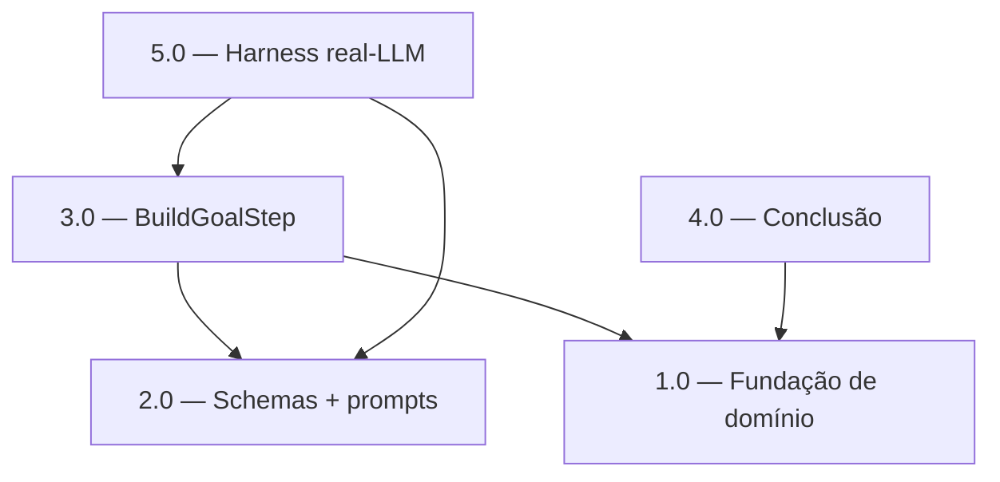

<!-- spec-hash-prd: 4052540751695ef747eb0c656a6009cdca4331ee803d639e0ce5bcb1e5a2fc15 -->
<!-- spec-hash-techspec: e8744af17176327e6b60ad459fd75a84fd7d06dfc945e6b8a3439af68e9edd75 -->
# Resumo das Tarefas de Implementação para Valor Opcional da Meta no Onboarding

## Metadados
- **PRD:** `.specs/prd-onboarding-valor-opcional-meta/prd.md`
- **Especificação Técnica:** `.specs/prd-onboarding-valor-opcional-meta/techspec.md`
- **Total de tarefas:** 5
- **Tarefas paralelizáveis:** 1.0 com 2.0; 3.0 com 4.0

## Tarefas

| # | Título | Status | Dependências | Paralelizável | Skills |
|---|--------|--------|-------------|---------------|--------|
| 1.0 | Fundação de domínio: constructor puro `DecideGoalValueCents` + campos de estado | pending | — | Com 2.0 | design-patterns-mandatory, domain-modeling-production, mastra, go-testing |
| 2.0 | Schemas de extração + structs + system prompts (ADR-001) | pending | — | Com 1.0 | design-patterns-mandatory, domain-modeling-production, mastra |
| 3.0 | Reestruturação de `BuildGoalStep` + testes unitários dos 7 cenários | pending | 1.0, 2.0 | Com 4.0 | design-patterns-mandatory, domain-modeling-production, mastra, go-testing |
| 4.0 | Conclusão: persistência condicional + mensagem final value-aware | pending | 1.0 | Com 3.0 | design-patterns-mandatory, domain-modeling-production, mastra, go-testing |
| 5.0 | Harness real-LLM (gate de merge ≥ 0.90 em gpt-4o-mini) | pending | 2.0, 3.0 | Não | mastra, go-testing |

## Dependências Críticas
- 3.0 depende de 1.0 (constructor + campos de estado) e 2.0 (schemas + prompts): o step consome ambos.
- 4.0 depende de 1.0 (campo `GoalValueCents` e semântica sentinela).
- 5.0 é o **gate de merge**: depende de 3.0 (fluxo de extração no `BuildGoalStep`) e 2.0 (schemas/prompts). Merge só é permitido com ratio ≥ 0.90 verde.

## Riscos de Integração
- **go-implementation não declarada por design**: é `category: language`, auto-carregada por detecção de diff `.go` no `execute-task` Stage 2. O trio obrigatório (go-implementation + design-patterns-mandatory + domain-modeling-production) fica integralmente ativo em toda tarefa Go; o guard do `task-template.md` proíbe listar skills `*-implementation`.
- **Risco R1 (merge-patch de estado inteiro)**: a preservação de `GoalValueCents`/`GoalValueAsked` no resume assume patch parcial (`{"resumeText":...}`). Coberto por teste de regressão em 1.0. Se um consumidor futuro emitir patch de estado inteiro, quebra — invariante documentada em ADR-002.
- **Risco R4 (assinatura de `conclusionFinalMessage`)**: 4.0 muda a assinatura; caller único verificado (L780). `grep "conclusionFinalMessage("` deve retornar só essa call antes do merge.
- **Ordem de tipos/símbolos**: 1.0 e 2.0 tocam o mesmo arquivo (`onboarding_workflow.go`) em regiões distintas (constructor/struct vs. schemas/prompts); paralelizáveis com atenção a conflito de merge no mesmo arquivo.

## Cobertura de Requisitos

| Tarefa | Requisitos cobertos |
|--------|-------------------|
| 1.0 | RF-07, RF-08, RF-10 |
| 2.0 | RF-01, RF-09, RF-13 |
| 3.0 | RF-01, RF-02, RF-03, RF-03.1, RF-03.2, RF-03.3, RF-04, RF-05, RF-06, RF-13.1 |
| 4.0 | RF-11, RF-12, RF-15, RF-16 |
| 5.0 | RF-09, RF-14 |

## Grafo de Dependencias

## Legenda de Status
- `pending`: aguardando execução
- `in_progress`: em execução
- `needs_input`: aguardando informação do usuário
- `blocked`: bloqueado por dependência ou falha externa
- `failed`: falhou após limite de remediação
- `done`: completado e aprovado
