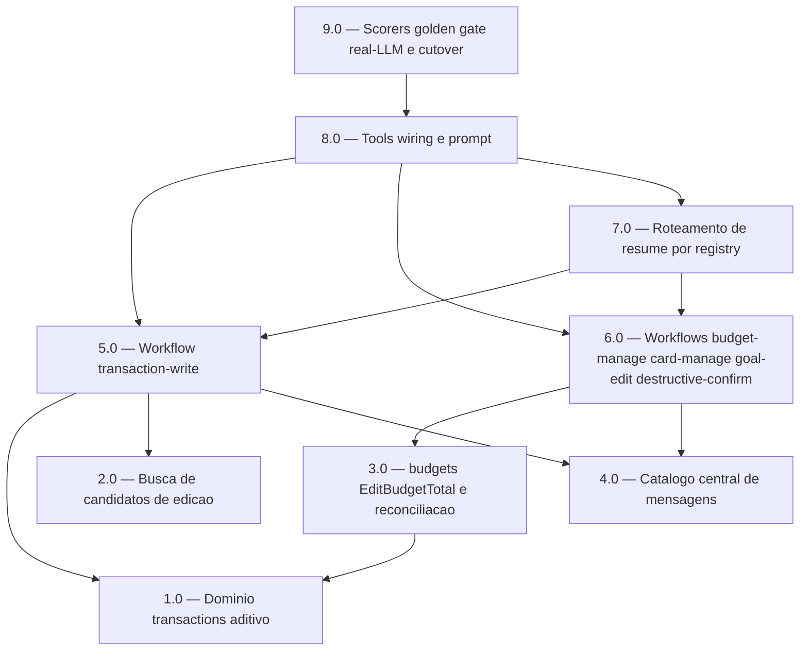

<!-- spec-hash-prd: 490527377919d28e532eb4d17fb26628b01b3c86a1dd2824772e4b2d90bf5087 -->
<!-- spec-hash-techspec: 00e6bae94027a5de6e0af2505561cee68675f35d404ba0653836c6ed8e458a4c -->
# Resumo das Tarefas de Implementação para Operação Conversacional Diária

## Metadados
- **PRD:** `.specs/prd-operacao-conversacional-diaria/prd.md`
- **Especificação Técnica:** `.specs/prd-operacao-conversacional-diaria/techspec.md`
- **Total de tarefas:** 9
- **Tarefas paralelizáveis:** 1.0 com 2.0; 4.0 com 1.0 e 2.0; 5.0 com 6.0

## Tarefas

| # | Título | Status | Dependências | Paralelizável | Skills |
|---|--------|--------|-------------|---------------|--------|
| 1.0 | Domínio transactions aditivo (enum PaymentMethod + evento enriquecido) | done | — | Com 2.0 | domain-modeling-production, design-patterns-mandatory |
| 2.0 | Busca de candidatos de edição (SearchEditCandidates) | done | — | Com 1.0 | postgresql-production-standards, domain-modeling-production |
| 3.0 | budgets: EditBudgetTotal e reconciliação de edição | done | 1.0 | Não | domain-modeling-production, design-patterns-mandatory, postgresql-production-standards |
| 4.0 | Catálogo central de mensagens de tom de voz | done | — | Com 1.0, 2.0 | mastra, design-patterns-mandatory |
| 5.0 | Workflow transaction-write (registro/edição/recorrência) | done | 1.0, 2.0, 4.0 | Com 6.0 | mastra, domain-modeling-production, design-patterns-mandatory |
| 6.0 | Workflows budget-manage, card-manage, goal-edit, destructive-confirm | done | 3.0, 4.0 | Com 5.0 | mastra, domain-modeling-production, design-patterns-mandatory |
| 7.0 | Roteamento de resume por registry (SuspendedRunIndex) | done | 5.0, 6.0 | Não | mastra, design-patterns-mandatory |
| 8.0 | Tools, wiring do módulo e prompt do agente | done | 5.0, 6.0, 7.0 | Não | mastra, design-patterns-mandatory |
| 9.0 | Scorers, golden 13 fluxos, gate real-LLM e cutover do legado | done | 8.0 | Não | mastra, postgresql-production-standards |

## Dependências Críticas
- 1.0 é pré-requisito de 3.0: o consumer de reconciliação depende do evento `TransactionUpdated` já enriquecido com a subcategoria.
- 5.0 e 6.0 dependem do catálogo (4.0) para as mensagens verbatim e dos usecases/portas de domínio (1.0/2.0/3.0).
- 7.0 depende de 5.0 e 6.0 existirem (há workflows para o dispatcher resolver e registrar).
- 8.0 depende de 5.0/6.0/7.0 (tools reapontadas aos novos workflows e ao dispatcher).
- 9.0 é o cutover: só após 8.0, com o novo fluxo completo, valida por real-LLM e remove o legado com drenagem (ADR-005).

## Riscos de Integração
- Contrato de evento cross-module `transactions -> budgets` (1.0/3.0): payload versionado; consumer tolera ausência de subcategoria para eventos antigos em trânsito no cutover.
- Substituição do `tryResumeChain` pelo dispatcher único (7.0): risco de mais de um run suspenso por thread; mitigado pela pendência ativa que bloqueia novo workflow (RF-09) e por teste de invariante.
- Remoção total do legado (9.0): executada só no cutover, após real-LLM verde e drenagem dos runs suspensos, para não quebrar build/produção. Critério de conclusão: `grep` sem referência aos símbolos removidos + build/vet/test/lint verdes.
- Guard de migração de forma de pagamento (crédito<->não-crédito) restringe edição de forma de pagamento; a mensagem de bloqueio vem do catálogo (evita falso-sucesso).
- Total de tarefas dentro do teto (9 de 10); nenhuma justificativa de excesso necessária.

## Cobertura de Requisitos

| Tarefa | Requisitos cobertos |
|--------|-------------------|
| 1.0 | RF-03, RF-15 |
| 2.0 | RF-15 |
| 3.0 | RF-15, RF-17, RF-25 |
| 4.0 | RF-05 |
| 5.0 | RF-01, RF-02, RF-04, RF-06, RF-07, RF-09, RF-10, RF-11, RF-13, RF-14, RF-15, RF-16, RF-31 |
| 6.0 | RF-04, RF-10, RF-17, RF-18, RF-19, RF-20, RF-21, RF-22, RF-31 |
| 7.0 | RF-08 |
| 8.0 | RF-01, RF-05, RF-12, RF-23, RF-24, RF-25, RF-26, RF-31 |
| 9.0 | RF-27, RF-28, RF-29, RF-30 |

## Grafo de Dependencias

## Legenda de Status
- `pending`: aguardando execução
- `in_progress`: em execução
- `needs_input`: aguardando informação do usuário
- `blocked`: bloqueado por dependência ou falha externa
- `failed`: falhou após limite de remediação
- `done`: completado e aprovado
