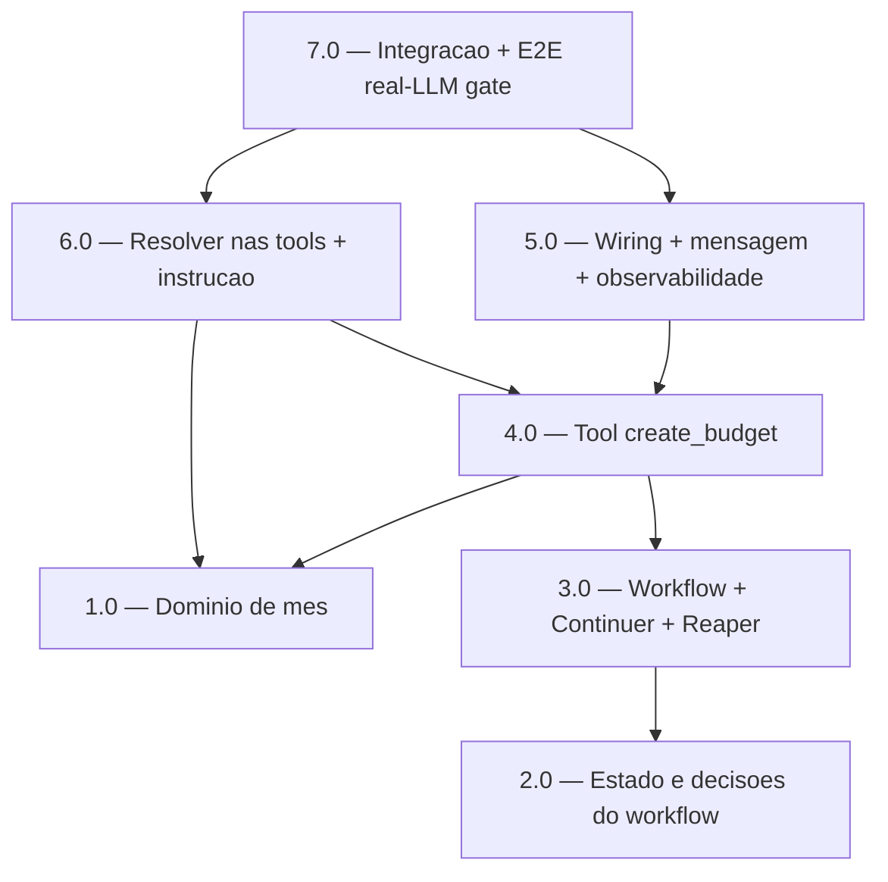

<!-- spec-hash-prd: ed471323c1cc317f89481eb38b494ea82bc10065436a33006d5cc9f19db1f9b8 -->
<!-- spec-hash-techspec: 266021f2a6e2310a9e82a23142016ff549a9f61c067eee957bc0ad46b9279427 -->
# Resumo das Tarefas de Implementação para Orçamento Retroativo Conversacional e Mês por Extenso

## Metadados
- **PRD:** `.specs/prd-orcamento-retroativo-conversacional-e-mes-por-extenso/prd.md`
- **Especificação Técnica:** `.specs/prd-orcamento-retroativo-conversacional-e-mes-por-extenso/techspec.md`
- **Total de tarefas:** 7
- **Tarefas paralelizáveis:** 1.0∥2.0 (domínio puro independente); 5.0∥6.0 (arquivos disjuntos após 4.0)

## Tarefas

| # | Título | Status | Dependências | Paralelizável | Skills |
|---|--------|--------|-------------|---------------|--------|
| 1.0 | Domínio de mês: MonthReference + DecideCompetence + Prev + FormatCompetencePtBR | pending | — | Com 2.0 | domain-modeling-production, design-patterns-mandatory |
| 2.0 | Estado e decisões do workflow budget-creation (tipos fechados + Decide* puros) | pending | — | Com 1.0 | domain-modeling-production, mastra |
| 3.0 | Workflow budget-creation + Continuer + Reaper (coleta espelha onboarding) | pending | 2.0 | — | mastra, design-patterns-mandatory |
| 4.0 | Tool fina create_budget (inicia workflow) + DTO Validate + mapeamento MonthReference | pending | 1.0, 3.0 | — | mastra |
| 5.0 | Wiring module.go + tryBudgetCreation + mensagem específica + observabilidade | pending | 4.0 | Com 6.0 | mastra |
| 6.0 | Resolver nas tools de leitura + instrução do agente + composição da retrospectiva | pending | 1.0, 4.0 | Com 5.0 | mastra |
| 7.0 | Testes de integração (Postgres) + E2E real-LLM gate estatístico ≥0.90 | pending | 5.0, 6.0 | — | mastra |

## Dependências Críticas
- 3.0 depende de 2.0 (estado/decisões do workflow).
- 4.0 depende de 1.0 (DecideCompetence) e 3.0 (workflow/engine para engine.Start).
- 5.0 e 6.0 dependem de 4.0 (tool registrada/disponível); 6.0 também de 1.0 (DecideCompetence/FormatCompetencePtBR).
- 7.0 depende de 5.0 e 6.0 (fluxo completo montado) — é o gate de aceitação real-LLM.

## Riscos de Integração
- **Merge-patch de `Allocations map`:** resume parcial não pode zerar a distribuição acumulada (R1 techspec) — testar resume `{"ResumeText":"..."}`.
- **Precedência no `try*`:** `tryBudgetCreation` antes do agente; exclusão mútua de estado de espera por `resourceId` (R3 techspec).
- **Regressão de classificação do LLM:** `DecideCompetence` é a autoridade; extração de total/distribuição reusa schema+Decide do onboarding; gate ≥0.90 (R2 techspec).
- **Chave do run = `resourceId`** (Continuer não conhece competência no próximo inbound); TTL 30min/reaper 35min para não deixar run suspenso (R6 techspec).
- **`create_budget` NÃO entra em `WithWriteToolSet`** — é starter de workflow; idempotência via run-key + replay + unicidade (evita falso positivo de write-guard).

## Cobertura de Requisitos

| Tarefa | Requisitos cobertos |
|--------|-------------------|
| 1.0 | RF-13, RF-14, RF-15, RF-16, RF-18, RF-19 |
| 2.0 | RF-06, RF-07, RF-28 |
| 3.0 | RF-01, RF-02, RF-03, RF-04, RF-05, RF-08, RF-09, RF-11, RF-12 |
| 4.0 | RF-01, RF-10, RF-25, RF-28 |
| 5.0 | RF-25, RF-26, RF-27, RF-29, RF-30 |
| 6.0 | RF-17, RF-18, RF-20, RF-21, RF-22, RF-23, RF-24 |
| 7.0 | RF-04, RF-05, RF-08, RF-09, RF-15, RF-16, RF-22, RF-23, RF-24, RF-26 |

## Grafo de Dependencias

## Legenda de Status
- `pending`: aguardando execução
- `in_progress`: em execução
- `needs_input`: aguardando informação do usuário
- `blocked`: bloqueado por dependência ou falha externa
- `failed`: falhou após limite de remediação
- `done`: completado e aprovado
